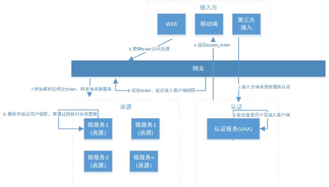

# 分布式系统认证方案

## 选型

1.  基于Session的认证

2.  基于token的认证

    -   适合统一的认证机制

        客户端, 一方应用, 三方应用都会遵循统一的认证机制

    -   对第三方应用接入更合适

        因为更开放, 可以使用Oauth2.0和JWT等

    -   减轻服务器压力

### Session的认证

Session的集中存储: 将Session在一个(内存的)独立的地方存储

Session复制：多台应用服务器之间同步session，使session保持一致，对外透明。

Session黏贴：当用户访问集群中某台服务器后，强制指定后续所有请求均落到此机器上。

(?)

#### 优点

安全(信息存在服务器)

#### 缺点

-   Session基于Cookie, 现在移动客户端环境复杂, 依靠Cookie不太有效
-   Session无法跨域

当一个请求URL的协议、端口、域名 三者之间任意一个与当前页面的URL不同即为**跨域**。

### token的认证

用户进行认证之后, 客户端自己携带令牌

#### 优点

不会在服务端搞复制黏贴, 不用存在服务器

#### 缺点

安全性问题(可以靠技术克服)

**token中含有权限和用户信息, 数据量大**

## 分布式系统架构

网关会先验证接入方(客户端, 第三方)的权限

微服务校验用户的权限是否有权限访问资源

### 流程描述

-   后文细讲

1.  用户通过接入方（应用）登录，接入方采取OAuth2.0方式在统一认证服务(UAA)中认证。 
2.  认证服务(UAA)调用验证该用户的身份是否合法，并获取用户权限信息。 
3.  认证服务(UAA)获取接入方权限信息，并验证接入方是否合法。
4.  若登录用户以及接入方都合法，认证服务生成jwt令牌返回给接入方，其中jwt中包含了用户权限及接入方权 限。 
5.  后续，接入方携带jwt令牌对API网关内的微服务资源进行访问。
6.  API网关对令牌解析、并验证接入方的权限是否能够访问本次请求的微服务。 
7.  如果接入方的权限没问题，API网关将原请求header中附加解析后的明文Token，并将请求转发至微服务。 
8.  微服务收到请求，明文token中包含登录用户的身份和权限信息。因此后续微服务自己可以干两件事：
    1.  用 户授权拦截（看当前用户是否有权访问该资源）
    2.  将用户信息存储进当前线程上下文（有利于后续业务逻辑随时 获取当前用户信息） 

流程所涉及到UAA服务、API网关这三个组件职责如下：

1）统一认证服务(UAA) 它承载了OAuth2.0接入方认证、登入用户的认证、授权以及生成令牌的职责，完成实际的用户认证、授权功能。 

2）API网关 作为系统的唯一入口，API网关为接入方提供定制的API集合，它可能还具有其它职责，如身份验证、监控、负载均 衡、缓存等。API网关方式的核心要点是，所有的接入方和消费端都通过统一的网关接入微服务，在网关层处理所 有的非业务功能。

