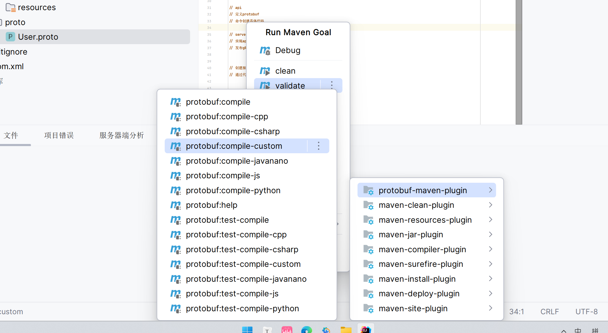
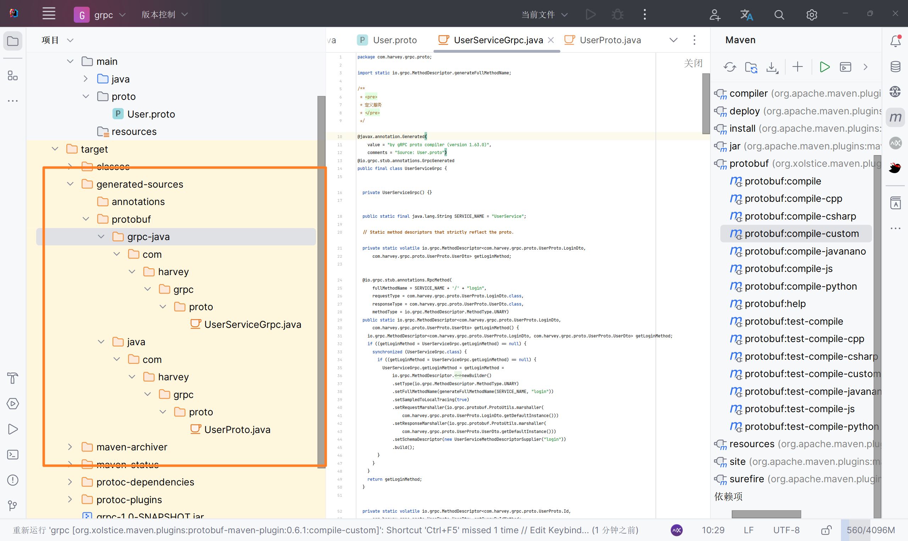
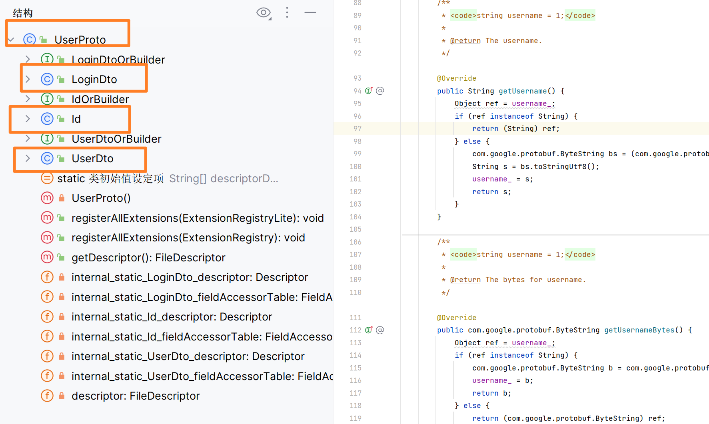
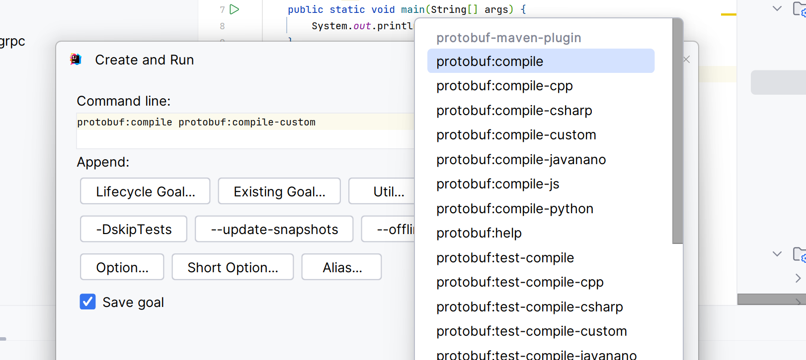
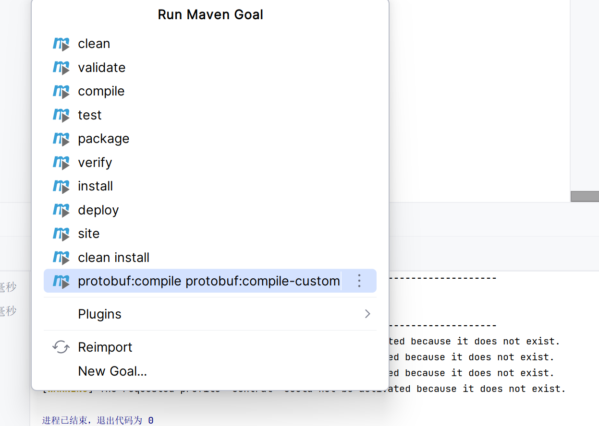
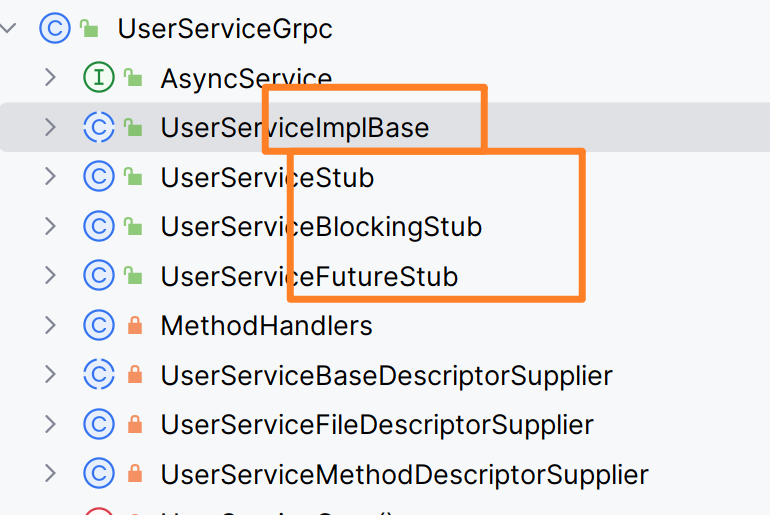

#  ProtoBuf

>   Protocol Buffers


-   与编程语言[IDL]无关

-   与平台(操作系统)无关

-   中间语言/ 数据描述语言(yaml, properties, xml, ini...)

-   可以方便地在Client与server中进行RPC的数据传输

-   能够压缩数据的体量

-   两种版本

    -   protobuf2

    -   protobuf3(主流)

        gRPC使用

        Dubbo使用

文件`.proto`


##辅助代码

### 版本设定

```protobuf
syntax = "proto3";
```

-   第一行一定是版本设定, 分号结尾


### 注释

```protobuf
// 这是注解
/*
多行注释
*/
```


### Java特定辅助设置

-   有C, Java, Go的一些设置, Python之类的就没有

```protobuf
// 指定后续protobuf生成的Java代码, 生成一个源文件, 还是多个源文件
option java_multiple_files = false; // false表示一个源文件

// protobuf生成的类, 放置在哪个包中
option java_package = "com.harvey.chat";

// 生成Java的类的外部类的名字
// 因为protobuf生成的Java类都是放在一个大类里的, 而这些内部类才是真正有作用的
option java_outer_classname = "ProtoBufCreatedClass";
```

### 导入与逻辑包

```protobuf
// 导入文件, 用于多个ProtoBuf文件之间定义的类互相调用
import "UserService.proto";

// 逻辑包, 可以保证多个protobuf文件定义的类之间不冲突, Java_package也能使类不冲突
package com.harvey.protobuf;
```


## 数据结构

###基本数据结构

[proto3/dev](https://protobuf.dev/programming-guides/proto3/)


### message

>   struct

```protobuf
// 数据传输, message: 对数据的封装
message LoginRequest{
  string username = 1; // 1 表示字段在消息体里的编号
  int64  id = 3; // 0不被允许
  bool flag = 2; // 顺序无所谓
  sint32 sNum = 5; // 编号不能重复, 有符号32位整形
}
// 编号最大, 2^29-1
// 最小 1
// 19000-19999 是Protobuf自己保留的编号, 不能用

```


#### 字段修饰关键字:

-   `singular`(缺省) 该字段只能是0个(null)或1个
-   `repeated` 字段包含多个值, 放你娘狗屁的List, 就是数组

```protobuf
message SearchResponse {
  repeated int64 nums = 1;
}
```


#### 消息嵌套

```protobuf
message SearchResponse {
  repeated int64 nums = 1;
} // 定义
message LoginRequest{
  sint32 sNum = 5;

  SearchResponse a = 4; // 使用
}
```


```protobuf
message LoginRequest{
  sint32 sNum = 5;
  message SearchResponse {
    repeated int64 nums = 1;
  } // 定义
  SearchResponse a = 4; // 使用
}
message SearchRequest{
  LoginRequest.SearchResponse a = 2;
}
```

#### 啊?

```protobuf
message LoginRequest{
  LoginRequest x = 2;
}
```

### enum


```protobuf
// 枚举
enum Season{
  SPRING=0; // 必须从零开始
  SUMMER=2;
  AUTUMN=3;
  WINTER=5;
}
```


### oneof

>   union

```protobuf
message Student{
  oneof score{ // 作为一个字段
    int64 score100 = 1; // 百分制的成绩
    string scoreABCDE = 2; // 等级制成绩
  }
  int64 name = 5; // 需要和oneof里的编号错开
}
```


## 服务


### 定义

```protobuf
// 调用远端的服务接口, Service

message LoginDto{
  string username = 1;
  string password = 2;
}
message Id{
  int64 id = 1;
}
message UserDto{
  int64 id = 1;
  string icon = 2;
  string nickName = 3;
}
message IsRemember{
  bool isRemember=1;
}

// 定义服务
service UserService{
  rpc login(LoginDto) returns(UserDto){};
  rpc queryById(Id) returns(UserDto){};
}
// 不能传多个参数, 方法不能重写, 不能使用基本数据类型作为参数
```


## 编译

```shell
protoc --java_out=生成目标目录 proto文件
```


```shell
27970@Harvey-PC MINGW64 /d/IT_study/source/JDK/chat/protobuf/src (master)
$ protoc --java_out=./main/java ./proto/User.proto
```

```xml
<dependency>
    <groupId>com.google.protobuf</groupId>
    <artifactId>protobuf-java</artifactId>
    <version>4.26.0</version>
</dependency>
```

qwq生成出来的代码长达2046行


maven的插件, 也可以对protobuf文件进行编译

```xml
<dependency>
  <groupId>io.grpc</groupId>
  <artifactId>grpc-netty-shaded</artifactId>
  <version>1.63.0</version>
  <scope>runtime</scope>
</dependency>
<dependency>
  <groupId>io.grpc</groupId>
  <artifactId>grpc-protobuf</artifactId>
  <version>1.63.0</version>
</dependency>
<dependency>
  <groupId>io.grpc</groupId>
  <artifactId>grpc-stub</artifactId>
  <version>1.63.0</version>
</dependency>
<!-- necessary for Java 9+ -->
<dependency> 
  <groupId>org.apache.tomcat</groupId>
  <artifactId>annotations-api</artifactId>
  <version>6.0.53</version>
  <scope>provided</scope>
</dependency>
```


插件

```xml
<build>
    <extensions>
        <extension>
            <groupId>kr.motd.maven</groupId>
            <artifactId>os-maven-plugin</artifactId>
            <version>1.7.1</version>
        </extension>
    </extensions>
    <plugins>
        <plugin>
            <groupId>org.xolstice.maven.plugins</groupId>
            <artifactId>protobuf-maven-plugin</artifactId>
            <version>0.6.1</version>
            <configuration>
                 <!--${os.detected.classifier}内置变量, 获取操作系统的类型-->
                <protocArtifact>com.google.protobuf:protoc:3.25.1:exe:${os.detected.classifier}</protocArtifact>
                <pluginId>grpc-java</pluginId>
                <pluginArtifact>io.grpc:protoc-gen-grpc-java:1.63.0:exe:${os.detected.classifier}</pluginArtifact>
            </configuration>
            <executions>
                <execution>
                    <goals>
                        <goal>compile</goal>
                        <goal>compile-custom</goal>
                    </goals>
                </execution>
            </executions>
        </plugin>
    </plugins>
</build>
```

Ctrl+Alt+R=>Maven插件



-   compile+compile-customer



-   UserServiceGrpc存放服务代理
-   UserProto存放各式Message



### 优化编译步骤

####两个命令一起运行

>   其实直接按compile就可以直接生成了


New Goal




```shell
mvn protobuf:compile protobuf:compile-custom
```

####生成目录

```xml
<configuration>
    <!--${os.detected.classifier}内置变量, 获取操作系统的类型-->
    <protocArtifact>com.google.protobuf:protoc:3.25.1:exe:${os.detected.classifier}</protocArtifact>
    <pluginId>grpc-java</pluginId>
    <pluginArtifact>io.grpc:protoc-gen-grpc-java:1.63.0:exe:${os.detected.classifier}</pluginArtifact>
    <!--指定最终的生成目录-->
    <outputDirectory>${basedir/src/main/java}</outputDirectory>
    <!--不要每次都清空原来的目录, 防止内容被覆盖-->
    <clearOutputDirectory>false</clearOutputDirectory>
</configuration>
```


### 最终方案

```xml
<dependencies>
    <dependency>
        <groupId>io.grpc</groupId>
        <artifactId>grpc-netty-shaded</artifactId>
        <version>1.63.0</version>
        <scope>runtime</scope>
    </dependency>
    <dependency>
        <groupId>io.grpc</groupId>
        <artifactId>grpc-protobuf</artifactId>
        <version>1.63.0</version>
    </dependency>
    <dependency>
        <groupId>io.grpc</groupId>
        <artifactId>grpc-stub</artifactId>
        <version>1.63.0</version>
    </dependency>
    <!-- necessary for Java 9+ -->
    <dependency>
        <groupId>org.apache.tomcat</groupId>
        <artifactId>annotations-api</artifactId>
        <version>6.0.53</version>
        <scope>provided</scope>
    </dependency>
</dependencies>

<build>
    <extensions>
        <extension>
            <groupId>kr.motd.maven</groupId>
            <artifactId>os-maven-plugin</artifactId>
            <version>1.7.1</version>
        </extension>
    </extensions>
    <plugins>
        <plugin>
            <groupId>org.xolstice.maven.plugins</groupId>
            <artifactId>protobuf-maven-plugin</artifactId>
            <version>0.6.1</version>
            <configuration>
                <!--${os.detected.classifier}内置变量, 获取操作系统的类型-->
                <protocArtifact>com.google.protobuf:protoc:3.25.1:exe:${os.detected.classifier}</protocArtifact>
                <pluginId>grpc-java</pluginId>
                <pluginArtifact>io.grpc:protoc-gen-grpc-java:1.63.0:exe:${os.detected.classifier}</pluginArtifact>
                <!--指定最终的生成目录-->
                <outputDirectory>${basedir/src/main/java}</outputDirectory>
                <!--不要每次都清空原来的目录, 防止内容被覆盖-->
                <clearOutputDirectory>false</clearOutputDirectory>
            </configuration>
            <executions>
                <execution>
                    <goals>
                        <goal>compile</goal>
                        <goal>compile-custom</goal>
                    </goals>
                </execution>
            </executions>
        </plugin>
    </plugins>
</build>
```

## 使用生成API

###结构



### [ServiceName]ImplBase

继承这个类, 实现里边的方法, 就可以让别人来调用的时候执行正确的逻辑


###[ServiceName]\[xxxx]Stub

代理对象, 不同的Stub的区别在于网络通信的方式不同

-   缺省
-   `Blocking` 阻塞式
-   `Future` 异步式

###[ServiceName]\[xxxx]Supplier

