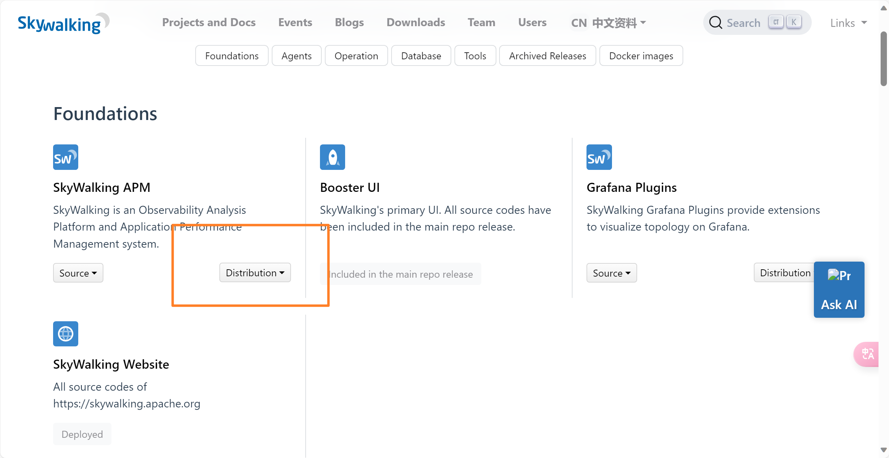
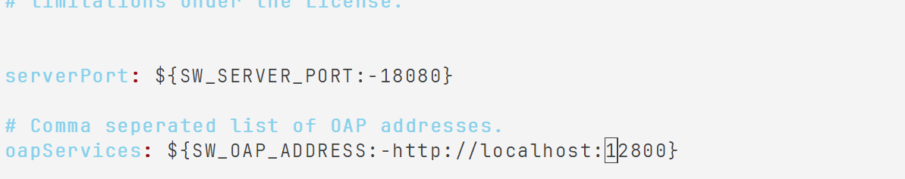
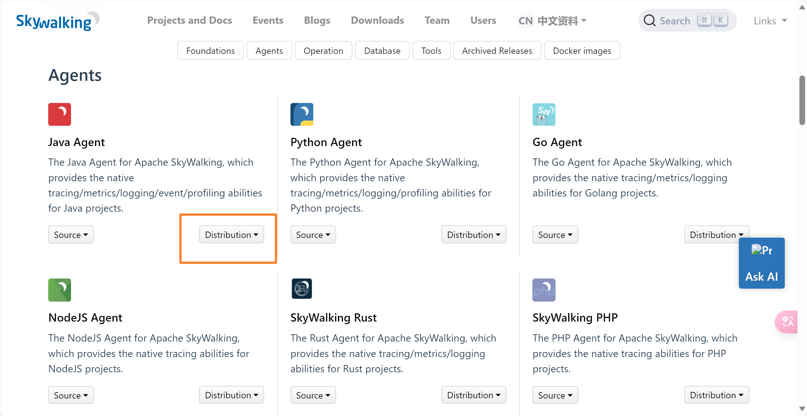
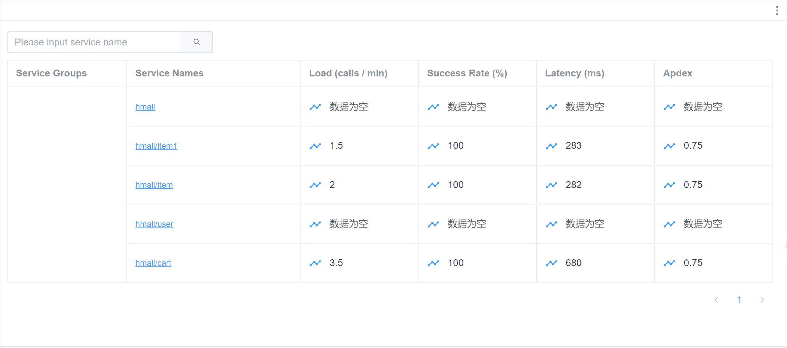
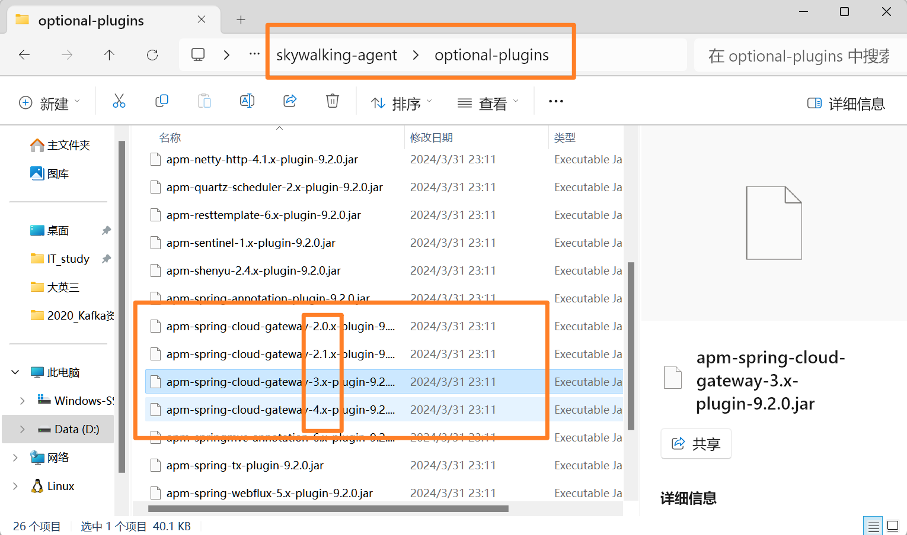
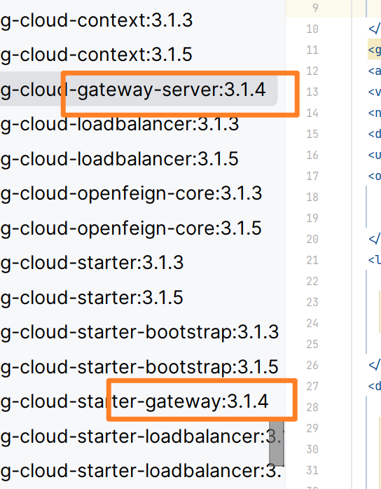
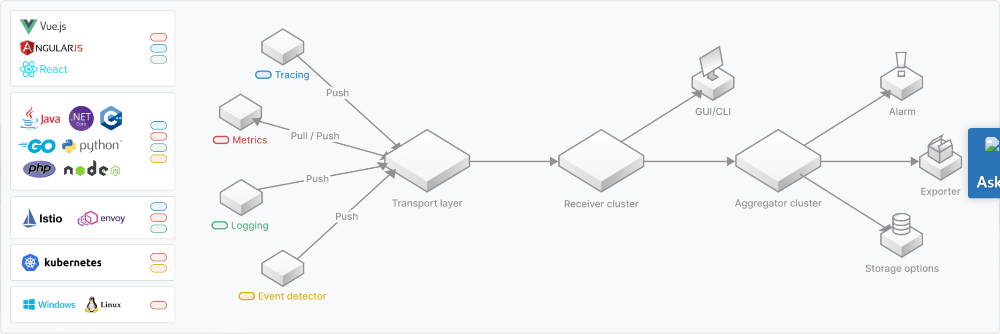

# Skywalking

-   Apache顶级项目
-   吴晟

[apache/skywalking](https://github.com/apache/skywalking?tab=readme-ov-file)

## 核心功能

-   单点指标的分析
-   拓补图
-   速度
-   依赖
-   性能优化
-   上下文传递
-   插件丰富, 探针无侵入

## 概念

-   服务
    -   一个服务对应一个功能
    -   各个服务有不同功能
    -   一组工作负载
-   服务实例
    -   一个服务可能有多个服务实例(集群, 相同功能的不同个体)
-   端点
    -   Endpoint

## 下载安装

### 部署服务端

-   Skywalking APM Distribution



```shell
tar -zxf 文件
```

需要JDK11, yum安装一下

#### 配置

`/root/skywalking/apache-skywalking-apm-bin/webapp`



#### 运行

```shell
bin/oapService.sh
```

### 部署UI界面

#### 运行

```shell
bin/webappService.sh
```

[Apache SkyWalking](http://centos:18080/General-Service/Services)

### Agent监控Springboot应用

-   Java Agent Distribution

收集数据上交服务端



配置在一个服务的IDE的VM option

```shell
-javaagent:D:\IT_study\skywalking\apache-skywalking-java-agent-9.2.0\skywalking-agent\skywalking-agent.jar
-DSW_AGENT_NAME=hmall  # 不同的服务使用不同的名字
-DSW_AGENT_COLLECTOR_BACKEND_SERVICES=centos:11800
```

gRpc的端口是11800, skywalking使用grpc做数据的上报

然后会打印一大堆日志, 然后Spring正常启动



#### 网关支持

SpringCloud+Skywalking默认不支持网关

怎么办呢?

移动插件





拷贝到plugin

### Docker

[How to use the Docker images | Apache SkyWalking](https://skywalking.apache.org/docs/main/next/en/setup/backend/backend-docker/)

还没有做一个数据卷的映射vim config/application.yml 

```shell
docker run -d \
	--name skywalking-oap \
	-p 11800:11800 \
	-p 12800:12800 \
	-e TZ=Asia/Shanghai \
    -e SW_STORAGE=elasticsearch \
    -e SW_STORAGE_ES_CLUSTER_NODES=es:9200 \
    --net=es-net \
    --restart=always \
    apache/skywalking-oap-server:9.7.0
```

```shell
docker run \
    --name skywalking-ui \
    --restart always \
    -p 8091:8080 -d \
    -e TZ=Asia/Shanghai \
    -e SW_OAP_ADDRESS=http://skywalking-oap:12800 \
    --link skywalking-oap:skywalking-oap \
    --net=es-net \
    apache/skywalking-ui:8.9.0
```

## 组件



### Agent

>   探针

做一个无侵入的增强

### OAP

分析引擎, 接收数据

查询引擎, 展示, UI界面

### 存储

默认使用自带的H2, 支持MySQL, Es等, 一般ES为其查询

### UI

## 设计目标

-   可观测性
-   拓补结构
-   轻量级
-   可插拔
-   可移植

