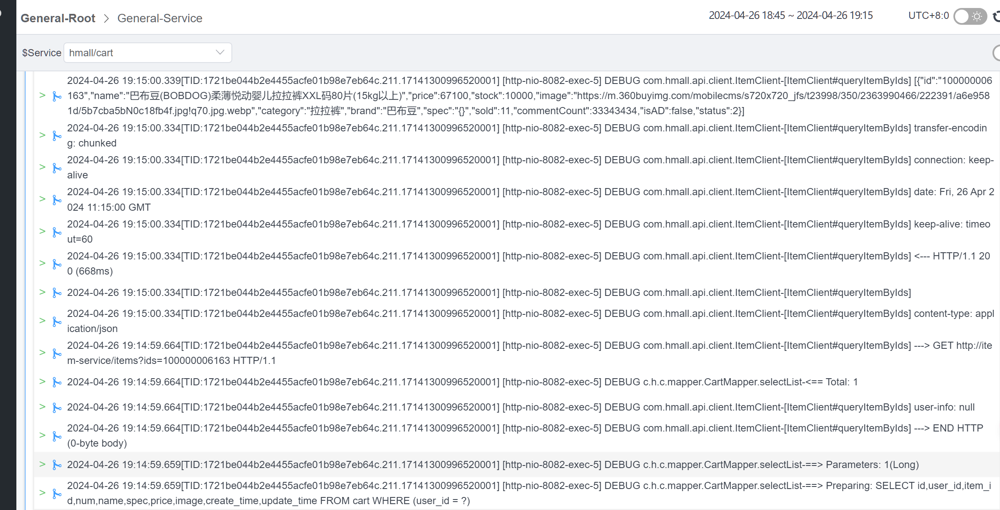

# 日志采集

服务的日志写给oap, 也能包含该服务的信息


## 引入依赖

```xml
<!--上传日志-->
<dependency>
    <groupId>org.apache.skywalking</groupId>
    <artifactId>apm-toolkit-logback-1.x</artifactId>
    <version>8.14.0</version>
</dependency>
```


## 配置`logback-spring.xml`

```xml
<?xml version="1.0" encoding="UTF-8"?>

<configuration scan="true" scanPeriod=" 5 seconds">

    <appender name="STDOUT" class="ch.qos.logback.core.ConsoleAppender">
        <encoder class="ch.qos.logback.core.encoder.LayoutWrappingEncoder">
            <layout class="org.apache.skywalking.apm.toolkit.log.logback.v1.x.mdc.TraceIdMDCPatternLogbackLayout">
                <Pattern>%d{yyyy-MM-dd HH:mm:ss.SSS}[%X{tid}] [%thread] %-5level %logger{36}-%msg%n</Pattern>
            </layout>
        </encoder>
    </appender>

    <appender name="ASYNC" class="ch.qos.logback.classic.AsyncAppender">
        <discardingThreshold>0</discardingThreshold>
        <queueSize>1024</queueSize>
        <neverBlock>true</neverBlock>
        <appender-ref ref="STDOUT"/>
    </appender>

    <appender name="grpc-log" class="org.apache.skywalking.apm.toolkit.log.logback.v1.x.log.GRPCLogClientAppender">
        <encoder class="ch.qos.logback.core.encoder.LayoutWrappingEncoder">
            <layout class="org.apache.skywalking.apm.toolkit.log.logback.v1.x.mdc.TraceIdMDCPatternLogbackLayout">
                <Pattern>%d{yyyy-MM-dd HH:mm:ss.SSS}[%X{tid}] [%thread] %-5level %logger{36}-%msg%n</Pattern>
            </layout>
        </encoder>
    </appender>

    <root level="INFO">
        <appender-ref ref="ASYNC"/>
        <appender-ref ref="grpc-log"/>
    </root>

</configuration>
```


来了



