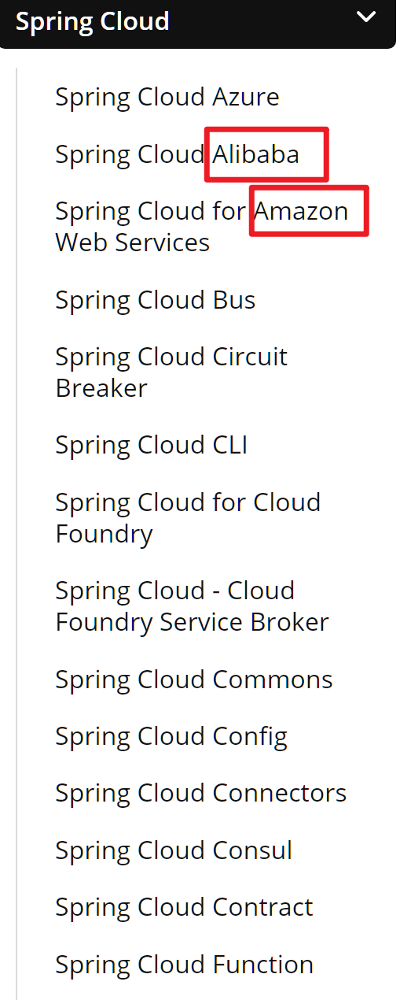
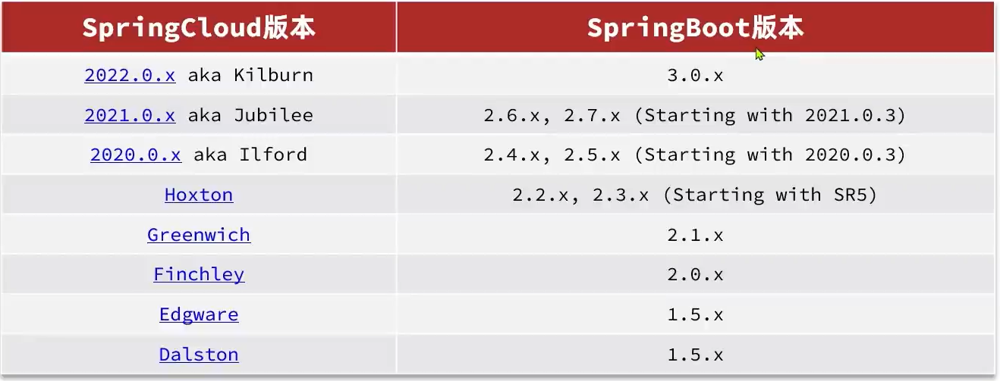

# 概念

>   微服务是一种**软件架构**风格, 它是以专注与单一职责的**很多小型项目**为基础, **组合**出**复杂的大型应用**


对于服务的拆分, 总是让我联想到maven对项目模块的拆分. 

maven的拆分是适合纵向的, 把Controller,Service,Dao才开

而微服务的拆分是横向的, 各自又自己的Controller,Service,Dao

而maven的模块调用不能解决跨模块问题,maven共享的是代码, 微服务需要共享的是信息

## 单体架构

将业务的所有功能集中在一个模块开发, 打包成一个包部署

### 特点

#### 优点

- (对小项目)简单容易

-   部署成本低

#### 缺点

-   团队协作成本高
    -   代码耦合时产生的冲突
-   系统发布效率低
    -   功能越多,代码越多, 只能一次性打包, 花个老半天
    -   改个bug, 又要花费老半天
-   系统可用性查
    -   例如多种不同性质的项目放在一台tomcat服务器上
    -   tomcat所有**精力放在**对**并发量要求很高**的查询上 ,而**没有精力**分配给**很重要**的支付功能, 岂不是本末倒置 ?

## 微服务架构

>   服务化思想指导下的一套最佳实践架构方案. 
>
>   服务化, 就是把单体架构重点功能模块拆分为多个独立的项目

### 特点

#### 优点

-   粒度小
    -   服务的原子性
        -   商品服务
        -   用户服务
        -   购物车服务
        -   交易服务
-   团队自治
    -   小团队
    -   冲突很快解决
    -   完整(开发测试)
-   服务自治
    -   分别编译
    -   分别部署

#### 缺点

-   复杂
-   跨模块复杂

### 微服务技术栈

#### SpringCloud

-   使用范围广泛
-   集成各自微服务功能组件, 并基于SpringBoot实现了这些主键的自动装配

[Spring Cloud](https://spring.io/projects/spring-cloud/)



咋回事捏? 

-   spring把这些早就存在但没火微服务架构做了**自动配置**, 开箱即用
-   spring置定接口规范, 是规则的制定者

#### 依赖版本



springboot3基于spring5, jdk必须17及以上(啊?)

所以选择


组件的版本咱办捏? 

```xml
<!-- 对依赖包进行管理 -->
<dependencyManagement>
    <dependencies>
        <!--spring cloud-->
        <dependency>
            <groupId>org.springframework.cloud</groupId>
            <!--这里是依赖版本管理👇-->
            <artifactId>spring-cloud-dependencies</artifactId>
            <version>${spring-cloud.version}</version>
            <!--<spring-cloud.version>2021.0.3</spring-cloud.version>-->
            <type>pom</type>
            <scope>import</scope>
        </dependency>
    </dependencies>
<dependencyManagement>
```

### CAP原则

>   `Consistency` `Availablity` `Partition torlerance`

-   数据的强一致性
    -   最终一致性不是CAP要求的一致性
-   可用性
    -   一定要响应(Fallback)
    -   响应超时认为不可用
-   分区容错性

不可得其三, 唯有AP, CP

