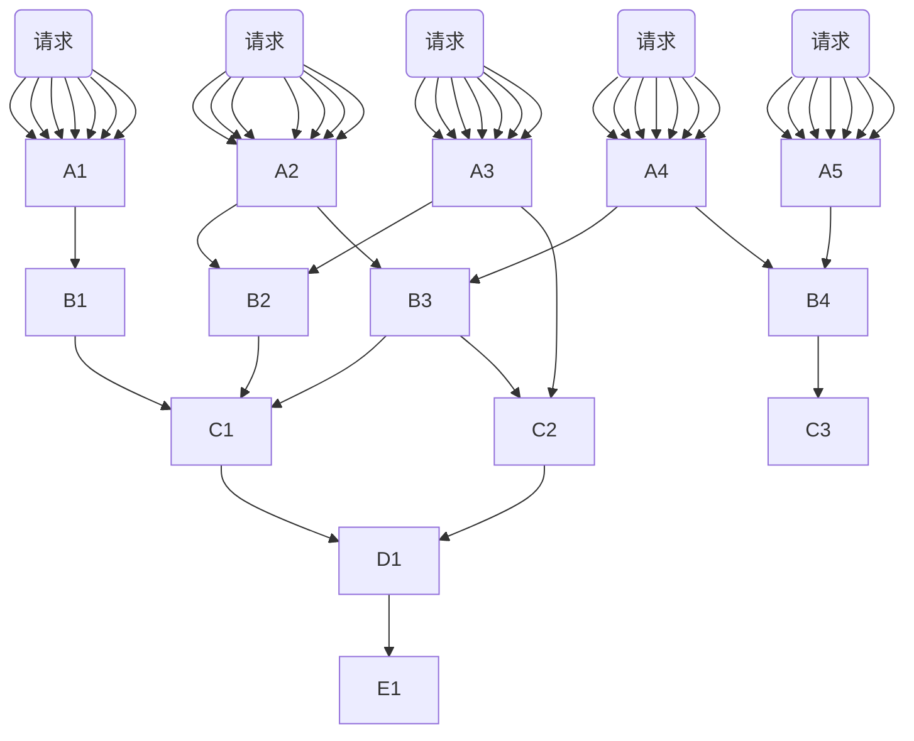

# 灾难性雪崩效应

## 服务的链式调用

在微服务中, 常常有一个服务调用其他服务, 自己又被别的服务调用的情况



## 灾难性雪崩概念

如上图

`E1`这个服务会被大量调用, `E1`所在服务器的压力就会非常大

无论是从好多请求都会调用它的角度, 还是只要其中一个服务的请求多导致这个服务也要被多次请求的角度

另一方面, 只要`E1`出现了故障, 或者, E1的响应速度比较慢, 无疑会导致连带的`A1-A4`服务皆不可用

这就导致了**灾难性的雪崩效应**

## 造成原因

1.  服务提供者( *Application Service* )的不可用
    -   硬件故障
    -   程序BUG
    -   缓存击穿
    -   并发请求量过高
2.  重试加大流量
    -   用户重试
    -   代码重试逻辑
3.  服务调用者(*Application Client*)不可用
    -   同步请求阻塞造成的资源耗尽

## 解决方案

降低影响

### 服务降级

超时降级, 资源不足时(线程或信号量) 降级

降级后可以配合降级接口返回**托底数据** , 实现一个Fallback方法

当请求后端服务出现异常的时候, 可以使用Fallback方法

保证服务出现问题, 整个项目还可以继续运行

### 熔断

当失败率(如网络故障/超时造成的失败率高)**达到阈值**自动触发降级触发熔断器

当出现熔断时, 在设定的时间内容就不再请求*Application Service*了, 直接返回托底数据

### 请求缓存

之前都是走缓存

即使出现大量请求, 也不会对依赖的服务造成大量负载

### 请求合并

在一段时间内, 有大量的请求, 将这些请求分组合并成一个, 对下层的依赖服务只发起一次请求

要求有等幂性? 或者说带一个参数表示次数, 表示这种请求做个n次? 只发起一次请求, 但是却做了多次, 有用吗? 

能利用一些批量性操作的API?

```
接收请求
根据一些统计方法
判断得知这个请求很多
然后进行合并
由于Tomcat是一个线程一个请求的
所以要合并需要自己造服务器?
或者说使用线程安全的List?
然后底层的服务全部都做成参数都是List的
这样合理吗?
```

### 隔离

线程池隔离和信号量隔离

通过判断信号量是否已满, 炒熟容量的请求直接降级, 从而**限流**

