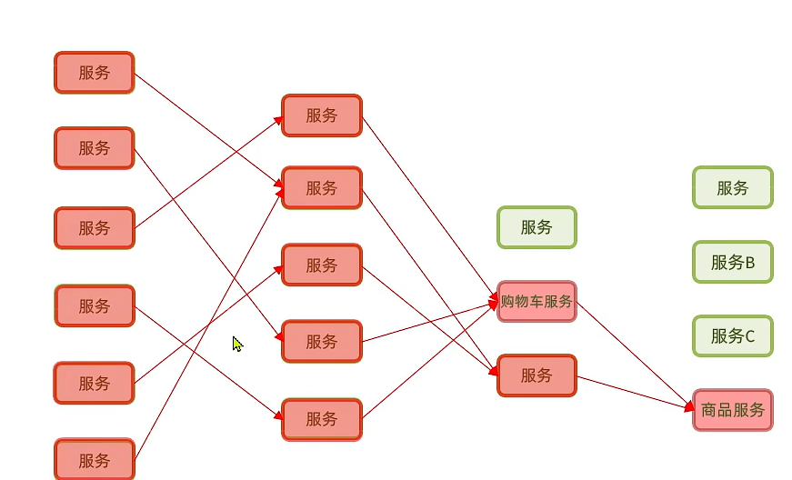
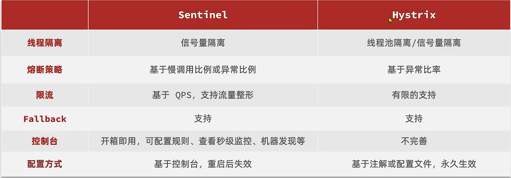

# 雪崩

## 概述

-   一个服务崩了(或者特别慢)

    

## 服务保护

### 服务降级方案

>   degrade 降级

从做限制的角度, 保护核心业务的健康

#### 请求限流

并发高, 罪孽深

-   限流器
    -   流量整形

        原本畸形的并发量, 在限流之后, 就平缓了

#### 线程隔离

>   舱壁模式

思想: 将故障隔离在一定的范围内

通过**限定每个业务能使用的线程数量**而将故障业务隔离, 避免故障扩散

但是这样还不够, 需要和**服务熔断**一起

#### 服务熔断

**断路器**统计请求的异常比例或慢调用比例, 如果超出阈值则会**熔断业务**, 拦截该接口的请求

所有请求快速失败走`fallback`逻辑

### 保护技术

-   Sentinel
    -   Alibaba
    -   流量控制断路器, 保护装置
-   Hystrix
    -   Netflex,有点淘汰了
    -   最高SpringCloud 2020
-   SpringCloudCircuitBreaker
    -   Spring出品

