# Sentinel

>   Alibaba出品, [微服务流量控制组件](https://sentinelguard.io/zh-cn/index.html)
>
>   degrade,降级

## 概述

-   核心依赖库. Sentinel客户端
-   图形化界面
-   可用于
    -   监控微服务内部的所有接口的运行情况
    -   限流规则, 熔断规则

## 安装

### 图形化界面

-   [jar包](https://github.com/alibaba/Sentinel/releases/download/1.8.6/sentinel-dashboard-1.8.6.jar)

#### 运行

-   sentinel-dashboard-1.8.6.jar有没有重命名过? 注意下

```bash
java '-Dserver.port=8090' '-Dcsp.sentinel.dashboard.server=localhost:8090' '-Dproject.name=sentinel-dashboard' '-jar' sentinel-dashboard.jar
```

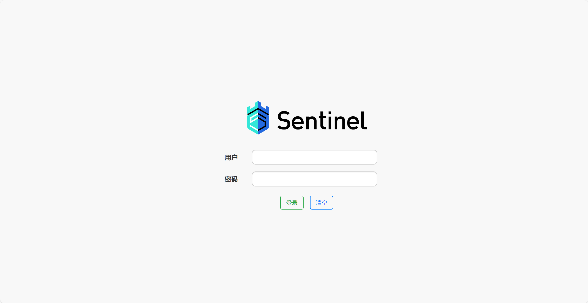

账号密码`sentinel` `sentinel`

### 引入依赖

```xml
<!--sentinel-->
<dependency>
    <groupId>com.alibaba.cloud</groupId>
    <artifactId>spring-cloud-starter-alibaba-sentinel</artifactId>
</dependency>
```

### 配置连接控制台

```yaml
spring:
  cloud:
    sentinel:
      transport:
        dashboard: localhost:8090
```

### 测试

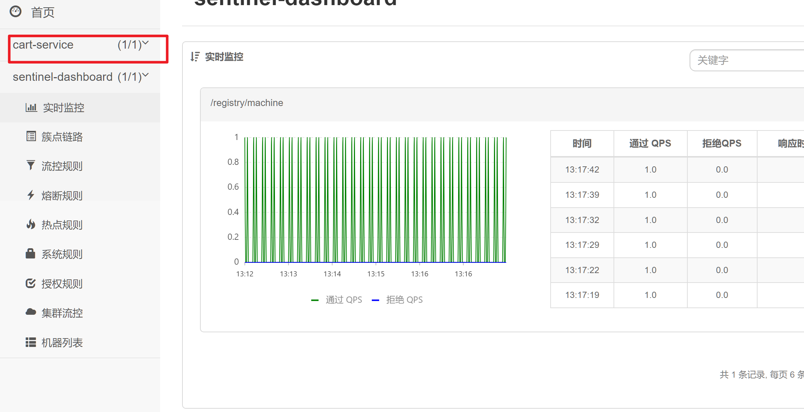

## 基本使用

### 簇点链路

-   即单机调用链路

-   一次请求进入服务后经过的每一个被Sentinel监控的**资源链**

-   默认Sentinel会监控**SpringMVC的每一个Endpoint**, 

-   限流, 熔断等都是针对簇点链路中的**资源**设置的

-   资源名默认是接口的**请求路径**

    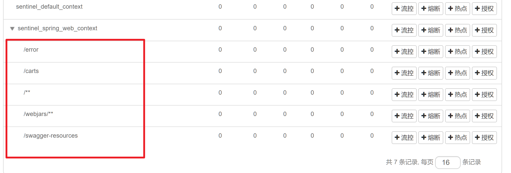

    此时, 若用Rest风格的路径请求, 则会导致无法分清**不同请求方式**Controller
    -   配置使用**请求方式和路径**作为资源名

        ```yaml
        spring:
          cloud:
            sentinel:
              http-method-specify: true
        ```

    -   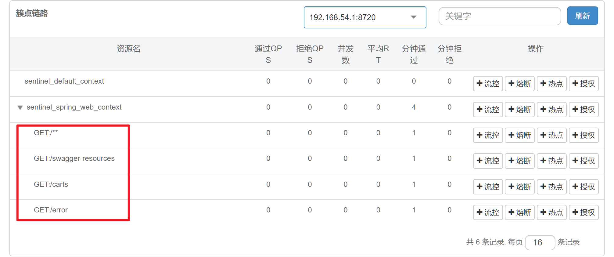


## 请求限流

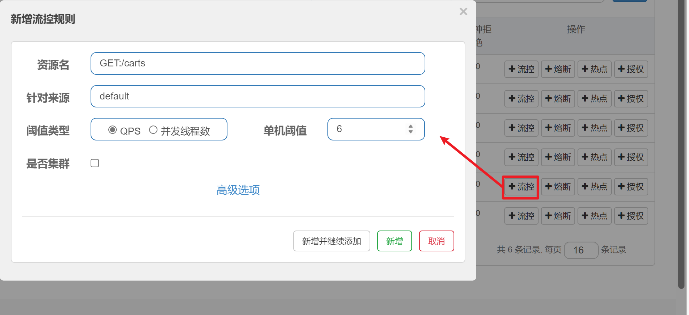

-   单机阈值: 每秒钟最多请求数

    超出阈值(2)的响应

    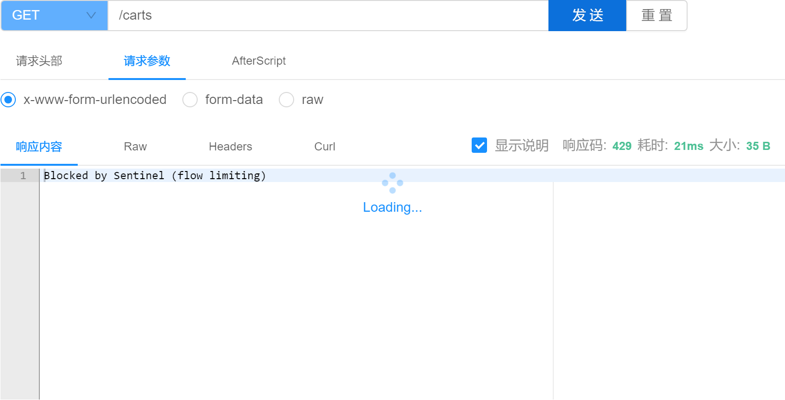

    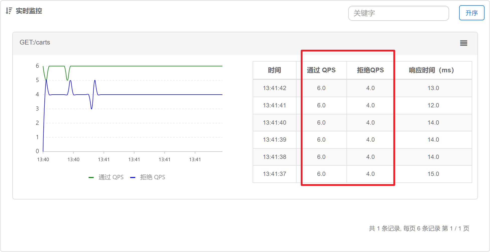

    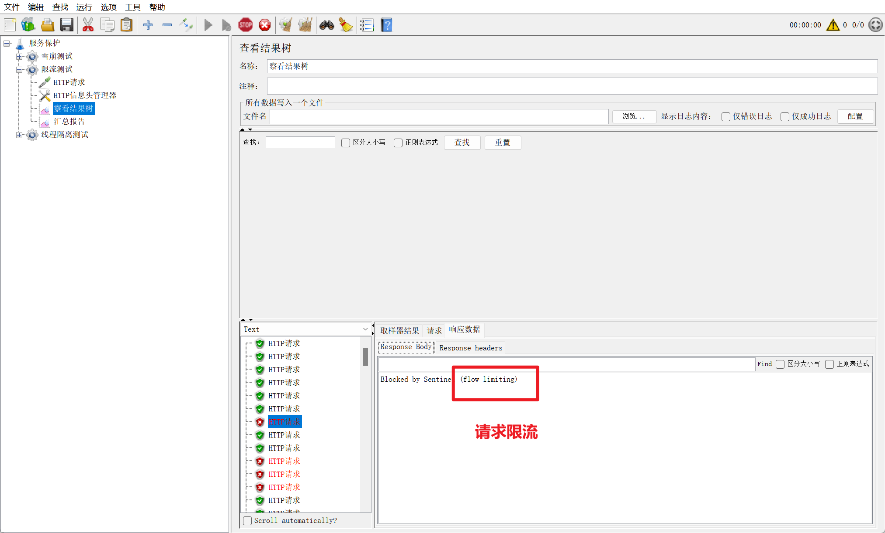


## 线程隔离


对业务做线程隔离

### Open Feign整合Sentinel

在服务调用者

```yaml
feign:
  sentinel:
    enabled: true
```


### 线程隔离规则

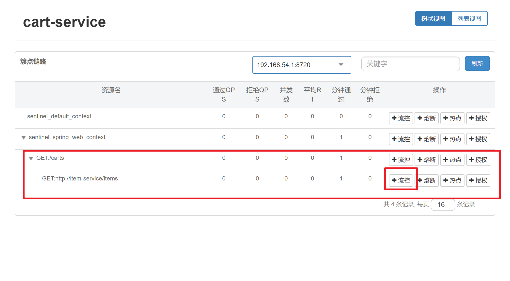

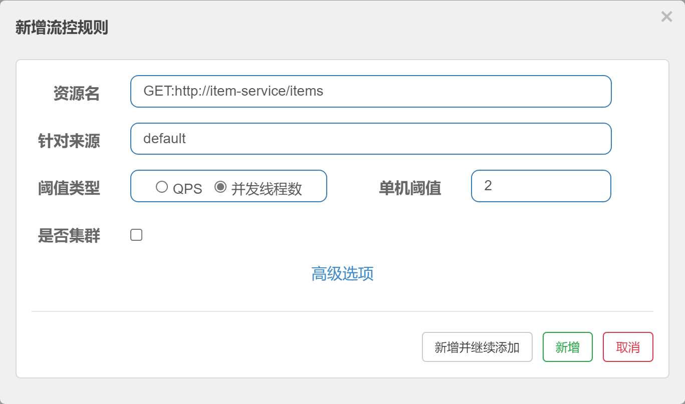

-   单机阈值, 最高线程数不超过2

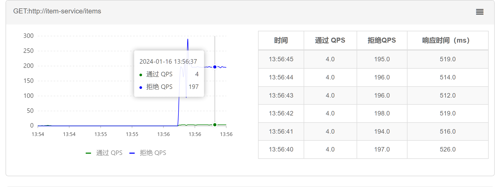

## Fallback

-   FallbackClass, 无法对远程调用的异常做处理
-   FallbackFactory, 可以对远程调用的异常做处理

### 定义FallbackFactory

```java
@Slf4j
public class ItemClientFallbackFactory implements FallbackFactory<ItemClient> {

    @Override
    public ItemClient create(Throwable cause) {
        log.debug("创建Item Client Fallback Factory");
        return new ItemClient() {
            @Override
            public List<ItemDTO> queryItemByIds(Collection<Long> ids) {
                log.error("查询商品失败", cause);
                return Collections.emptyList();//返回空集合, 防止空指针
            }
            @Override
            public void deductStock(Collection<OrderDetailDTO> detailDTOS) {
                log.error("扣减库存失败, 下单失败", cause);
                throw new RuntimeException(cause);
            }
        };
    }
}
```

### 注册FallbackFactory

注册Bean

```java
public class FallbackConfig {
    @Bean
    public ItemClientFallbackFactory itemClientFallbackFactory(){
        return new ItemClientFallbackFactory();
    }
}
```

在Client指定`FallbackConfig`

```java
@FeignClient(value = Constants.ITEM_SERVICE_NAME,
        fallbackFactory = FallbackConfig.class)// 指定FallbackConfig
public interface ItemClient {
    @GetMapping("/items")
    List<ItemDTO> queryItemByIds(@RequestParam("ids") Collection<Long> ids);
    @PutMapping("/items/stock/deduct")
    void deductStock(@RequestBody Collection<OrderDetailDTO> detailDTOS);
}
```

在启动类指定`FallbackConfig.class`

```java
@EnableFeignClients(clients = {ItemClient.class},defaultConfiguration = {ClientConfig.class, FallbackConfig.class})
@MapperScan("com.hmall.cart.mapper")
@SpringBootApplication
public class CartServiceApplication {
    public static void main(String[] args) {
        SpringApplication.run(CartServiceApplication.class, args);
    }
}
```

### 测试

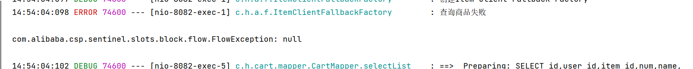

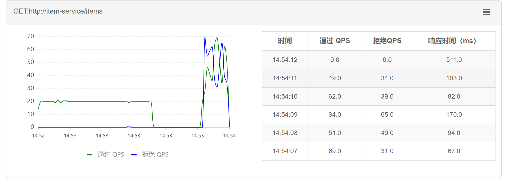


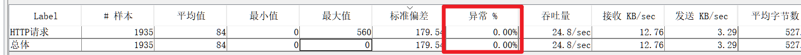

## 服务熔断

### 要求

-   在请求超出阈值之后**熔断**, **拦截一切请求**
-   在服务**恢复**时, **放行**请求


### 状态机

-   `Close`
    -   不做熔断, 不会拦截请求
    -   会统计**慢调用比例**
    -   慢调用比例达到一定值, 自动转变为状态`Open`
-   `Open`
    -   在**一定时间**内, 对一切请求做拦截
    -   **快速失败**, 启用`Fallback`
    -   **熔断时间结束**, 转变为状态`Half-Open`
-   `Half-Open`
    -   尝试放行几次请求(可配置)
    -   请求执行成功(成功率高于,可配置), 转变为状态`Close`
    -   请求执行失败(成功率低于,可配置), 转变为状态`Open`

### 熔断规则

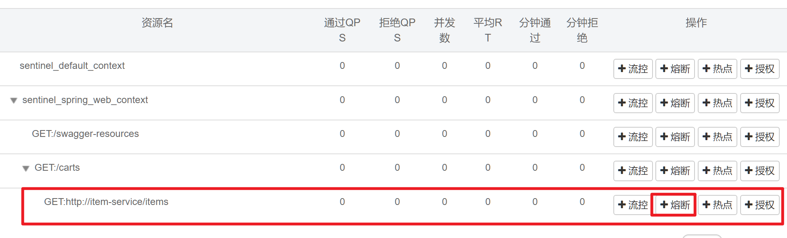

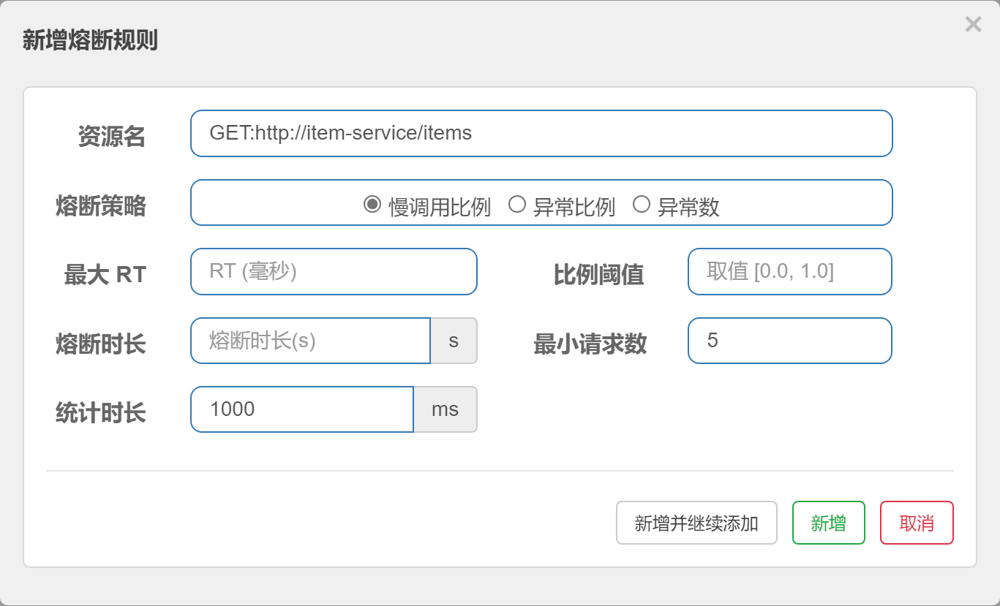


-   测试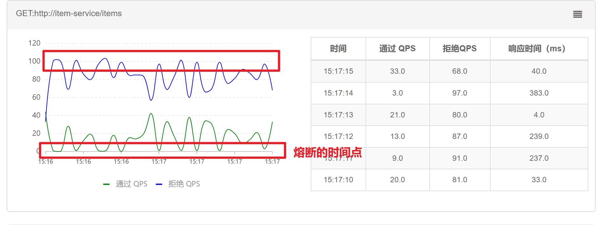

    用户友好

    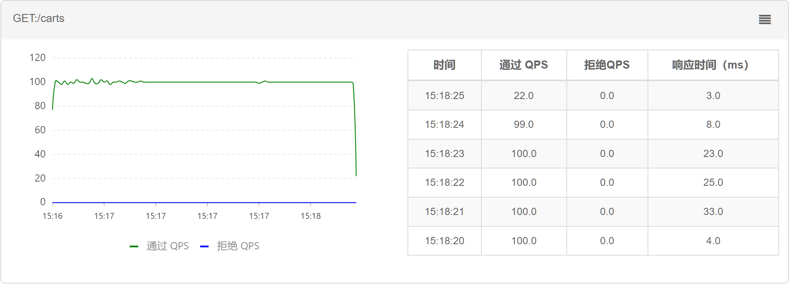

## 持久化配置

>   妈的使用付费版😓

### Nacos联合

依据Nacos的配置中心, 实现Sentinel的持久化配置

### 实现流程

#### 引入依赖

```
<!--sentinel持久化-->
<dependency>
    <groupId>com.alibaba.csp</groupId>
    <artifactId>sentinel-datasource-nacos</artifactId>
</dependency>
```

#### 在Nacos里配置

```json
{
    "resource": "GET:http://item-service/items",
    "count": 200.0,
    "grade": 0, 
    "slowRatioThreshold": 0.2,
    "timeWindow": 1
}
```

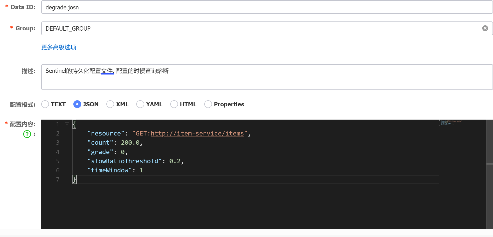

-   `resource`

    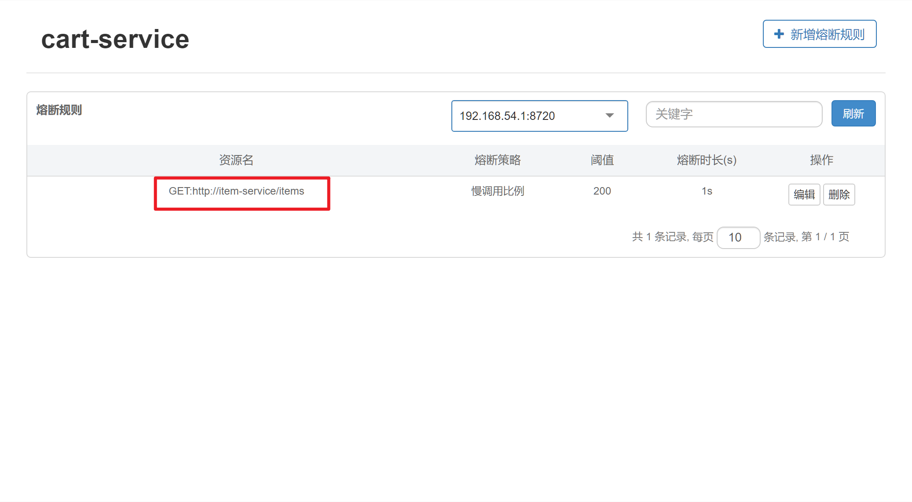

-   其余的其实是替代`application.yml`里的配置

    ```yml
    feign:
      sentinel:
        enabled: true
        rules:
          "default":
            - grade: 0 # 请求模式, 满请求比例还是异常比例等, 是一个枚举
            	# `com.alibaba.csp.sentinel.slots.block.RuleConstant.DEGRADE_GRADE_RT`
              count: 200.0 # 在响应时间的模式中, 代表最大响应时间
              timeWindow: 20 # 熔断时间
              slowRatioThreshold: 0.5 # 慢请求的比例
    ```

    `com.alibaba.csp.sentinel.slots.block.degrade.DegradeRule`

    

#### 配置(v.)Sentinel配置所在的(a.)数据源

```yaml
spring:
  cloud:
    sentinel:
      datasource:
        ds1: # 配置文件的数据源名称,随便起名
          nacos:
            server-addr: centos:8848
            rule-type: degrade
            group-id: DEFAULT_GROUP
            data-id: degrade.json
            data-type: json
```

经测试失败

