# Nacos

阿里的产品

注册中心组件

现已加入SpringCloudAlibaba全家桶套餐

## 基于Docker部署Nacos

### 准备MySQL数据表

[数据库](nacos.sql)

### Nacos的配置文件

[配置文件](custom.env)

```bash
docker run -d \
--name nacos \
--env-file ./nacos/custom.env \
-p 8848:8848 \
-p 9848:9848 \
-p 9849:9849 \
--restart=always \
nacos/nacos-server:v2.1.0-slim
```

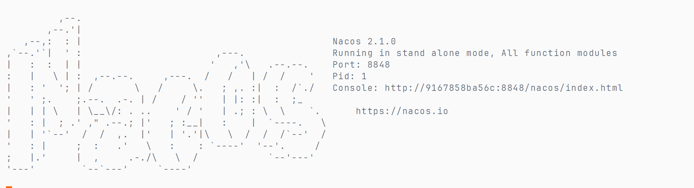


泪目

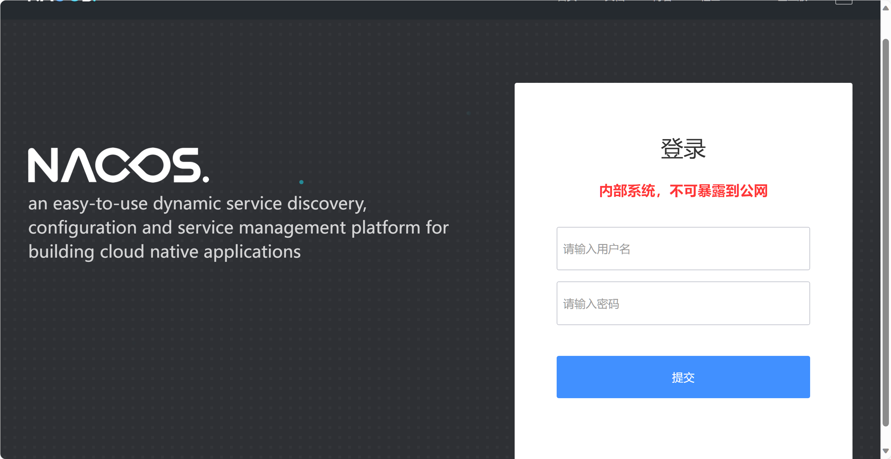

输入用户名密码

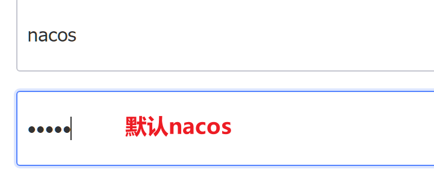

输入列表

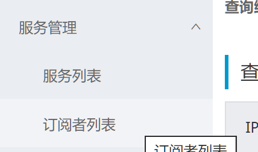

## 服务注册

### 引入Nacos依赖

-   Nacos的依赖里包含注册和调用api

```xml
<!--服务注册-->
<dependency>
    <groupId>com.alibaba.cloud</groupId>
    <artifactId>spring-cloud-starter-alibaba-nacos-discovery</artifactId>
</dependency>
```


### 配置Nacos地址

```yaml
spring:
  application:
    name: item-service
  cloud:
    nacos:
      discovery:
        server-addr: ${hm.nacos.host}:8848
```

重启后自动注册

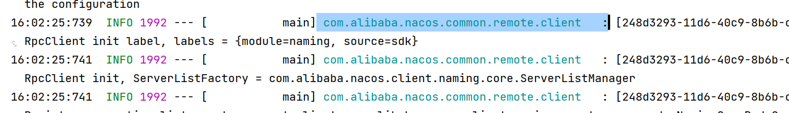

### 模拟多实例

创建新的启动项

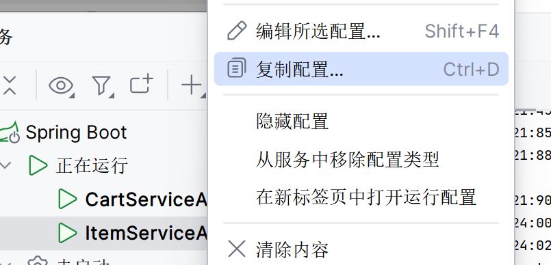

由于在同一台机器运行, 可能造成端口冲突, 所以端口得改

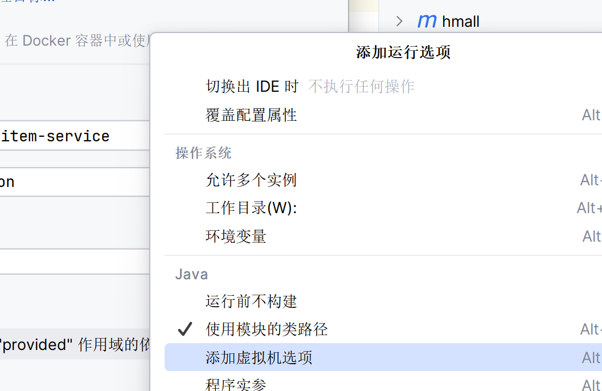


```bash
-Dserver.port=8083
```

优先级高于yaml文件

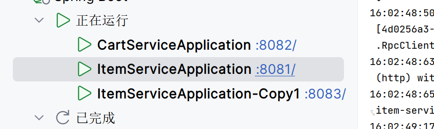

查看Nacos

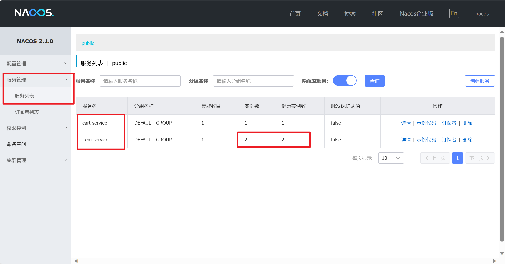

## 服务调用

调用服务,就要从nacos拉取服务的信息

### 引入依赖

已完成

### 配置nacos地址

已完成

### 服务调用

#### 获取URI

```java
@Resource
private final DiscoveryClient discoveryClient;

/**
 * 依据负载均衡获取URI, 负载均衡自定义, 参数最大索引, 返回值最终Index
 *
 * @param serviceName 服务名
 * @param strategy    负载均衡策略
 * @return 实例URI
 */
private URI getUri(String serviceName, Function<Integer, Integer> strategy) {
    // 根据服务名称, 拉取服务实例
    List<ServiceInstance> instances = discoveryClient.getInstances(serviceName);
    // 负载均衡, 挑选一个实例
    if (instances == null || instances.isEmpty()) {
        log.error("can't find service by service name: " +
                serviceName +
                " ,please check your argument"
        );
        return null;
    }
    ServiceInstance instance = instances.get(strategy.apply(instances.size()));
    return instance.getUri();
}
```

负载算法均衡见MyCat

####向服务发送请求

```java
String placeholders = "ids";// 占位符
URI uri = getUri(Constants.ITEM_SERVICE_NAME,
        RandomUtil::randomInt);// 获取路径
if(uri==null){
    return null;
}
String url = String.format("%s/items?ids={%s}", uri, placeholders);
```

### 测试

第一次

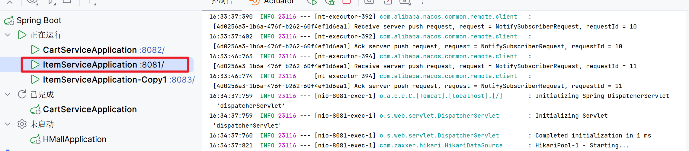

第二次

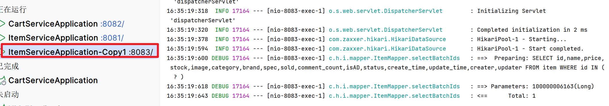

让8083挂

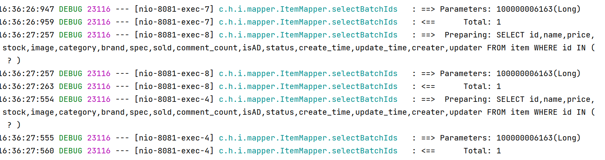

没问题

## 分级存储

### 服务分级存储模型

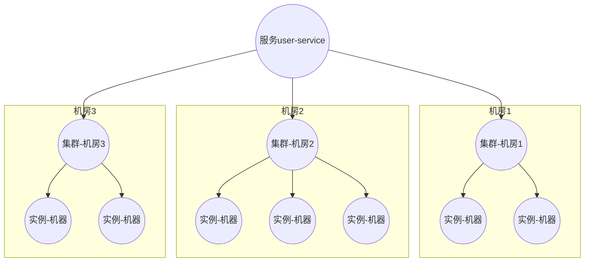


优先考虑本地集群(同一个机房), 在同一个就局域网加访问

### 配置

```yaml
spring:
  cloud:
    nacos:
      server-addr: centos:8848
      discovery:
        cluster-name: "PLACE1"
```

### 运行测试


### 分级下的负载均衡

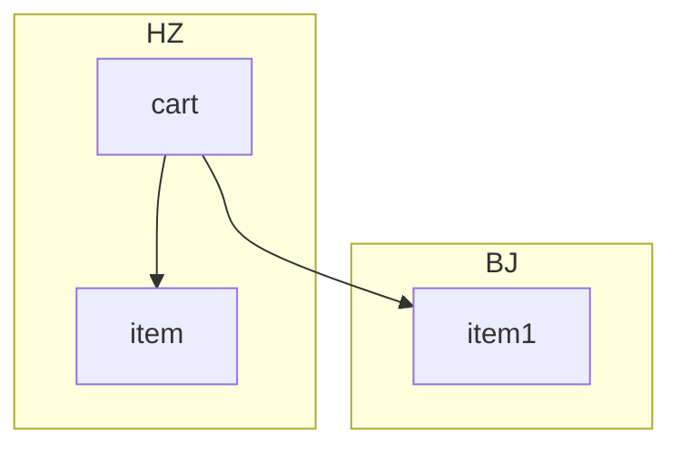

在`cart-service`下配置

```yaml
item-service:
  ribbon:
    NFLoadBalancerRuleClassName: com.alibaba.cloud.nacos.ribbon.NacosRule
```

NacosRule优先本地, 然后随机, 如果本地的宕机了, 使用远程的服务

失败, 依旧是轮询

##配置负载均衡权重


失败

权重设置成0, 用户的请求会逐渐减少, 用户无法感知, 然后就可以对系统做一个升级维护

## 环境隔离Namespace

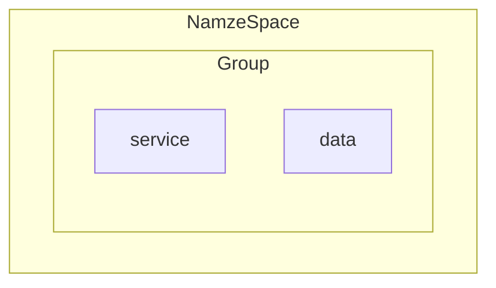

-   Namespace
    -   常用于环境(local-dev-test-deploy)划分
    -   服务跨环境不可见
    
-   Group
    -   一般依赖关系高的服务放在一起
    
    -   默认的策略是服务跨Group可见的
    
        也可以配置成跨服务不可见
    
        ```yaml
        spring:
          cloud:
            nacos:
              discovery:
                group: MY_GROUP  # 注册到指定 Group
                metadata:
                  nacos.discovery.group.selector: same  # 限制仅同 Group 可见
        ```
    
        

###新建


### 配置与使用

```yaml
spring:
  cloud:
    nacos:
      discovery:
        namespace: 38fbc4ea-907e-4bce-8abb-f4bcce9fb598 # 配置ID
```


不在一个命名空间, 就报错, 找不到该服务


在一个命名空间, 不报错


## 非临时实例

[非临时实例简述](./Day03-注册中心)

对服务器压力比较大

##配置

```yaml
spring:
  cloud:
      discovery:
        ephemeral: false # 非临时实例
```


### 删除

由于非临时实例收到Nacos保护, 很难被删除, 用一下命令删除

```shell
curl -X DELETE 'http://127.0.0.1:8848/nacos/v1/ns/instance?serviceName=cart-service&groupName=DEFAULT_GROUP&namespaceId=public&ip=192.168.54.1&clusterName=DEFAULT&port=8082&ephemeral=false'
```

失败