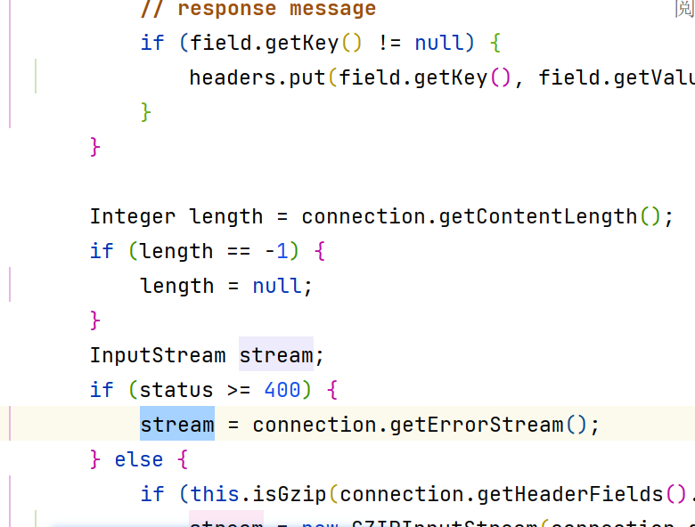
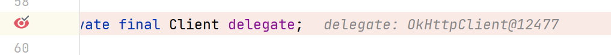

#  OpenFeign

## 现有注册中心存在的问题

```java
@Resource
private final DiscoveryClient discoveryClient;

/**
 * 依据负载均衡获取URI, 负载均衡自定义, 参数最大索引, 返回值最终Index
 *
 * @param serviceName 服务名
 * @param strategy    负载均衡策略
 * @return 实例URI
 */
private URI getUri(String serviceName, Function<Integer, Integer> strategy) {
    // 根据服务名称, 拉取服务实例
    List<ServiceInstance> instances = discoveryClient.getInstances(serviceName);
    // 负载均衡, 挑选一个实例
    if (instances == null || instances.isEmpty()) {
        log.error("can't find service by service name: " +
                serviceName +
                " ,please check your argument"
        );
        return null;
    }
    ServiceInstance instance = instances.get(strategy.apply(instances.size()));
    return instance.getUri();
}

/**
 * 依据ItemsID向item-service发送请求, 获取ItemDTO数据
 *
 * @param itemIds Item的Id集合
 * @return ItemDTO实体
 */
private List<ItemDTO> requestItemByIds(Set<Long> itemIds) {
    String placeholders = "ids";// 占位符
    URI uri = getUri(Constants.ITEM_SERVICE_NAME,
            RandomUtil::randomInt);// 获取路径
    if(uri==null){
        return null;
    }
    String url = String.format("%s/items?ids={%s}", uri, placeholders);
    HttpMethod method = HttpMethod.GET;// enum
    HttpEntity<ItemDTO> requestEntity = null;// 请求实体,对于简单请求直接为null

    // Class<ItemDTO> responseType = ItemDTO.class;单个类型可以直接用Class做参数

    // 但是由于是集合, 不能直接用泛型,类型会擦除, 也不能之列List.class, 就不知道转成了个啥了
    ParameterizedTypeReference<List<ItemDTO>> responseType =
            new ParameterizedTypeReference<>() {
            };
    // Parameterized泛Type型Reference引用
    Map<String, String> uriVariables = Map.of(placeholders, CollUtil.join(itemIds, ","));
    // hutool
    // 2.查询商品
    // 自动把Json的字符串反序列化
    ResponseEntity<List<ItemDTO>> responseEntity = restTemplate
            .exchange(url, method, requestEntity, responseType, uriVariables);
    if (!responseEntity.getStatusCode().is2xxSuccessful()){
        // 不成功
        return null;
    }
    List<ItemDTO> items = responseEntity.getBody();
    if (items==null||items.isEmpty()) {
        return null;
    }
    return items;
}
```

写这么多代码,我不乐意!

## OpenFeign简述

>   声明式Http客户端, 是SpringCloud在Eureka公司开源的Feign基础上改造而来

[github仓库](https://github.com/OpenFeign/feign)

## 使用OpenFeign

### 引入依赖

```xml
<!--OpenFeign-->
<dependency>
    <groupId>org.springframework.cloud</groupId>
    <artifactId>spring-cloud-starter-openfeign</artifactId>
</dependency>
<!--负载均衡策略器组件-->
<dependency>
    <groupId>org.springframework.cloud</groupId>
    <artifactId>spring-cloud-starter-loadbalancer</artifactId>
</dependency>
```

### 注解启用OpenFeign

`@EnableFeignClients`

```java
@EnableFeignClients
@SpringBootApplication
public class CartServiceApplication {

    public static void main(String[] args) {
        SpringApplication.run(CartServiceApplication.class, args);
    }

}
```

### 定义FeignClient

```java
@FeignClient(value = Constants.ITEM_SERVICE_NAME)
public interface ItemClient {
    @GetMapping("/items")
    List<ItemDTO> queryItemByIds(@RequestParam("ids")Collection<Long> ids);
    // 方法的返回值能通过反射获取
}
```

### 使用FeignClient

```java
@Resource
private ItemClient itemClient;

private void handleCartItems(List<CartVO> vos) {
    // 1.获取商品id
    Set<Long> itemIds = vos.stream().map(CartVO::getItemId).collect(Collectors.toSet());
    List<ItemDTO> items = itemClient.queryItemByIds(itemIds);
    ...
}
```

## 连接池

OpenFeign底层使用Client发起请求(`feign.Client.Default#convertResponse`)

从源码可以看出, OpenFeign使用的是JDK自带的发送请求的方式, 使用IO流



需要每次都创建连接, 效率极低

### Http连接池

OpenClient对Http请求做了优雅的伪装, 不过其底层发起http请求, 依赖于其他框架

-   HttpURLConnection: 默认实现, 不支持连接池
-   Apache HttpClient: 支持连接池
-   OKHttp: 支持连接池

### 使用Http连接池

#### 引入依赖

```yaml
<!--Http请求连接池-->
<dependency>
    <groupId>io.github.openfeign</groupId>
    <artifactId>feign-okhttp</artifactId>
</dependency>
```

#### 开启连接池

```yml
feign:
  okhttp:
    enabled: true
```



连接成功生效了

## 使用OpenFiegn的最佳实践

>   使用OpenClient的最佳使用方式

### 存在问题

Order需要对Item的查询, Cart需要对Item的查询

那么, 需要好几个CartItem? 

老问题: 

1.  重复编写
2.  一改全改

### 服务拆解模块

-   Item模块作为父模块, 提供三个子模块
    1.  **dto实体类**模块
        -   引用坐标
    2.  **api接口**模块
        -   **引用坐标**
    3.  **biz业务代码**模块
-   优点: 项目结构更合理
-   缺点: 项目结构变复杂了

### 新模块统一管理

-   新模块**api接口**管理
    -   所有的**实体类**,
    -   所有的**client客户端**
    -    所有的**配置类**
-   缺点: 
    -   所有的微服务都要去访问同一个api
    -   不同微服务的接口都要放在一起去维护
    -   代码耦合度增高了

### 对最佳实践方案的选择

-   一开始是单体服务, 到后来去拆开成微服务的
    -   **一开始**就在单体服务里**有了**配置类实体类, 可以改造原来的项目结构为统一管理模块
-   一开始就决定是采用微服务架构的, 

### 对的创建新模块方案的实践

#### 移动依赖

```xml
<!--服务注册-->
<dependency>
    <groupId>com.alibaba.cloud</groupId>
    <artifactId>spring-cloud-starter-alibaba-nacos-discovery</artifactId>
</dependency>
<!--OpenFeign-->
<dependency>
    <groupId>org.springframework.cloud</groupId>
    <artifactId>spring-cloud-starter-openfeign</artifactId>
</dependency>
<!--负载均衡策略器-->
<dependency>
    <groupId>org.springframework.cloud</groupId>
    <artifactId>spring-cloud-starter-loadbalancer</artifactId>
</dependency>
<!--Http请求连接池-->
<dependency>
    <groupId>io.github.openfeign</groupId>
    <artifactId>feign-okhttp</artifactId>
</dependency>
```

#### 移动启动Client注解

```java
@EnableFeignClients("com.hmall.api.client")
```

或

```java
@EnableFeignClients(clients = {ItemClient.class})
```

## 日志

### OpenFeign日志规则

>   OpenFeign只会在FeignClient所在包的日志级别为**DEBUG**时, 才会输出日志

### OpenFeign的日志级别

1.  **NONE**
    -   不记录任何日志
    -   **默认值**
2.  **BASIC**
    -   仅记录**请求的方法**(GET,POST,PUT,DELETE), **URL**以及**响应状态码**和执行时间
3.  **HEADERS**
    -   在BASIC的基础上, 额外记录了请求和**响应的头**信息
4.  **FULL**
    -   记录所有的**请求和响应信息**, 包括头信息, **请求体, 元数据**

### 注册日志级别

```java
/**
 * 注册Feign日志级别
 *
 * @author <a href="mailto:harvey.blocks@outlook.com">Harvey Blocks</a>
 * @version 1.0
 * @date 2024-01-07 21:40
 */
// 千万注意别加注解
public class ClientConfig {
    @Bean
    public Logger.Level aVoid(){
        return Logger.Level.FULL;
    }
}
```

### 声明级别生效

-   对特定客户端声明有效

    ```java
    @FeignClient(value = Constants.ITEM_SERVICE_NAME,configuration = ClientConfig.class)
    ```

-   对全局声明有效

    ```java
    @EnableFeignClients(clients = {ItemClient.class},
                        defaultConfiguration = ClientConfig.class)
    ```

### 测试

```log
21:50:22:156  INFO 5152 --- [nio-8082-exec-1] o.a.c.c.C.[Tomcat].[localhost].[/]       : Initializing Spring DispatcherServlet 'dispatcherServlet'
21:50:22:157  INFO 5152 --- [nio-8082-exec-1] o.s.web.servlet.DispatcherServlet        : Initializing Servlet 'dispatcherServlet'
21:50:22:161  INFO 5152 --- [nio-8082-exec-1] o.s.web.servlet.DispatcherServlet        : Completed initialization in 4 ms
WARNING: An illegal reflective access operation has occurred
WARNING: Illegal reflective access by com.baomidou.mybatisplus.core.toolkit.SetAccessibleAction (file:/D:/IT_study/maven/repository/com/baomidou/mybatis-plus-core/3.4.3/mybatis-plus-core-3.4.3.jar) to field java.lang.invoke.SerializedLambda.capturingClass
WARNING: Please consider reporting this to the maintainers of com.baomidou.mybatisplus.core.toolkit.SetAccessibleAction
WARNING: Use --illegal-access=warn to enable warnings of further illegal reflective access operations
WARNING: All illegal access operations will be denied in a future release
```

```log
21:50:39:305  INFO 5152 --- [nio-8082-exec-9] com.zaxxer.hikari.HikariDataSource       : HikariPool-1 - Starting...
21:50:39:850  INFO 5152 --- [nio-8082-exec-9] com.zaxxer.hikari.HikariDataSource       : HikariPool-1 - Start completed.
```

```log
21:50:39:869 DEBUG 5152 --- [nio-8082-exec-9] c.h.cart.mapper.CartMapper.selectList    : ==>  Preparing: SELECT id,user_id,item_id,num,name,spec,price,image,create_time,update_time FROM cart WHERE (user_id = ?)
21:50:39:927 DEBUG 5152 --- [nio-8082-exec-9] c.h.cart.mapper.CartMapper.selectList    : ==> Parameters: 1(Long)
21:50:40:035 DEBUG 5152 --- [nio-8082-exec-9] c.h.cart.mapper.CartMapper.selectList    : <==      Total: 1
```

```log
21:50:40:195 DEBUG 5152 --- [nio-8082-exec-9] com.hmall.api.client.ItemClient          : [ItemClient#queryItemByIds] ---> GET http://item-service/items?ids=100000006163 HTTP/1.1
21:50:40:195 DEBUG 5152 --- [nio-8082-exec-9] com.hmall.api.client.ItemClient          : [ItemClient#queryItemByIds] ---> END HTTP (0-byte body)
```

```log
21:50:40:920  INFO 5152 --- [ent-executor-21] com.alibaba.nacos.common.remote.client   : [c6ddad8a-476b-4646-b16b-ec9ce9cb8364] Receive server push request, request = NotifySubscriberRequest, requestId = 46
21:50:40:921  INFO 5152 --- [ent-executor-21] com.alibaba.nacos.common.remote.client   : [c6ddad8a-476b-4646-b16b-ec9ce9cb8364] Ack server push request, request = NotifySubscriberRequest, requestId = 46
```

```
21:50:42:028 DEBUG 5152 --- [nio-8082-exec-9] com.hmall.api.client.ItemClient          : [ItemClient#queryItemByIds] <--- HTTP/1.1 200  (1832ms)
21:50:42:029 DEBUG 5152 --- [nio-8082-exec-9] com.hmall.api.client.ItemClient          : [ItemClient#queryItemByIds] connection: keep-alive
21:50:42:030 DEBUG 5152 --- [nio-8082-exec-9] com.hmall.api.client.ItemClient          : [ItemClient#queryItemByIds] content-type: application/json
21:50:42:030 DEBUG 5152 --- [nio-8082-exec-9] com.hmall.api.client.ItemClient          : [ItemClient#queryItemByIds] date: Sun, 07 Jan 2024 13:50:41 GMT
21:50:42:030 DEBUG 5152 --- [nio-8082-exec-9] com.hmall.api.client.ItemClient          : [ItemClient#queryItemByIds] keep-alive: timeout=60
21:50:42:030 DEBUG 5152 --- [nio-8082-exec-9] com.hmall.api.client.ItemClient          : [ItemClient#queryItemByIds] transfer-encoding: chunked
21:50:42:031 DEBUG 5152 --- [nio-8082-exec-9] com.hmall.api.client.ItemClient          : [ItemClient#queryItemByIds] 
21:50:42:033 DEBUG 5152 --- [nio-8082-exec-9] com.hmall.api.client.ItemClient          :
```

```log
[ItemClient#queryItemByIds] [{"id":"100000006163","name":"巴布豆(BOBDOG)柔薄悦动婴儿拉拉裤XXL码80片(15kg以上)","price":67100,"stock":10000,"image":"https://m.360buyimg.com/mobilecms/s720x720_jfs/t23998/350/2363990466/222391/a6e9581d/5b7cba5bN0c18fb4f.jpg!q70.jpg.webp","category":"拉拉裤","brand":"巴布豆","spec":"{}","sold":11,"commentCount":33343434,"isAD":false,"status":2}]
21:50:42:033 DEBUG 5152 --- [nio-8082-exec-9] com.hmall.api.client.ItemClient          : 
```

```log
[ItemClient#queryItemByIds] <--- END HTTP (371-byte body)
```

