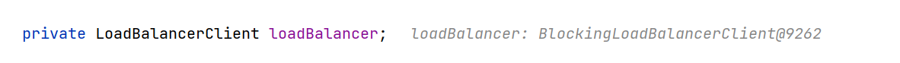
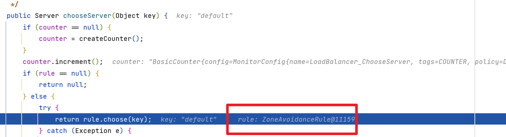
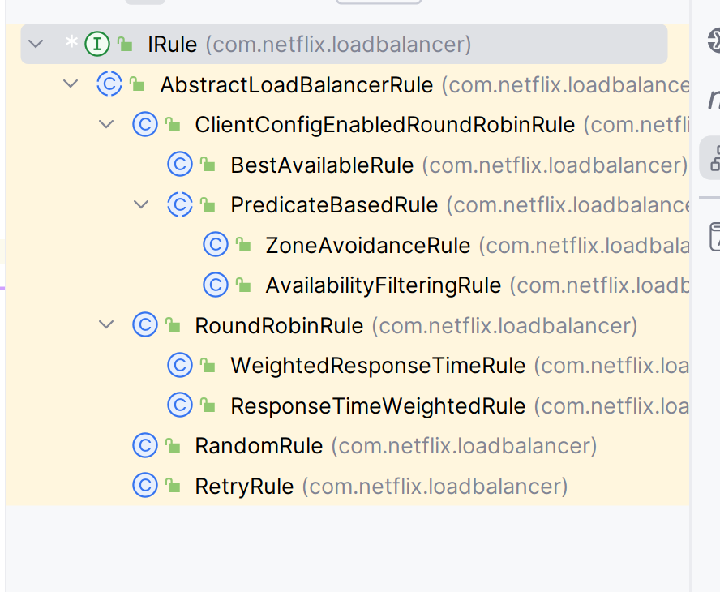

# Ribbon

```xml
<dependency>
    <groupId>org.springframework.cloud</groupId>
    <artifactId>spring-cloud-starter-netflix-ribbon</artifactId>
    <version>2.2.7.RELEASE</version>
</dependency>
```

由于Ribbon闭源了, 不和现在的SpringCloud2021.0.X及以上的版本的Eureka适配了(也可以看见上面不得不指明`version`, 说明在2021.0.X的Spring-Cloud不再支持Ribben), 具体的体现是阻碍了Eureka发现服务

直接引入原生的Ribben依赖**也不能解决问题**, 体现是依旧使用了Spring原生的负载均衡策略




```xml
<dependency>
    <groupId>com.netflix.ribbon</groupId>
    <artifactId>ribbon-loadbalancer</artifactId>
    <version>2.3.0</version>
</dependency>
```

```java
@Bean
@LoadBalanced // 负载均衡器
public RestTemplate restTemplate(){
    return new RestTemplate();
}
```


## 负载均衡原理


### 流程

1.  客户端发起请求`http://user/user`
2.  经过Ribbon负载均衡器
3.  Ribbon向Eureka服务发起请求, 获取真实HOST, PORT
4.  Eureka返回Ribbon服务列表
5.  Ribbon对服务列表负载均衡
6.  Ribben向user服务发起请求

### 源码

`org.springframework.cloud.client.loadbalancer.LoadBalancerInterceptor`

```java
@Override
public ClientHttpResponse intercept(final HttpRequest request, final byte[] body,
       final ClientHttpRequestExecution execution) throws IOException {
    final URI originalUri = request.getURI();
    String serviceName = originalUri.getHost();
    Assert.state(serviceName != null, "Request URI does not contain a valid hostname: " + originalUri);
    return this.loadBalancer.execute(serviceName, this.requestFactory.createRequest(request, body, execution)); // 服务拉取
}
```



## 负载均衡策略



-   `RoundRobinRule`

    -   简单轮询, 默认

-   `AvailablityFilteringRule`

    -   对于

        1.  默认情况下, 服务器连接失败三次, 被设置为"短路"的服务器, 且"短路"状态持续30s, 连接再次失败(再次连接失败后重试时间几何倍增长)的
        2.  并发连接数过高的

        服务器进行忽略

-   `WeightedResponseTimeRule`

    -   为每一个服务器赋予一个权重值
    -   服务器响应时间越长, 权重越小

-   `ZoneAvoidenceRule`

    -   以区域(同一个机房/机架)可用的服务器为基础进行服务器的选择
    -   使用Zone对服务器进行分类
    -   先从Zone负载均衡, 再从Zone的范围内负载均衡

-   `BestAvaliableRule`

    -   忽略短路服务器
    -   选择并发较低服务器

-   `RandomRole`

    -   随机选择可用服务器

-   `RetryRole`

    -   重试机制

### 选择负载均衡策略

在服务的消费者层面对所有的服务的提供者使用同一套负载均衡策略

```java
@Bean
public IRule randomRule(){
    return new RandomRule();
}
```

或对指定服务的提供者做负载均衡

```yaml
user: # 服务名
  ribbon:
    NFLoadBalancerRuleClassName: com.netflix.loadbalancer.RandomRule # 负载均衡规则
```

## 懒加载

在项目第一次访问时, Ribbon才会去创建LoadBalanceClient, 

创建+服务拉取+请求=>时间会很长

饥饿模式会在项目启动时创建, 降低第一次访问的耗时

```yaml
ribbon:
  eureka:
    enabled: true
    client: user # 对指定服务开启饥饿加载
```

