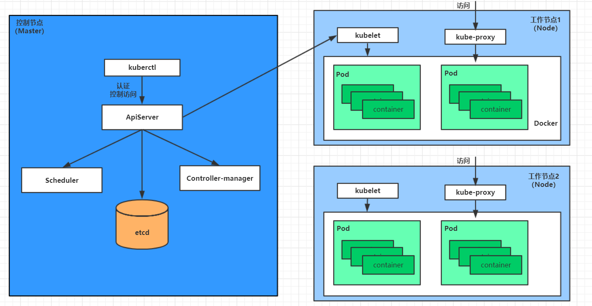

# 组件

## K8S概念

-   **Master**
    -   集群控制节点
    -   每个集群需要至少一个master节点负责集群的管控
-   **Node**
    -   工作负载节点
    -   由master分配容器到这些node工作节点上
    -   node节点上的docker负责容器的运行
-   **Pod**
    -   kubernetes的最小控制单元
    -   容器都是运行在pod中的
    -   *一个pod中可以有1个或者多个容器*
-   **Controller**
    -   控制器
    -   通过它来实现对pod的管理
    -   比如启动pod、停止pod、伸缩pod的数量等等
-   **Service**
    -   pod对外服务的统一入口
    -   维护**同一类**的多个pod, 进行负载均衡等
    -   同一类? 以`Label`为依据
-   **Label**
    -   标签
    -   用于对pod进行分类
    -   同一类pod会拥有相同的标签
-   **NameSpace**
    -   命名空间
    -   用来隔离pod的运行环境

## Master

>   集群的控制平面, 负责集群的决策

-   **ApiServer** 
    -   资源操作的唯一入口
    -   接收用户输入的命令
    -   提供认证、授权、API注册和发现等机制
-   **Scheduler** 
    -   负责集群资源调度，按照预定的调度策略**计算**任务的分配
-   **ControllerManager** 
    -   负责维护集群的状态
    -   比如程序**部署安排**、**故障检测**、**自动扩展**、**滚动更新**等
-   **Etcd**
    -   负责存储集群中各种资源对象的信息
    -   默认使用Etcd数据库
    -   可配置

## node

>   集群的数据平面，负责为容器提供运行环境

-   **Kubelet** 
    -   负责维护容器的生命周期
    -   通过**控制docker**，来创建、更新、销毁容器
-   **KubeProxy**
    -   负责提供集群内部的**服务发现**和**负载均衡**
-   **Docker**
    -   负责节点上容器的各种操作

## 各组件调用关系

以Nginx为例

1.  首先要明确，一旦`kubernetes`环境启动之后，master和node都会将自身的信息存储到`Etcd`数据库中

2.  一个nginx服务的安装请求会首先被发送到`master`节点的`apiServer`组件

3.  `apiServer`组件会调用`Scheduler`组件来决定到底应该把这个服务安装到哪个node节点上

    在此时，它会从`Etcd`中读取各个node节点的信息，然后按照一定的算法进行选择，并将结果告知apiServer

4.  `apiServer`调用controller-manager去调度Node节点安装nginx服务

5.  `kubelet`接收到指令后，会通知`docker`，然后由`docker`来启动一个nginx的`pod`

    -   `pod`是`kubernetes`的最小操作单元，容器必须跑在`pod`中至此

6.  一个nginx服务就运行了，如果需要访问nginx，就需要通过`kube-proxy`来对pod产生访问的代理

