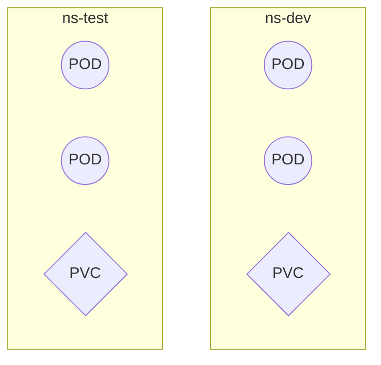

# Namespace

资源隔离

-   多套环境的资源隔离
-   多租户的资源隔离

形成逻辑组



## 默认Namespace

### Default

所有未指定NS的对象会被分配的空间

### kube-node-lease

集群节点之间的心跳维护, v1.13引入

### kube-public

此命名空间下的资源可以被任何人访问, 包括未认证用户

### kube-system

所有kubernetes系统创建的资源都处于这个命名空间

```shell
kubectl get pods -n kube-system
```

其中的pod都是组件

```shell
NAME                            READY   STATUS    RESTARTS        AGE
coredns-66f779496c-kvpnd        1/1     Running   1 (4h3m ago)    8h
coredns-66f779496c-xm4f7        1/1     Running   1 (4h3m ago)    8h
etcd-node1                      1/1     Running   2 (6h15m ago)   8h
kube-apiserver-node1            1/1     Running   2 (6h15m ago)   8h
kube-controller-manager-node1   1/1     Running   2 (6h15m ago)   8h
kube-proxy-c5wn4                1/1     Running   0               7h46m
kube-proxy-cmqf4                1/1     Running   2 (4h3m ago)    7h45m
kube-proxy-ldb8r                1/1     Running   2 (6h15m ago)   8h
kube-scheduler-node1            1/1     Running   2 (6h15m ago)   8h

```


## CRUD

### 查及ns属性

get/describe

```shell
kubectl describe ns default
```


```json
# kubectl get ns default -o json
{
    "apiVersion": "v1",
    "kind": "Namespace",
    "metadata": {
        "creationTimestamp": "2024-05-11T02:34:20Z",
        "labels": {
            "kubernetes.io/metadata.name": "default"
        },
        "name": "default",
        "resourceVersion": "41",
        "uid": "65bcf290-0570-4cca-bd40-ef5278f635e4"
    },
    "spec": {
        "finalizers": [
            "kubernetes"
        ]
    },
    "status": {
        "phase": "Active"
    }
}

```

#### status

-   `Actice`
-   `Terming` 正在删除的命名空间, ns在删除的时候会比较慢


#### 资源限制

```shell
kubectl describe ns default
```

```properties
Name:         default
Labels:       kubernetes.io/metadata.name=default
Annotations:  <none>
Status:       Active

# 资源限制
No resource quota.

No LimitRange resource.
```

`resource quota` 针对ns的资源限制

`LimitRange resource`对ns中每个组件的资源限制

### 增/删

```shell
kubectl create ns namespace-name
kubectl delete ns namespace-name
```

### 配置

```yaml
# v1? 那些组件的版本也是v1
apiVersion: v1
kind: Namespace
metadata:
  name: namespace-name
```

