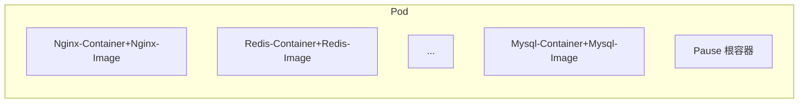

# Pod

Kubernetes集群进行**管理的最小单元**

程序运行在容器中, 容器存在Pod中

一个Pod中可以存放多个容器



集群中的组件也是以Pod的形式运行

## 组件Pod

```shell
kubectl get pod -n kube-system
```


|NAME                            |IP               |NODE   |用途   |
| ---- | ---- | ---- | ---- |
|coredns-66f779496c-kvpnd        |10.244.2.6       |node3  |DNS  |
|coredns-66f779496c-xm4f7        |10.244.2.5       |node3  |DNS  |
|etcd-node1                      |192.168.88.141   |node1  |etcd数据库持久化  |
|kube-apiserver-node1            |192.168.88.141   |node1  |ApiServer服务器, 集群入口  |
|kube-controller-manager-node1   |192.168.88.141   |node1  |Controller  |
|kube-proxy-c5wn4                |192.168.88.142   |node2  |Proxy  |
|kube-proxy-cmqf4                |192.168.88.142   |node3  |Proxy  |
|kube-proxy-ldb8r                |192.168.88.141   |node1  |Proxy  |
|kube-scheduler-node1            |192.168.88.141   |node1  |Scheduler, 请求调度  |

没有网络? 也能运行也是逆天


## CRUD

### 创建运行

Pod没有所谓"运行", 只有通过其控制器才能将其"运行"

```shell
# 控制器名
kubectl run nginx \
	--image=nignx:1.17.1 \
	--prot=80 \
	--namespace my-ns
```

