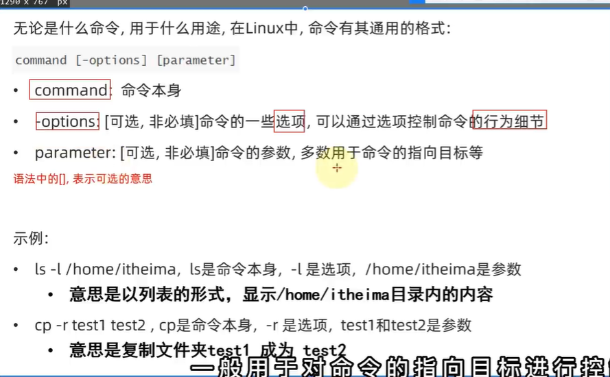

默认先会加载用户的HOME(~)目录,作为当前工作目录

路径在:/home/[username]

```Linux
cd [文件路径]
```

去到指定的文件

也可以:

```Linux
cd [工作目录下的文件(夹)名]
```

直接进入

```Linux
find
```

找到现所在文件夹下的一切文件夹和文件

``` linux
clear
^L   Ctrl+l
```

清屏

``` Linux
ls -l [文件路径]
```

-l 是选项

以列表形式显示 [文件路径] 下的内容

```bash
init 0
```

关机

```bash
init 6
```

重启

