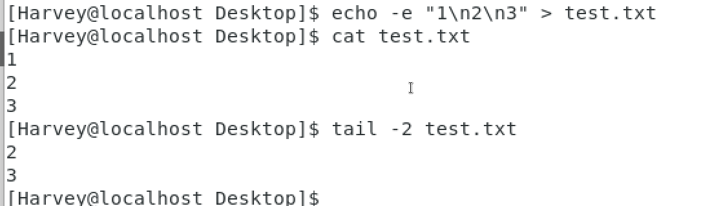

# 文件操作命令

## touch创建文件

```Linux
touch 文件路径
```

示例:

```Linux
touch test.txt
touch ~/happy/hrllo.txt
```

**在Linux中文件夹名是深色的,文件名是白色的**

**使用ls -l得到的列表的第一列,就会反映文件的属性(d啥的是文件夹,-啥的就是文件)**

##  cat查看文件内容

```Linux
cat 文件路径
```

示例:

```Linux
cat test.txt
cat ~/happy/hrllo.txt
```

直接把所有内容显示

## more查看文件

**支持翻页,适合文件内容比较多**

```Linux
more 文件路径
```

示例:

```Linux
more test.txt
more ~/happy/hrllo.txt
```

**键入space翻页,键入Q退出查看**

## tail 查看文件尾部内容

```linux
tail [-f,-num] 路径
```

- -f 表示持续跟踪(follow)文件最新更改(**很难描述,要俩linux命令界面,我不会呀qwq**)
  - -f 可用ctrl+c (**^C**)强制停止
- -num 查看文件末尾的多少行,缺省则10行

### 示例:



## cp 复制文件(夹)

copy

```Linux
cp [-r] 被复制文件(夹)路径 目标文件路径(还要给他重命名下)
```

- -r 表示递归,在复制**文件夹**的时候使用

```Linux
cp text.txt test.txt
cp -r ../../games Desktop/MyGame
```

## mv移动文件(夹)

move

```Linux
mv 被移动文件(夹)路径 目标文件路径(还要给他重命名下)
```

```Linux
mv ../../games Desktop
```

### 目标不存在,mv就相当于一个改名的效果

```Linux
mv text.txt test.txt
```

## rm删除文件(夹)

remove

```Linux
mv [-r][-f] 指定删除文件(夹)1路径 指定删除文件(夹)2路径....指定删除文件(夹)N路径
```

- -r表示递归,用于删除文件夹(也可以删文件)

- -f表示force强制删除文件,而不会弹出提示信息

  - 普通用户删除内容不会弹出提示
  - 只有root管理员删除内容才会有提示
  - 一般用户用不到-f

- rm命令支持通配符*:

  ```linux
  mv -r test*
  ```

  可以删除text1 test2 testx...

### 注意

  rm很危险,特别是处于root用户的时候,要谨慎使用

  如下命令,千万不要在root管理员下使用:

  ```Linux
  re -rf /
  re -rf /*
  ```

