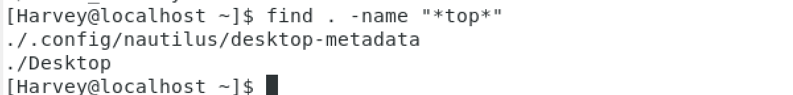
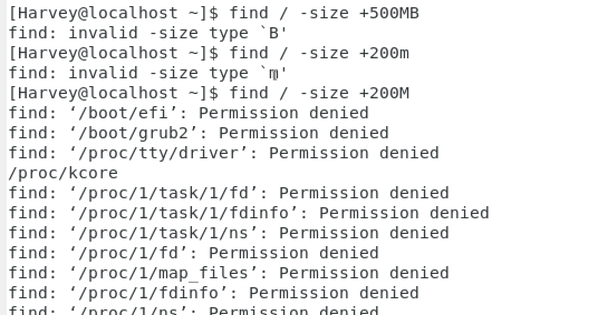

# witch命令程序文件查找

命令的本质是命令程序(类似于可执行文件.exe)

```LInux
witch 命令
```

返回命令文件的绝对路径

# find查找文件

### 通过文件名查找

```Linux
find [起始路径] -name "fileName"
```

- 存在权限限制
- 起始路径不写默认**工作目录为起始路径**,返回**相对路径**
- 起始路径写了返回**绝对路径**(尊嘟假嘟0.o)
- fileaName不写

**fileName可以用通配符*匹配**



### 通过内存大小查找


```Linux
find 起始路径 -size [+,-]n[k,M,G]
```

- +-表示大于小于
- n表示内存大小数字
- kMG分别表示(KB,MB,GB)

示例:

```Linux
查找小于10KB文件,k要小写!!!!!!!!!!:find / -size -10k
查找大于100MB文件:find / -size +100M
查找大于1GB文件:find / -size +10G
```



