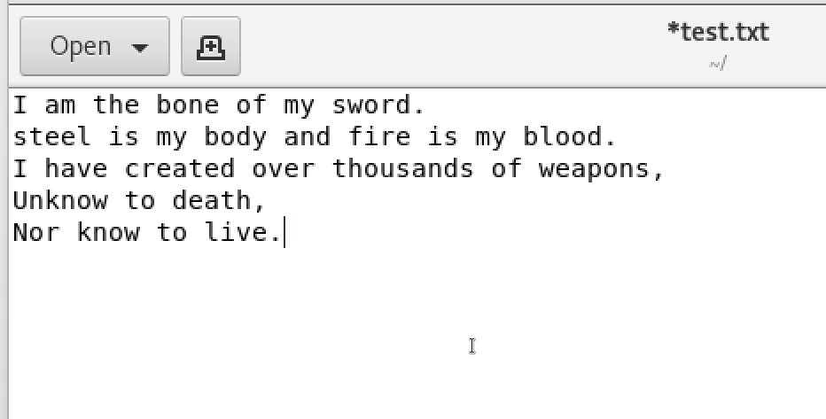
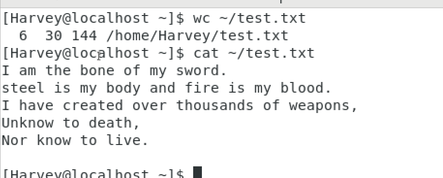
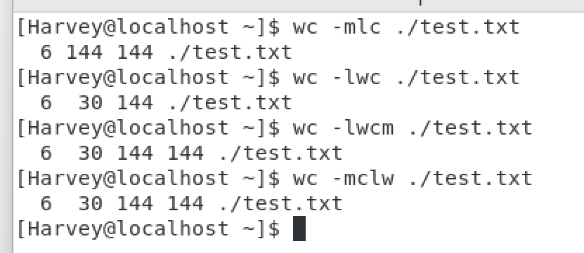

# wc命令

## 语法

```Linux
wc [-c][-m][-l][-w] 文件路径
```

- -c 统计bytes字节数量
- -m 统计字符数量
- -l (line) 统计行数
- -w (word)统计单词数量
- 文件路径.必填,表示要过滤内容的文件路径,**可作为内容的输入端口**


## 示例




```Linux
wc ~/test.txt
```




- 6:行数
- 30:单词数
- **字节**数
- 文件绝对路径




- 雷打不动的输出顺序:
  - line word [字节大小?字符个数?] (分不出来)

