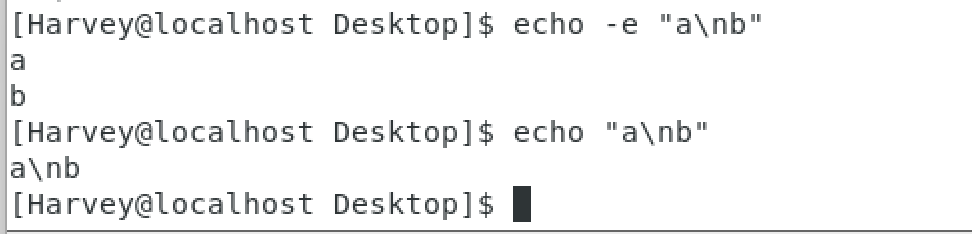

# echo命令输出内容

## 语法

```Linux
echo [-e] 输出的内容
```

- -e 翻译**转义字符(\t\n等)**

- 为了保证安全,防止误导(例如 :echo hello linux.误认为两个参数)

```linux
echo "输出的内容"
echo '输出的内容'
```

加上双引号


### 示例



如果想echo内容为 你"好，下面是2中方法

```linux
echo "你\"好" 
echo '你"好'
```


## 反引号`

需求:想用echo输出pwd的内容,而不是输出"pwd"

```linux
echo pwd
>>>pwd
echo `pwd`
>>>/home/Harvey
```

语法:

```linux
ech `命令`
```

## 重定向符号

### >语法

```linux
命令>文件
```

将左侧命令的结果,**覆盖**写入到>右侧指定文件中

### >>语法

```linux
命令>>文件
```

将左侧命令的结果,**追加**写入到>右侧指定文件中

### 示例:

```linux
echo -e 'hello\n' > test.txt
echo -e "要输出的内容:\n`ls -lah /usr/bin`" >> test.txt  
```

