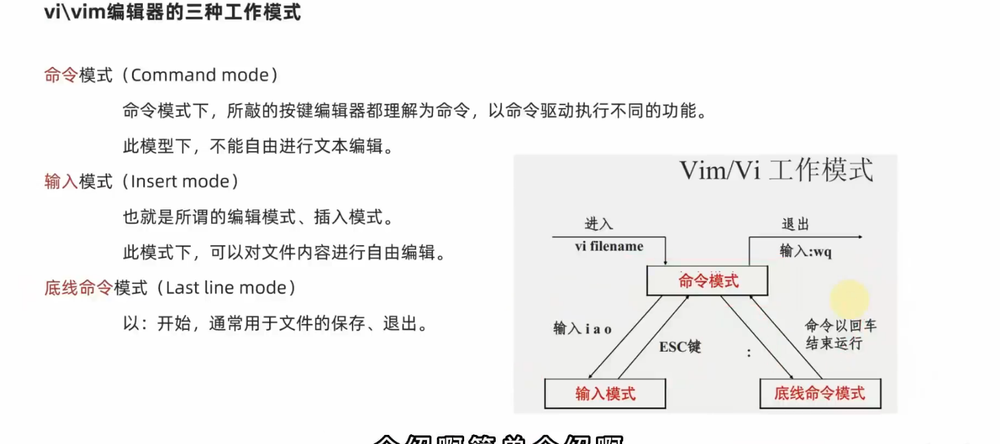
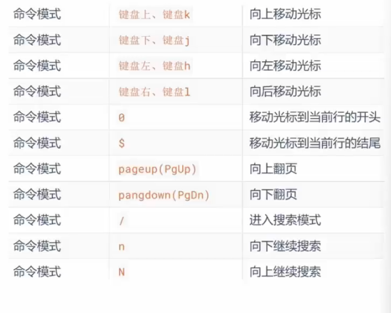
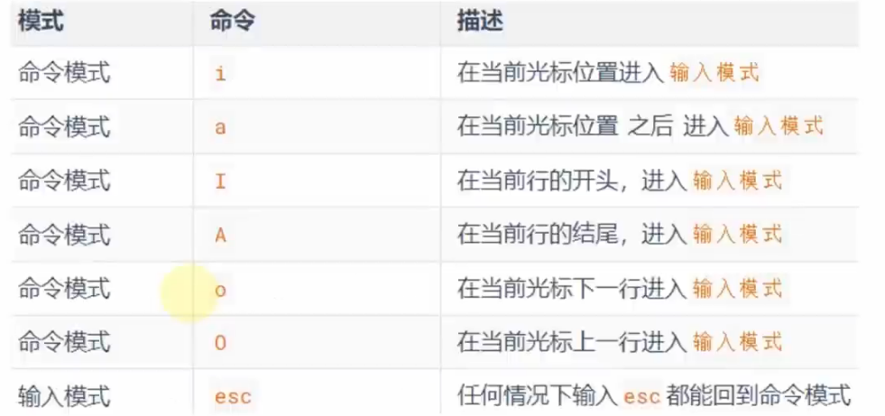
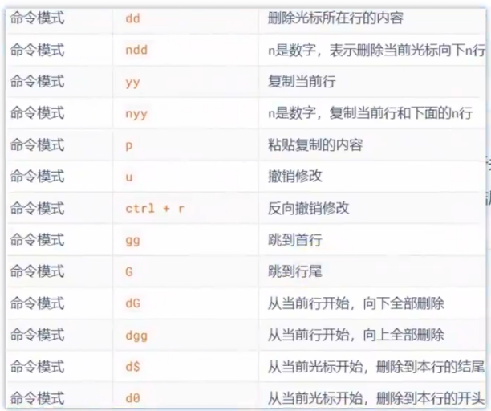
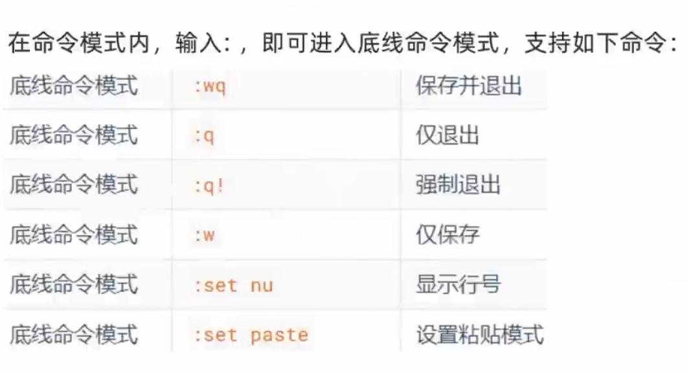

# 文本编辑器vi/vim

- vi/vim是针对命令行下对文本进行编辑的

- vim是vi的加强版,兼容vi所有指令,具有shell**程序编辑**功能,可以用高亮**辨别程序正误**

## 语法

```linux
vim 文件路径
vi 文件路径
```

- 如果文件不存在将创建一个新的文件

### vi/vim的三种工作模式



### 命令模式(Commond Mode)

上下左右/jkhl改变光标位置



i键 ->  在当前光标          转输入模式

a键 -> 在当前光标 之后 转输入模式

o键 -> 转输入模式



: 键-> 转底线命令模式

y键+y键->复制

p键->粘贴

d键+d键->删除

u键->撤销



- d$ 删除到本行结尾

### 输入模式(Insert Mode)

Esc->任意情况下返回命令模式

### 底线命令模式(Last Line Mode)

输入wq(w->保存q->退出)



