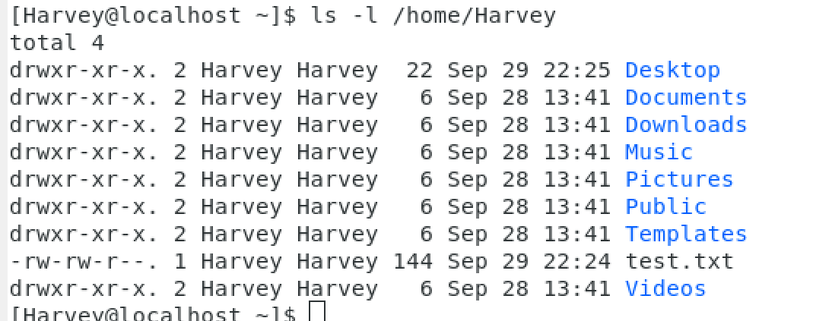
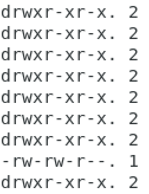
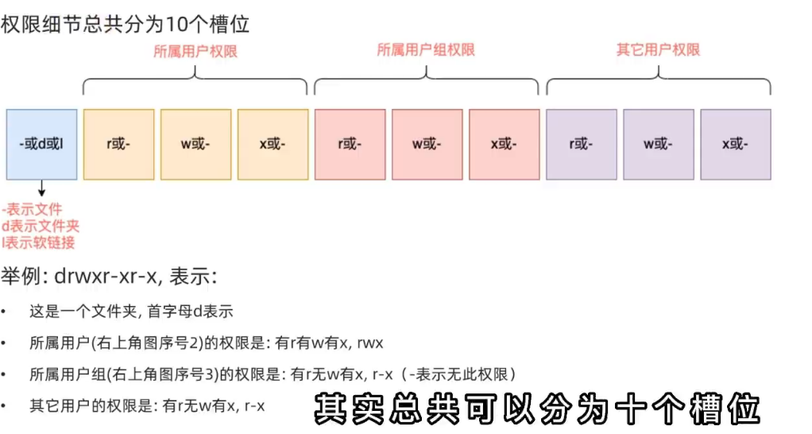

# 查看权限信息

通过`ls -l`查看文件信息,显示权限细节



- 信息

  ```Linux
权限控制信息 所属用户 所属用户组 创建时间 名
  ```

## 看懂权限控制信息






### 文件属性位

- -表示文件
- d表示文件夹
- l表示软链接

### 所属用户/所属用户组/其他用户权限位

- -表示没有该(r/w/x)权限
- r读(read)
  - 对于文件夹,即表示可使用ls命令查看其信息
- w写(write)
  - 对于文件夹,即可对文件夹内文件内创建,删除,改名
  - 如果没有w权限,那么会在保存的那一刻被阻止
- x执行(execute),举个例子:如果没有x权限,r也没有意义
  - 对于文件夹,即表示可使用cd命令进入

