# 主机状态

## 查看资源占用

-   查看CPU, 内存占用情况, 类似于windows 的资源管理器

    ```bash
    top 
    ```

    默认**每5s刷新一次** ,按**q或CTRL+C**关闭

    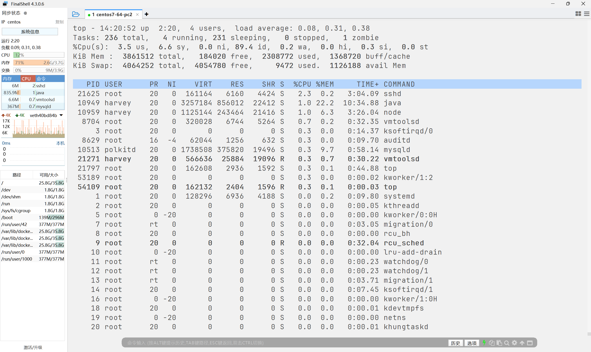

### 五行置顶信息

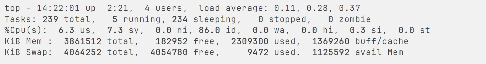

-   第一行
    -   `top`:命令名称
    -   `14:22:01`:当前系统时间
    -   `up 2:21`: 系统启动时间, 启动了2小时21分钟
    -   `4 users`: 四个用户登录?????啊?
    -   `loadaverage: 0.11,0.28, 0.37 `: 1 , 5 , 15 分钟平均负载
        -   平均负载为`1`, 可以认为有一颗CPU百分百繁忙
        -   平均负载为`4`,  可以认为有四颗CPU百分百繁忙

-   第二行
    -   `Tasks: 239 total`: 共计进程数
    -   `5 running` : 进程运行数
    -   `234 sleeping`: 进程睡眠数
    -   `0 stop` : 进程停止数(表示由异常而停止的进程)
    -   `0 zombie`: 0个僵尸进程(表示由异常而进入僵尸状态的进程, 我也不知道僵尸状态是啥, 不过大概猜以下吧? )

-   第三行 `%Cpu(s)`: CPU使用率
    -   `6.3us`: 用户对CPU使用率
    -   `7.3 sy`: 系统CPU使用率
    -   `0.0 ni`: 高优先级进程占用CPU时间占比
    -   `86.0 id`: 空闲CPU率
    -   `0.0 wa`: IO等待CPU占用率
    -   `0.0 hi`: CPU硬件中断率
    -   `0.3 si`: CPU软件中断率
    -   `0.0 st`: 强制等待CPU占用率

-   第四行`KiB Mem`物理内存
    -   `KiB`是KB单位
    -   `3861512 total`: 总量
    -   `182952 free`: 空闲
    -   `2309300 used`: 使用
    -   `1369260 buff/cache`: buff和cache缓存占用

-   第五行`KiB Swap`虚拟内存/交换空间(很难用完, 所以很少看)
    -   `4064252 total`: 总量
    -   `4054780 free`: 空闲
    -   `9472 used`: 使用
    -   `1125592 avail Mem`: 还有几个可用

### 列表信息

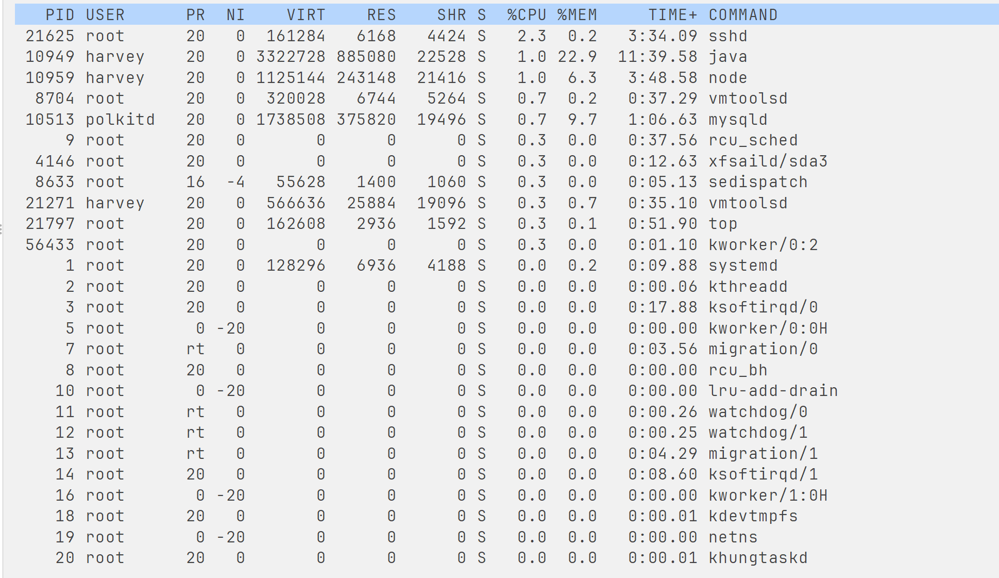

-   `PID` : 进程ID
-   `USER` : 进程所属用户
-   `PR` : 进程优先级, 越小越高
-   `NI` : 负表示高优先级, 正表示低优先级 
-   `VIRT` : 进程使用虚拟内存, 单位KB
-   `RES` : 进程使用物理内存, 单位KB
-   `SHR` : 进程使用共享内存, 单位KB, 指的是该程序依赖的第三方库占用的内存, 程序的真实使用内存应该是`RES`-`SHR`
-   `S` : 进程状态
    -   `S` : 休眠
    -   `R` : 运行
    -   `Z` : 僵死
    -   `N` : 负数优先级
    -   `I` : 空闲状态
-   `%CPU`
-   `%MEM`
-   `TIME+`: 使用CPU时间总计
-   `COMMAND`

### 选项

-   `-p`

    -   只显示某个进程的选项

-   `-d`

    -   设置刷新时间
    -   单位s
    -   支持小数
    -   **缺省5s**

-   `-c`

    -   显示生产进程的完整命令
    -   **缺省是进程名**

-   `-n`

    -   置顶刷新次数

-   `-b`

    -   以非交互**非全屏**模式运行, 以批次方式执行top

        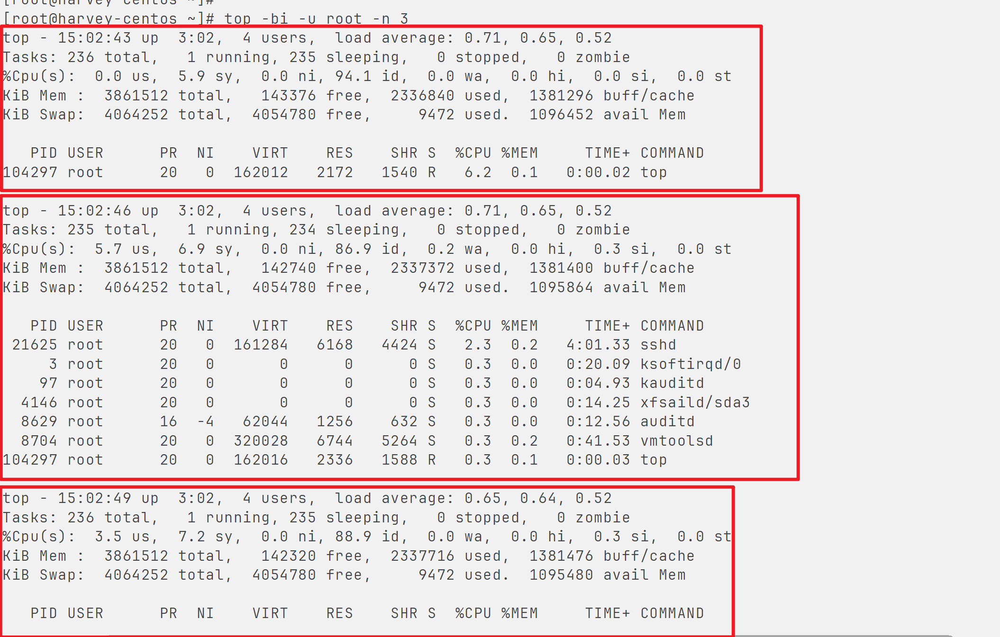

    -   一般配合 `-n` 指定输出几次统计信息, 将输出重定向到指定文件

        例如:

        ```bash
        top -b -n 3 > /tmp/top.tmp
        ```

-   `-i`

    -   不显示任何闲置(idle)或无用(zombie)的进程

-   `-u`

    -   查找特定用户启动的进程

### 交互式选项

`-b`选项那条说啥? 

以**非交互**非全屏模式运行, 以批次方式执行top

那不加`-b`就是以交互式的方式运行的, 就有一些按键进行控制

-   `h` 键

    -   显示帮助画面
    -   `q`键退出帮助画面

-   `c` 键

    -   显示产生进程的完整信息

    -   等同 `-c` 选项

    -   再次按下`c`键, 变回默认显示

-   `f` 键

    -   显示需要展示的项目

        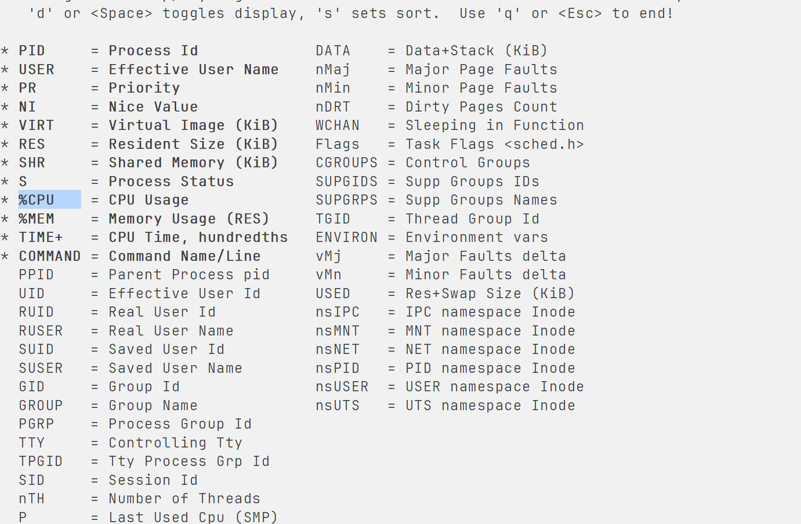

        前面有`*`的是会显示的字段

        在所在位置按`space` , 就可以让其不显示/显示

        按`q`键退出

-   `M` 键

    -   根据主流内存大小(RES)排序

-   `P` 键

    -   根据CPU使用百分比大小排序

-   `T` 键

    -   根据时间/累计时间排序

-   `E` 键

    -   切换顶部内存显示单位

-   `e` 键

    -   切换进程内存显示单位

-   `l` 键

    -   切换显示平均负载和启动时间选项

-   `i` 键

    -   不显示限制或无用的进程

    -   等同 `-i` 选项

    -   再次按下`i`键, 变回默认显示

-   `t` 键

    -   切换显示CPU状态信息

-   `m` 键

    -   切换显示内存信息

    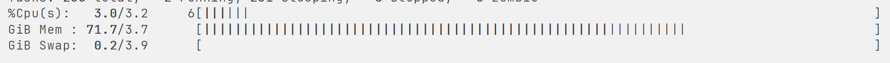

## 磁盘信息监控

查看硬盘使用情况

```bash
df [-h]
```

-   `-h` 以更人性化的单位显示

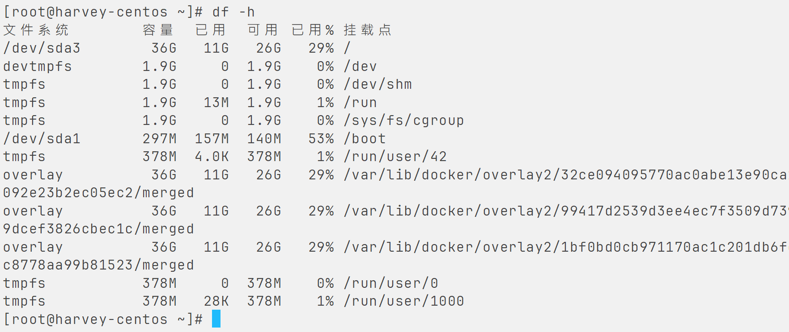

查看CPU, 磁盘的相关信息

```bash
iostat [-x] [刷新间隔秒数] [刷新次数]
```

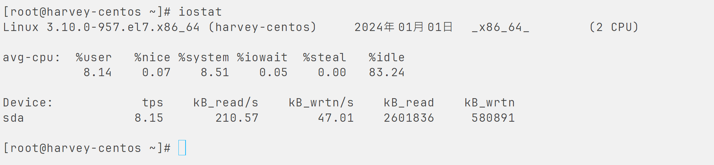

`tps`表示设备每秒的传输次数

-   `-x` 显示更多信息

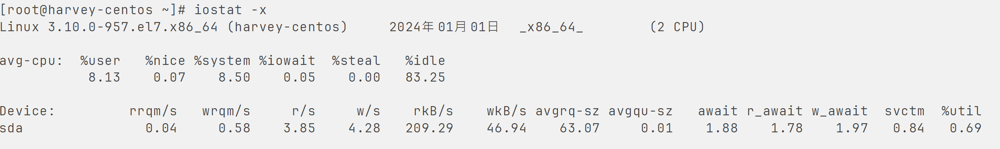

`rKB` 每秒发送到设备的读取请求数

`wKB` 每秒发送到设备的写入请求数

`%util` 磁盘利用率

## 网络状态监控

sar命令查看网络的相关统计

```bash
sar -n DEV [刷新间隔] [查看次数]
```

`-n`查看网络

`DEV`查看网络接口

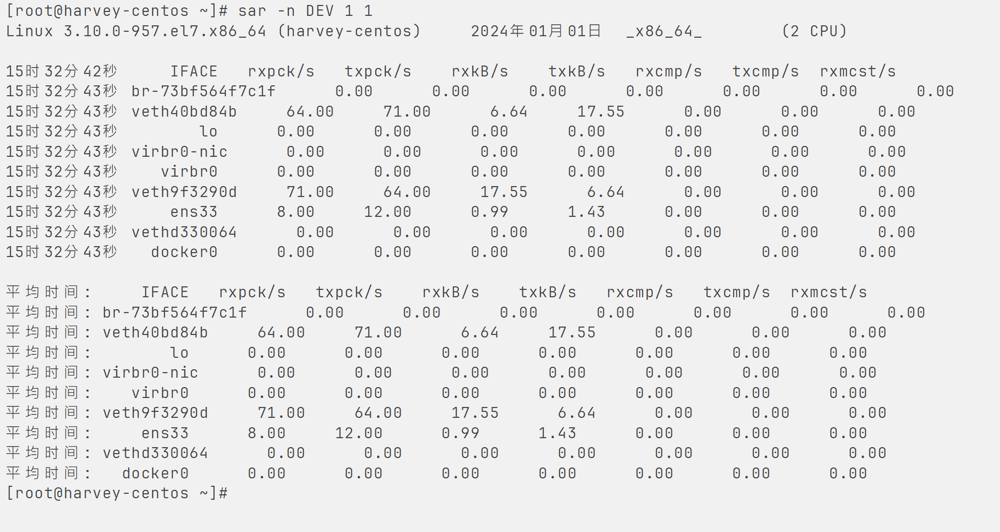

-   `IFACE` 

    本地网卡接口名称

-   `rxpck/s`

    接收的数据包数/s

-   `txpck/s`

    发送的数据包数/s

-   `rxKB/s`

    接收的数据包大小/s

-   `txKB/s`

-   `rxcmp/s`

    接收的压缩数据包/s

-   `txcmp/s`

-   `rxmcst/s`

    接收的多播数据包/s

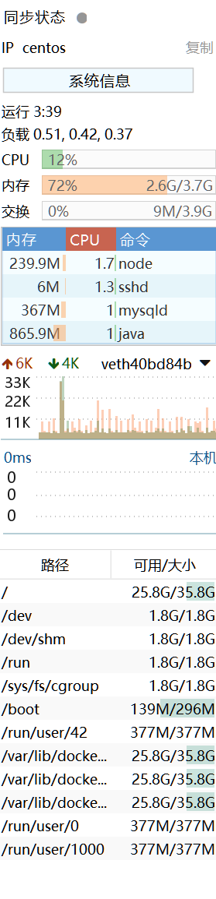

emmm

