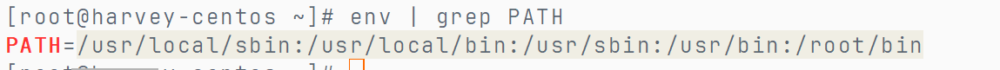
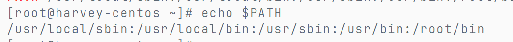
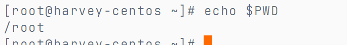
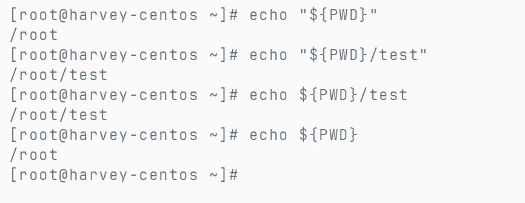
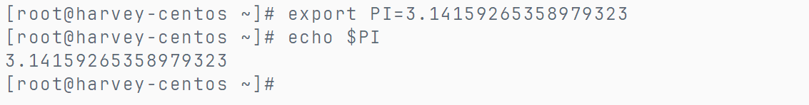
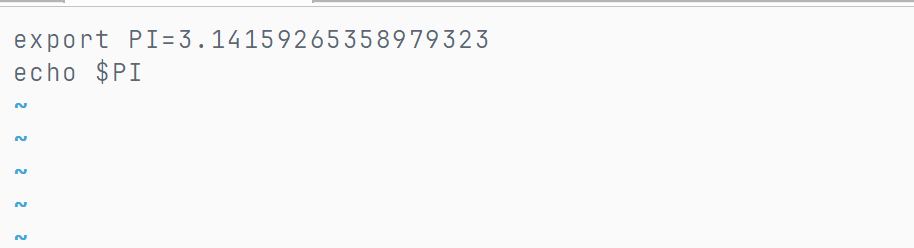
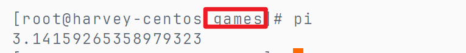

# 环境变量

我们执行命令, 实质上就是执行了程序文件

例如执行`cd`命令, 本质上就是执行了`/usr/bin/cd`这个程序文件

Q : 为何无论工作目录在哪里, 都能执行到`/usr/bin/cd`这个程序文件捏?

A : 系统为这些程序文件注册了环境变量

环境变量是键值对的形式的

### 查看环境变量

```bash
env
```



PATH的值就是程序的搜索路径, 这些路径由`:`分隔

## $符绝对引用

```bash
echo $PATH
```





拼接



### 用处

自定义变量

**自定义环境变量**

变量名是区分大小写的

-   临时设置(finalshell重新连接即失效)

    ```bash
    export 变量名=变量值
    ```

    

-   永久生效

    -   编辑文件

    -   针对当前用户生效, 则配置在当前用户的`~/.bashrc`文件中

    -   针对所有用户生效, 配置在系统的`/etc/profile`文件中

    -   通过语法

        ``` bash
        source 配置文件
        ```

        进行立刻生效

    -   或重新登录finalShell生效


### 测试使用

创建文件

```bash
vim pi
```

输入命令




授予可执行权限

```bash
chmod 755 pi
```

执行该文件

```bash
./pi
```

现在需要无论在哪里, 都可以执行这个程序

```bash
vim /etc/profile
```


**记得`$PATH:`, 原有的PATH不能丢**

使其生效

```bash
source /etc/profile
```



