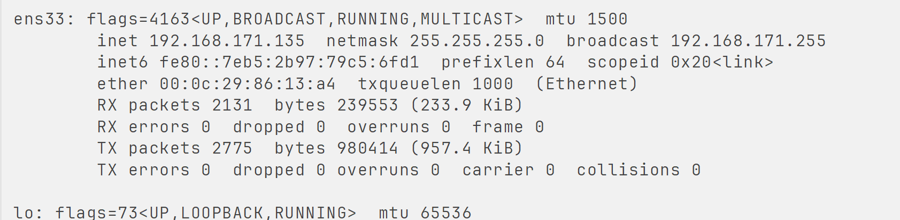
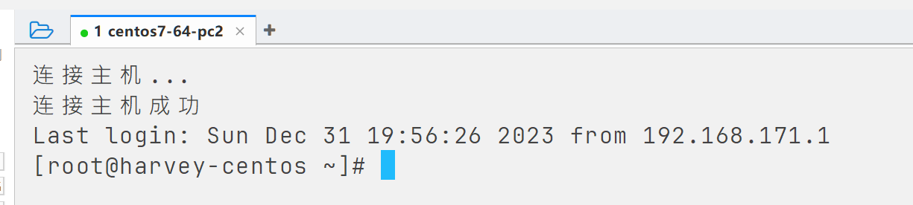
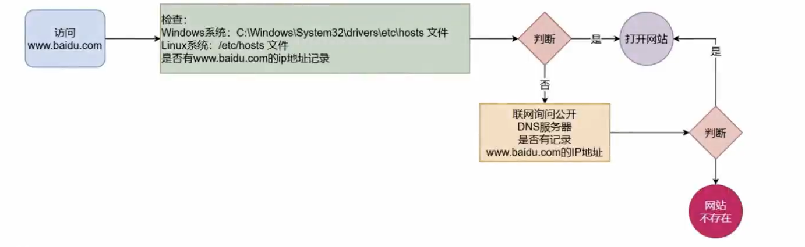
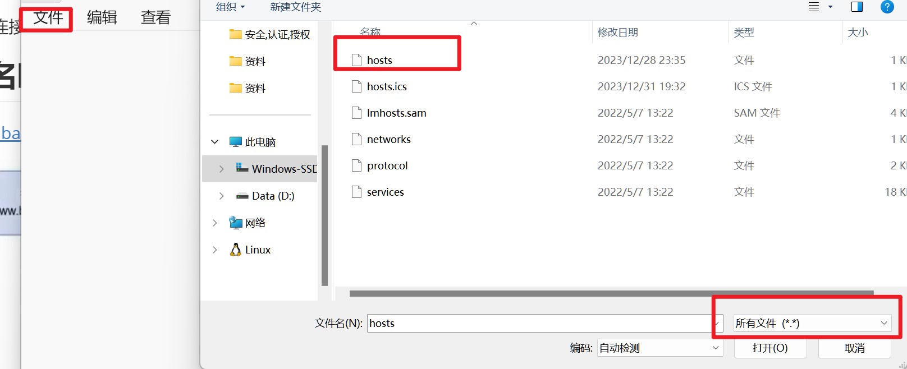
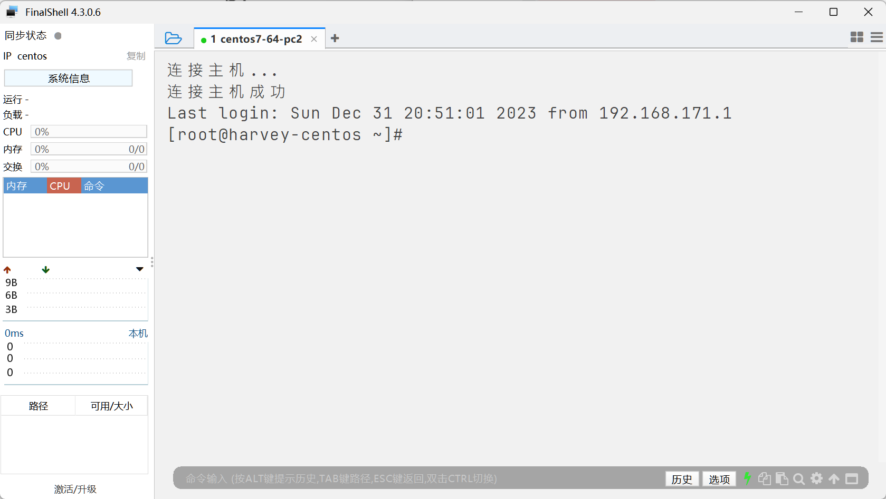

# IP地址

```bash
ifconfig
```



# 主机名

查看主机名

```bash
hostname
```

更改主机名

```bash
hostnamectl set-hostname Harvey-CentOS
```

-   需要root权限
-   不支持中文(有中文就直接localhost)
-   大写全小写




重新连接就出现啦

## 域名映射

www.baidu.com -> 百度服务器IP



### 本地私人记事本

windows:`C:\Windows\System32\drivers\etc\hosts`

以管理员身份打开记事本, 然后:






Linux:`/etc/hosts`

以后做集群, 就可以不配置IP使用IP地址连接, 而是使用**本地私人记事本**里配置的域名映射

