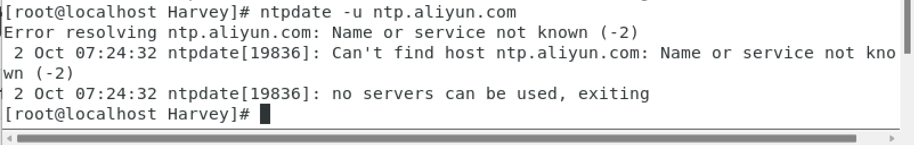

# 时间和时区

## date命令查看系统时间

## 语法

```Linux
date [-d] ["+格式化字符串"]
```

### 日期格式化字符串

- 以**+**开头
- %Y 年
- %y 年的后两位
- %m 月份[01,12]
- %d [01,31]
- %H 小时[00,23]
- %M 分钟[00,59]
- %S 秒[00,59]
- %s 时间戳(从1970-01-01 00:00:00到现在的**秒数**)

```Linux
date
date +"%Y-%m-%d %H:%M:%S"
date "+%Y-%m-%d %H:%M:%S"
```

### -d,进行日期计算

- year
- month
- day
- hour
- minute
- second

```bash
date -d "+1 day"
```

带格式化字符串

```bash
date -d "+1 day" +"%Y-%m-%d %H:%M:%S"
```

```bash
date -d "+1 day -1year" "+%Y-%m-%d %H:%M:%S"
```


## 改时区


PST, 非东八区也

1. su root
2. 把文件软链接

```Linux
rm -f /etc/localtime
ln -s /usr/share/zoneinfo/Asia/Shanghai /etc/localtime
```


CST,东八区也

## ntp程序时间校准

### 时间定时自动联网校准

1. 安装ntp:

   ```linux
   yum -y install ntp
   ```

2. 设置开机自启:

   ```Linux
   systemctl start ntpd
   systemctl enable ntpd
   ```

   **服务名叫ntpd**

### 时间自动联网校准

```Linux
pin
```



