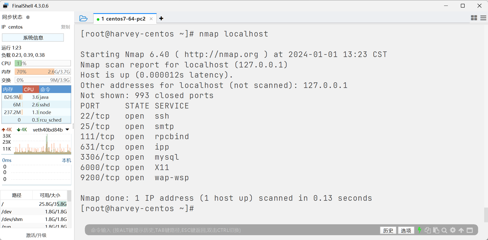
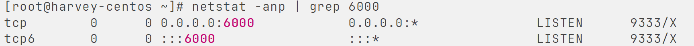

# 端口和netstat命令

## 端口

>   从略

-   公认端口

    -   [1,1023]
    -   系统内置或知名程序的预留使用
    -   如:
        -   SSH服务的22端口
        -   HTTPS服务的443端口
        -   HTTP服务的80端口

    -   没啥事别占用这些端口

-   注册端口

    -   [1024,49151]
    -   可以随意使用, 用于松散的绑定一些程序/服务
    -   例如:
        -   Tomcat:8080
        -   MySQL:3306
        -   Redis:6379
        -   ElasticSearch:9200,9300
        -   Kibana:5601

-   动态端口

    -   [49152,65535]
    -   通常不会固定绑定程序, 而是当程序**对外进行网络连接**时, 用于临时使用

-   出口时动态的, 入口是静态的

### nmap

>   查看端口占用情况

-   安装nmap

    ```bash
    yum -y install nmap
    ```

-   查看端口占用

    ```bash
    nmap IP地址
    ```

    

## netstat命令

-   安装

    ```bash
    yum -y install net-tools
    ```

-   查看

    ```bash
    netstat -anp | grep 6000
    ```

    

    ```bash
    netstat -anp | grep 1919
    ```

    无人占用

    

