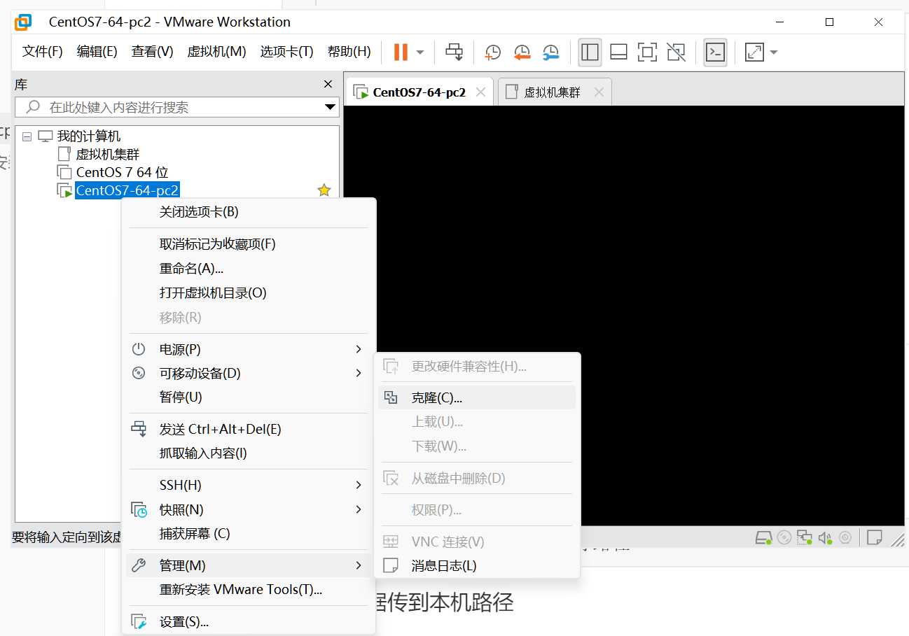

# 集群

多台服务器共同工作

## VM克隆虚拟机

>   垃圾电脑, 没有试. 对自己电脑有自信的可以试试看

用

```bash
init 0
```

快速关闭当前虚拟机

在VM中创建虚拟机集群的文件夹




-   选择`虚拟机中的当前状态`
-   选择`创建完整克隆`
-   给他个名字, 指定下位置(放在一个空文件夹下, 否则会是散装的虚拟机就会烦死你qwq)
-   拖拽到刚创建的文件夹中


-   [改一下IP地址](..\网络\Day05-虚拟机配置固定IP.md),集群中的IP地址不要重复

    -   虚拟机一台一台开, 一台一台改 ,否则IP地址会冲突

-   [本地私人记事本](..\网络\Day05-IP地址和主机名.md)

-   改下windows里的hosts(随意)

-   改下Linux系统里的hosts(还是有必要的)

    ```text
    192.168.88.130 node1
    192.168.88.131 node2
    192.168.88.132 node3
    ```

## 配置SSH的免密登录

### SSH

>   一种用于远程登录的安全认证协议

SSH支持账号密码, 支持密钥, 支持公钥

从node1远程登录node2

```bash
ssh root@node2
# 然后输入密码
```

-   以`root`的身份登录`node2`

```bash
ssh 用户名@目标IP地址
```

-   缺省用户名则表示使用当前用户同名的账户登录

`ctrl+d`或`exit`命令退出

## 配置免密登录

1.  在每台服务器执行命令

    ```bash
    ssh-keygen -t rsa -b 4096
    # 然后疯狂回车
    ```

    生成远程登录的密钥

2.  然后把密钥给别人,每台服务器上执行

    ```bash
    ssh-copy-id node1 # 然后再询问(yes/no)的地方输入yes, 然后输入node1的密码
    # 自己也可以远程登录自己, 自己也可以把密钥给自己; 不把自己的密钥给自己, 自己就不能免密远程登录自己
    ssh-copy-id node2 # 然后再询问(yes/no)的地方输入yes, 然后输入node2的密码
    ssh-copy-id node3 # 然后再询问(yes/no)的地方输入yes, 然后输入node3的密码
    ```


## 关闭防火墙和SELinux

为了避免出现网络不通, 简单的关闭防火墙

```bash
systemctl stop firewalld
systemctl enable firewalld
```

Linux有一个安全模块,SELinux, 用以限制用户和程序的相关权限,来确保系统的安全稳定

因为SELinux很复杂, 我们暂且简单的关闭它, 防止其权限限制导致软件不可用

配置SELinux有关文件. 由于这个文件与系统开机紧密相关, 在==修改之前需要保存快照==

```bash
vim /etc/sysconfig/selinux
```

将第七行的`SELINUX=enforcing`改成

```properties
SELINUX=disabled
```

保存退出后重启虚拟机


## 集群间数据传输

>   为了频繁在多台服务器之间相互传输数据使用scp命令
>
>   scp即ssh cp, cp命令的加强版

将本机数据传输到目标路径

```bash
scp [-r] 本机路径 远程目标路径
```

将远程数据传到本机路径

```bash
scp [-r] 远程目标路径 本机路径
```

-   `-r` 

    表示递归, 用于复制文件夹

 

```bash
scp -r /export/server/jdk root@node2:/export/server
```

-   `root@node2`表示用root的身份访问node2的服务器

```bash
scp -r node2:/export/server/jdk /export/server
```

-   省略用户名,表示使用当前的同名账户


```bash
cd /export/server
scp -r jdk root@node2:`pwd`/
scp -r node2:$PWD/jdk .
```

