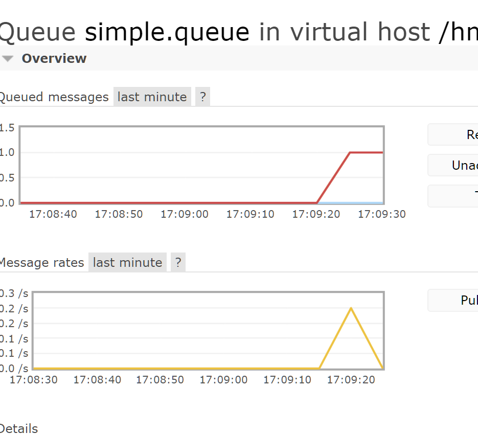
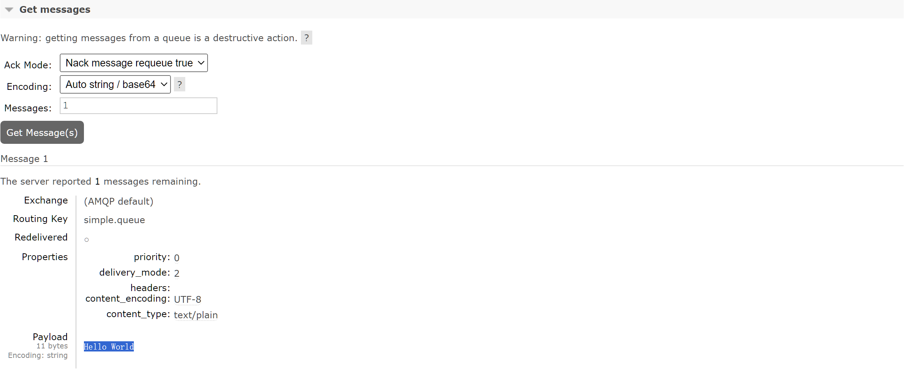

# AMQP

[AMQP](https://www.rabbitmq.com/tutorials/tutorial-one-spring-amqp.html)

## 介绍

>   **A**dcanced **M**essage **Q**ueue **P**rotocol
>
>   高级消息队列协议

AMQP与语言无关, 任何语言都能用AMQP收发消息

## Spring AMQP

>   与其说是Java客户端, 不如说是Spring客户端😓

[Spring AMQP](https://spring.io/projects/spring-amqp/)

-   基于AMQP
-   **API规范**
-   **提供了模板**来发送和接收消息
-   提供实现**spring-rabbit**

## 基本使用

### 依赖引入

```xml
<!--AMQP依赖，包含RabbitMQ-->
<dependency>
    <groupId>org.springframework.boot</groupId>
    <artifactId>spring-boot-starter-amqp</artifactId>
</dependency>
```

### 需求分析


-   创建队列`simple.queue`
    -   略
-   在`publisher`服务中利用`SpringAMQP`直接向`simple.queue`发送消息
-   在`consumer`服务中利用`SpringAMQP`从`simple.queue`监听消息

### 配置MQ

```yaml
spring:
  rabbitmq:
    host: centos
    port: 5672
    virtual-host: /hmall
    username: hmall
    password: 123456
```

### 消息发送

#### 代码编写

```java
@SpringBootTest
public class QueueTest {
    @Autowired
    private RabbitTemplate rabbitTemplate;

    @Test
    void testRabbitTemplate(){
        String queueName = "simple.queue";
        Map<String,Object> user = Map.of("name","Harvey","age",20);
        rabbitTemplate.convertAndSend(queueName,user);// 类型不限
    }
}
```

#### 运行测试






### 消息接收

#### 创建监听器

```java
@Component
public class RabbitMqListener {
    @RabbitListener(queues = "simple.queue")
    public void listenSimpleQueue(Map<String, Object> user) {
        // 类型与发送方匹配
        System.out.println(user);
    }
}
```

#### 运行测试

会报一堆错但是可以接收(原因: 队列里原先保留了一些消息, 现在传到Consumer里去了,而格式是不对的,所以Consumer报了错) => **消息丢失**

```text
{name=Harvey, age=20}
```

不改, 第二次运行, 不报错了????

