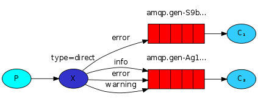
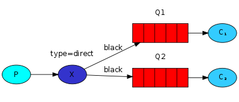
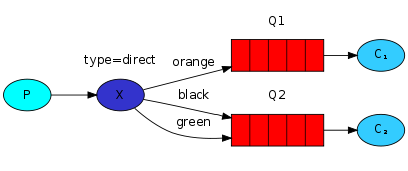
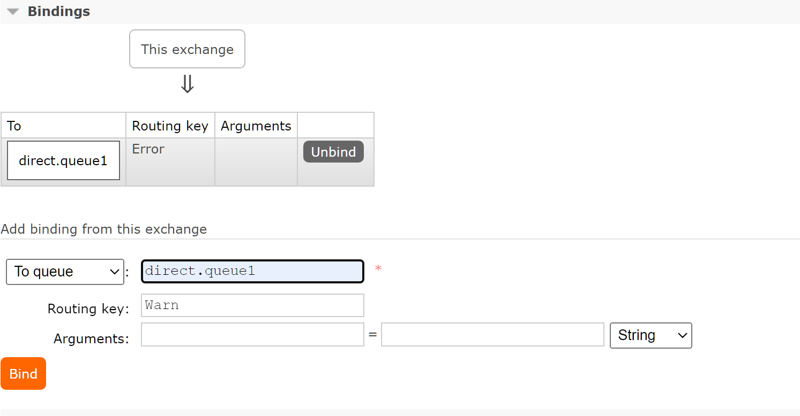

# Direct交换机

>   Direct 定向

## 需求的产生

不同的微服务想要收到不同的消息



## Direct交换机流程示意

-   Direct交换机会将接收到的消息**根据规则**路由到指定Queue





### 规则指定

-   每一个**Queue**都要Exchange设置一个**Bindingkey**

    

    

-   **发布者**发送消息时, **指定消息的RoutingKey**

    ```java
    @Test
    void testDirectExchange() {
        String exchangeName = "hmall.direct";
        rabbitTemplate.convertAndSend(exchangeName, "Info","info");
        rabbitTemplate.convertAndSend(exchangeName, "Debug","Debug");
        rabbitTemplate.convertAndSend(exchangeName, "Warn","warn");
        rabbitTemplate.convertAndSend(exchangeName, "Error","Error");
    }
    ```

-   Exchange将消息路由到**BindingKey**与**消息Rounting**一致的队列

    ```
    	1:info	2:Debug	1:warn	2:Error	1:Error
    ```

