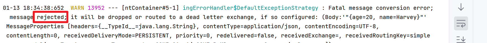
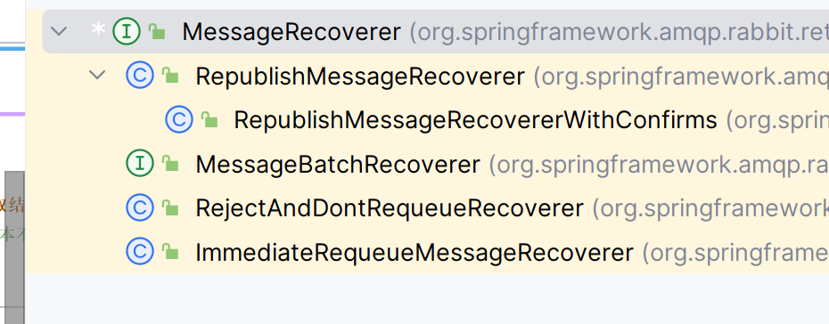
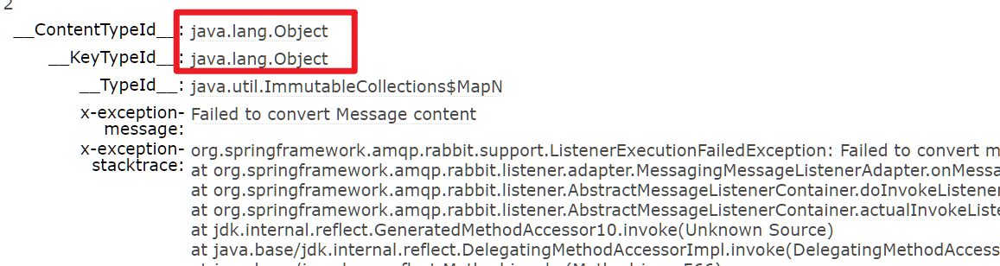

# 消费者的可靠性

## 消费者确认机制

>   Consumer Acknowledge

### 介绍

-   目的
    -   确认消费者是否成功处理消息
-   流程
    -   当消费者处理消息结束后, 应该向RabbitMQ发送一个挥着, 
    -   告知RabbitMQ自己的消息处理状态

### 消息处理状态

-   ack	
    -   成功处理消息.
    -   RabbitMQ从队列中删除消息
-   nack
    -   消息处理失败, 
    -   RabbitMQ需要再次投递消息
-   reject
    -   消息处理失败并拒绝该消息
    -   消息本身存在问题
    -   RabbitMQ虫队列中删除该消息

#### Spring对处理状态的判断

-   当方法成功执行, 发送ack

-   当方法抛出(如`org.springframework.amqp.rabbit.support.ListenerExecutionFailedException`)的消息异常, 发送reject

    

-   当方法返回其他异常(业务异常), 发送nack

### 开启消费者确认机制

-   none

    -   默认不处理
    -   消息投递给消费者后立即ack,
    -   消息立刻被删除
    -   非常不安全

-   manual

    -   手动模式
    -   自己在业务代码中调用api,选择发送处理装填
    -   存在业务入侵, 但更灵活

-   auto

    -   自动

    -   AOP做了环绕增强

        ```yml
        spring:
          rabbitmq:
            listener:
              simple:
                acknowledge-mode: auto
        ```

### 消费失败策略

>   当返回nack, 就会像踢皮球一样, 来回搞, 很不好

#### 重新入队

-   默认

-   当消费者出现异常后, 消息会不断==requeueu(重新入队)==, 再重新发送给消费者,然后无限循环, 导致mq的消息处理飙升,带来不必要的压力

#### 本地重试

-   spring的`retry`机制

-   配置

    ```yml
    spring:
      rabbitmq:
        listener:
          simple:
            retry:
              enabled: true
              initial-interval: 1000ms # 初始失败等待时常
              multiplier: 1 # 下次等待时长倍数
              max-attempts: 3 # 最大重试次数
              stateless: true # true为无状态, 如果业务中包含事务, 这里应该为false
              # 会记录业务状态,会做一些上下文的保存之类的
            prefetch: 1
            acknowledge-mode: auto
    ```

-   测试结果

    ```log
    {age=20, name=Harvey}
    {age=20, name=Harvey}
    {age=20, name=Harvey}
    01-13 18:48:41:866  Error 18340 --- [ntContainer#4-1] o.s.a.r.r.RejectAndDontRequeueRecoverer  : Retries exhausted for message (Body:'{"age":20,"name":"Harvey"}' Mess
    ```

    

    三次失败后消息删除

#### MessageRecoverer

>   再本地重试之后, 次数如果耗尽, 如果消息依然失败, 就有**MessageRecoverer**来进行处理



##### 三种Recover

-   `RejectAndDontRequeueRecoverer`

    -   默认
    -   重试耗尽后直接reject,丢弃消息

-   `ImmediateRequeueMessageRecoverer`

    -   重试耗尽后直接nack,消息重新入队
    -   比原来那种多了几次可以控制增加等待的时间的retry
    -   然后又失败, 然后又继续retry
    -   减缓了投递的频率
    -   让后面的人有个机会
    -   像高考时刷不出脸的人排到最后, 一会儿再来试(针不戳)

-   `RepublishMessageRecoverer`

    -   重试耗尽后将失败消息投递到指定的交换机
    -   也就是说, 我搞不定的, 抛给别人(一个专门用来接收哪些错误消息的交换机)
    -   可以发消息给开发人员, 转为人工处理(针不戳)

-   怎么办? 能不能二三两种结合? 发现retry不行的同时再发送给另一台交换机?

    能不能自定义啊qwq

##### 配置Recover

-   配置Recover

    ```java
    @Bean
    @ConditionalOnProperty(
            prefix = "spring.rabbitmq.listener.simple.retry",
            name="enabled",havingValue = "true")// 配置生效的时机
    public MessageRecoverer republishMessageRecoverer(RabbitTemplate rabbitTemplate){
        String errExchange = "error.exchange";
        String errRoutingKey = "error";
        return new RepublishMessageRecoverer(rabbitTemplate,errExchange,errRoutingKey);
    }
    ```

-   测试

    -   准备监听器,交换机,和队列

        ```java
        @RabbitListener(bindings = @QueueBinding(
                value = @Queue(name = "error.queue"),
                exchange = @Exchange(name = "error.exchange", type = ExchangeTypes.DIRECT),
                key = "error"
        ))
        public void errorListener(Object exMsg) {
            System.err.println(exMsg);
        }
        ```

        

        为啥异常栈的信息时用Object来存的啊

        ```java
        @RabbitListener(queues = "error.queue")
        public void errorListener(org.springframework.amqp.core.Message exMsg) {
            System.err.println("-------------------------------------------------------");
            System.err.println(Arrays.toString(exMsg.getBody()));
            System.err.println("-------------------------------------------------------");
        }
        ```

-   奇妙的是, 配置了Recover,即使是本来需要reject的转化异常, 也会变为输出warning日志, 不会报大段异常了.也就是说,异常不会在这个服务的日志里记录,而是直接给error.exchange所指定的服务记录了

    这个warning日志的内容是 **调用了Recover**, 也就是说, 如果是转化异常, 也会调用recover

-   ```java
    @RabbitListener(bindings = @QueueBinding(
            value = @Queue(name = "error.queue"),
            exchange = @Exchange(name = "error.exchange", type = ExchangeTypes.DIRECT),
            key = "error"
    ))
    public void errorListener(org.springframework.amqp.core.Message exMsg) {
        System.err.println("-------------------------------------------------------");
        System.err.println(new String(exMsg.getBody())); // 发送的信息
        System.err.println("-------------------------------------------------------");
        MessageProperties properties = exMsg.getMessageProperties();
        System.err.println(properties.getHeaders());// 错误栈
        System.err.println("-------------------------------------------------------");
        System.err.println(properties.getClusterId()); // 还有很多
        System.err.println("-------------------------------------------------------");
    }
    ```

    效果:

    ```log
    {age=20, name=Harvey}
    {age=20, name=Harvey}
    {age=20, name=Harvey}
    01-13 20:05:32:540  WARN 15952 --- [ntContainer#2-1] o.s.a.r.retry.RepublishMessageRecoverer  : Republishing failed message to exchange 'error.exchange' with routing key error
    -------------------------------------------------------
    {"age":20,"name":"Harvey"}
    -------------------------------------------------------
    {__ContentTypeId__=java.lang.Object, x-exception-message=null, x-original-routingKey=simple.queue, __KeyTypeId__=java.lang.Object, x-original-exchange=, __TypeId__=java.util.ImmutableCollections$MapN, x-exception-stacktrace=org.springframework.amqp.rabbit.support.ListenerExecutionFailedException: Listener method 'public void com.itheima.publisher.Listener.RabbitMqListener.listenSimpleQueue(java.util.Map<java.lang.String, java.lang.Object>)' threw exception
    	at .....................................................................
    	... 27 more
    }
    -------------------------------------------------------
    null
    -------------------------------------------------------
    ```

MQ的缺点又增加一个: 不能随便抛异常了qwq

