# RabbitMQ

## 安装

>   基于Docker

```bash
docker run \
	-e RABBITMQ_DEFAULT_USER=harvey \
	-e RABBITMQ_DEFAULT_PASS=123456 \
	-v mq-plugins:/plugins \
	--name mq \
	--hostname mq \
	-p 15672:15672 \
	-p 5672:5672 \
	-d \
	rabbitmq:3.8-management
```

```logs
  ##  ##      RabbitMQ 3.8.26
  ##  ##
  ##########  Copyright (c) 2007-2021 VMware, Inc. or its affiliates.
  ######  ##
  ##########  Licensed under the MPL 2.0. Website: https://rabbitmq.com
```

兔兔可爱捏

## 基本模型

-   交换机
    -   路由消息
-   队列
    -   容器
-   虚拟主机
    -   使得使用同一套RabbitMQ的不同项目的消息**隔离**

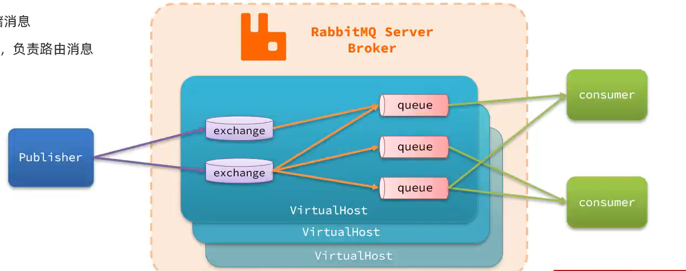

## 基本使用

`http://centos:15672/`

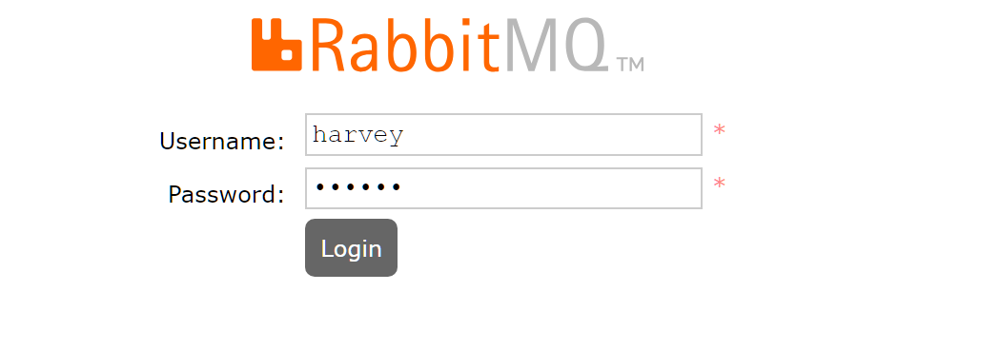

### 需求

1.  新建队列`hello.queue1`, `hello.queue2`
2.  向默认的`amp.fanout`交换机发送一条消息
3.  查看消息是否达到`queue1`, `queue2`

### 新建队列

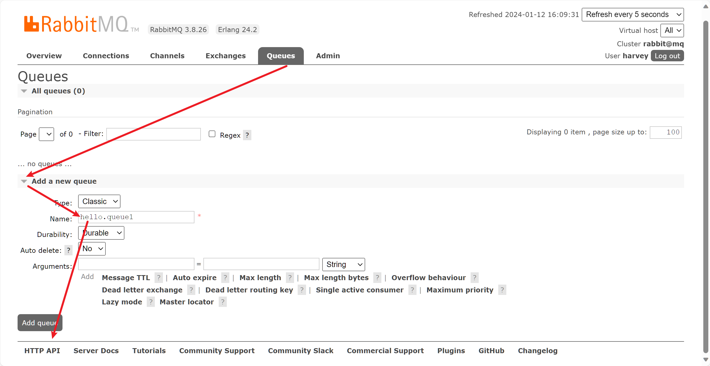

### 使用交换机发消息

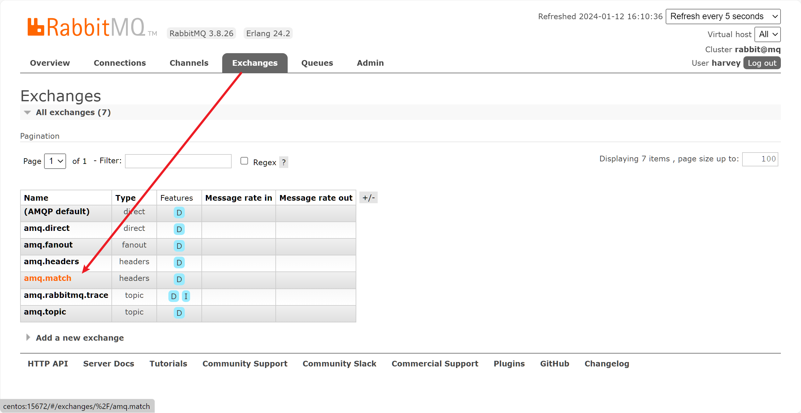

(指错了qwq)

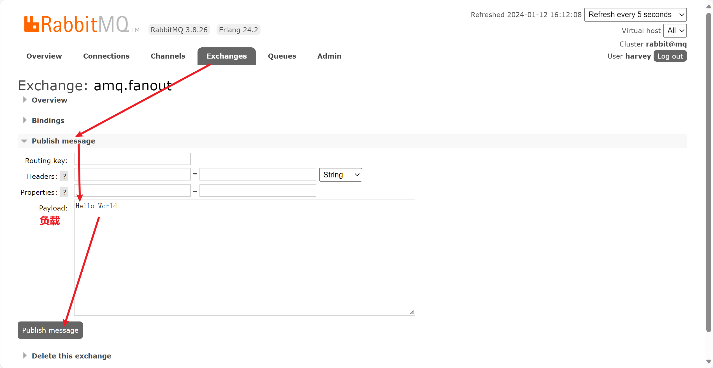

消息已发出, 但未被路由


### 查看消息是否到达队列

#### exchange-Overview

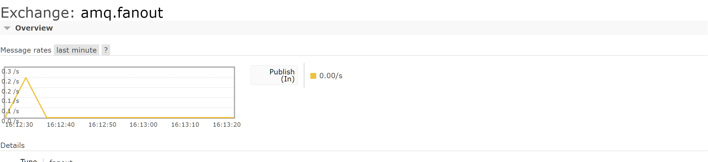

#### queue-Overview

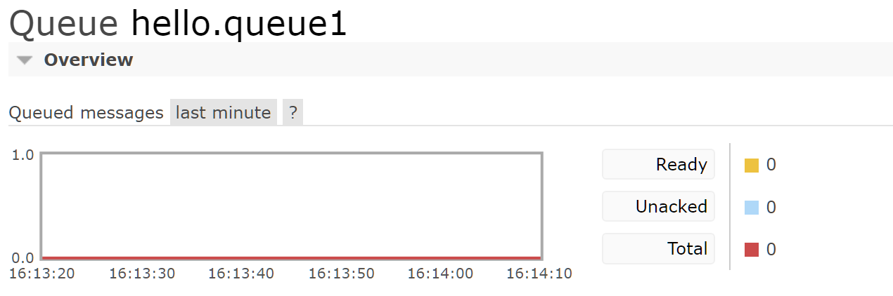

### 关联交换机和队列

-   交换机负责转发和路由消息, 不存储消息, 消息没有队列, 马上就会丢失

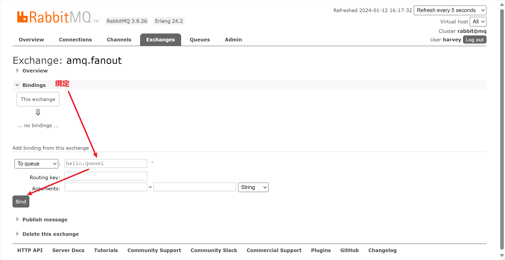


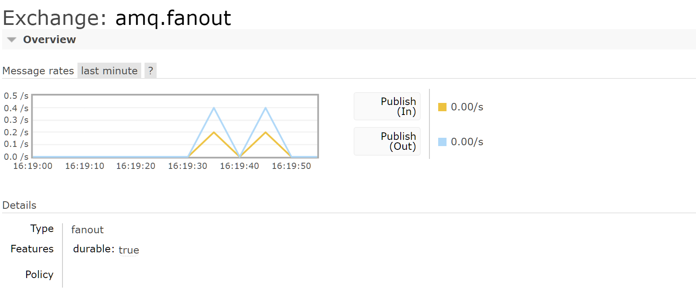

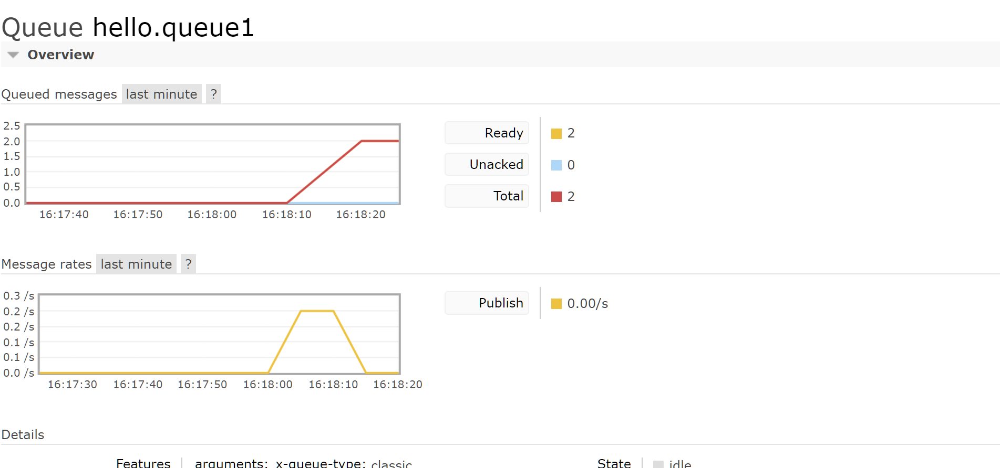


我有一个大胆的想法,binding设置**或的关系** ,这是不是能设置**且的关系**

### 数据隔离

>   Virtual Host 虚拟主机

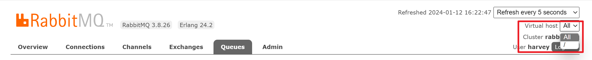

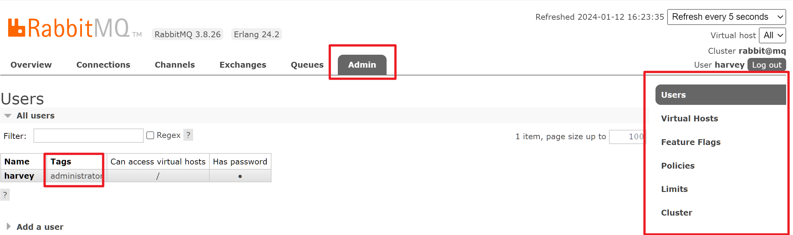

#### 创建用户

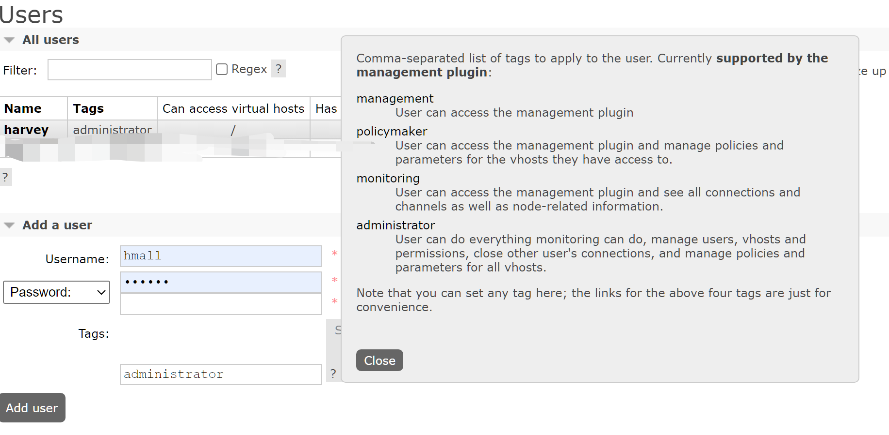

#### 创建虚拟主机

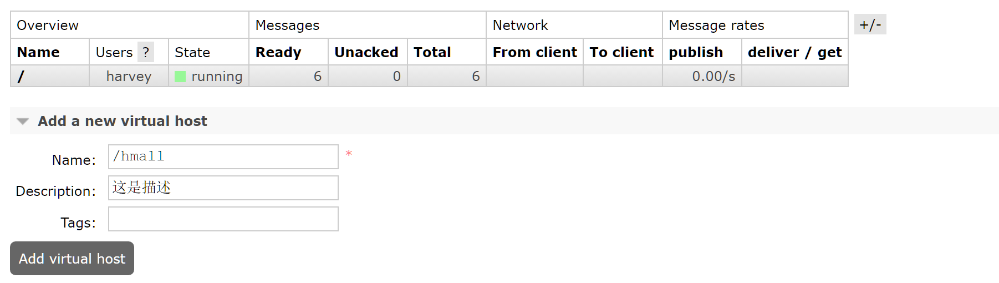

两套交换机

Typro的复制, 我向来是很认可的

| Virtual host | Name                                                         | Type    | Features | Message rate in | Message rate out | +/-  |
| :----------- | :----------------------------------------------------------- | :------ | :------- | :-------------- | :--------------- | :--- |
| /hmall       | [(AMQP default)](http://centos:15672/#/exchanges/%2Fhmall/amq.default) | direct  | D        |                 |                  |      |
| /hmall       | [amq.direct](http://centos:15672/#/exchanges/%2Fhmall/amq.direct) | direct  | D        |                 |                  |      |
| /hmall       | [amq.fanout](http://centos:15672/#/exchanges/%2Fhmall/amq.fanout) | fanout  | D        |                 |                  |      |
| /hmall       | [amq.headers](http://centos:15672/#/exchanges/%2Fhmall/amq.headers) | headers | D        |                 |                  |      |
| /hmall       | [amq.match](http://centos:15672/#/exchanges/%2Fhmall/amq.match) | headers | D        |                 |                  |      |
| /hmall       | [amq.rabbitmq.trace](http://centos:15672/#/exchanges/%2Fhmall/amq.rabbitmq.trace) | topic   | D I      |                 |                  |      |
| /hmall       | [amq.topic](http://centos:15672/#/exchanges/%2Fhmall/amq.topic) | topic   | D        |                 |                  |      |
| /hmall       | [hmall.direct](http://centos:15672/#/exchanges/%2Fhmall/hmall.direct) | direct  | D        |                 |                  |      |
| /hmall       | [hmall.fanout](http://centos:15672/#/exchanges/%2Fhmall/hmall.fanout) | fanout  | D        |                 |                  |      |
| /hmall       | [hmall.topic](http://centos:15672/#/exchanges/%2Fhmall/hmall.topic) | topic   | D        |                 |                  |      |
| /hmall       | [hmall.topic0](http://centos:15672/#/exchanges/%2Fhmall/hmall.topic0) | topic   | D        |                 |                  |      |

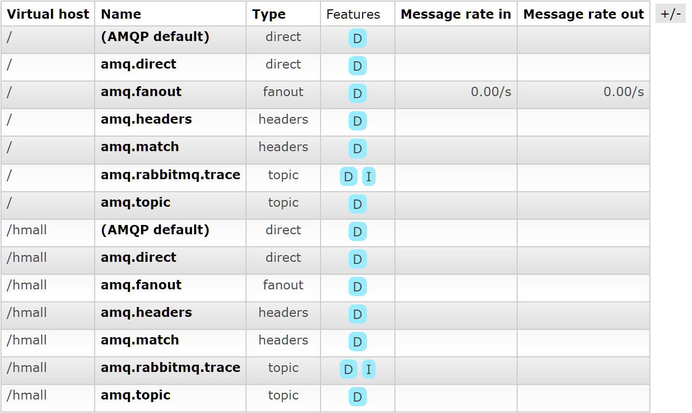

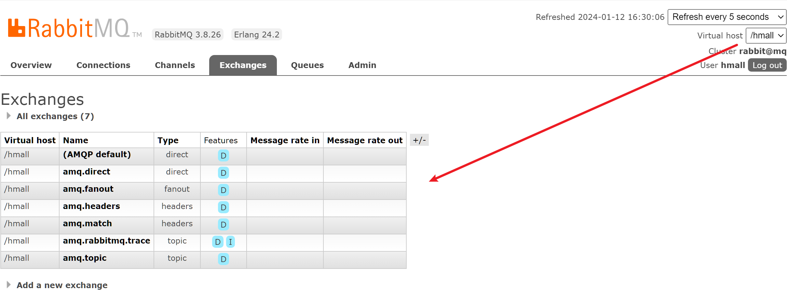

