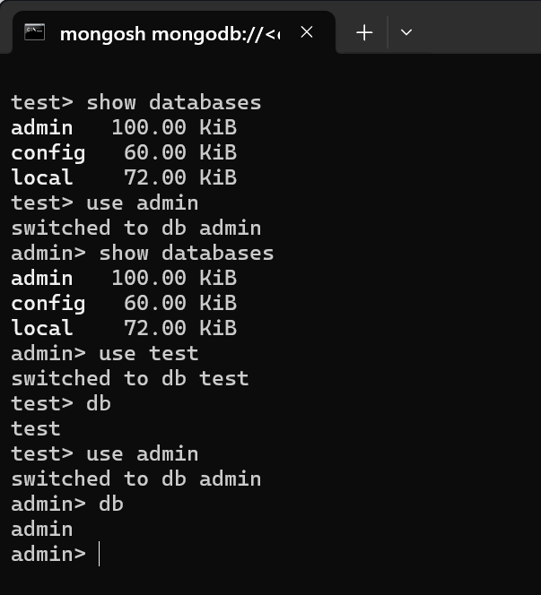

# Database

一个 MongoDB 实例中可以建立多个数据库

没有指定数据库，使用 **`test`** 作为默认数据库，该数据库存储在 data 目录中

不同的数据库持久化在不同的文件中。

## 操作

- 展示所有数据的列表

  ```bash
  show databases
  ```
  
  简写
  
  ```bash
  show dbs
  ```
  
- 切换数据库

  ```bash
  use <TARGET DB>
  ```

- 显示当前所在的数据库

  ```bash
  db
  ```

  



test数据库不在show中显示, 但是能够作为切换的目标


### 数据库标识

- UTF-8字符
- 不能是空字符串（"")。
- 不得含有` `空格、`.`DOT、`$`、`/`、`\`和`\0` (空字符)。
- 应全部小写(建议)
- 最多64字节
- 不和保留的数据库同名
  - **admin**: 此数据库中存储的用户将继承所有数据库的权限。一些特定的服务器端命令只能从这个数据库运行(例如查看所有数据库)
  - **local** 在MongoDB集群中, local数据库中的数据不会被复制. 用来存储限于本地单台服务器的任意集合
  - **config** : 用于分片设置, 保存分片的相关信息

### 创建

如果数据库不存在，第一次使用该数据库存储数据时创建该数据库

```bash
use db_mine
```


## 元数据

描述数据库自身的一些数据, 以`system`集合的形式存储

```bash
<DB_NAME>.system.<OPERATOR>
```

| 集合命名空间                | 描述                                      |
| :-------------------------- | :---------------------------------------- |
| <DB_NAME>.system.namespaces | 列出所有命名空间。                        |
| <DB_NAME>.system.indexes    | 列出所有索引。                            |
| <DB_NAME>.system.profile    | 包含数据库概要(profile)信息。             |
| <DB_NAME>.system.users      | 列出所有可访问数据库的用户。              |
| <DB_NAME>.local.sources     | 包含复制对端（slave）的服务器信息和状态。 |

