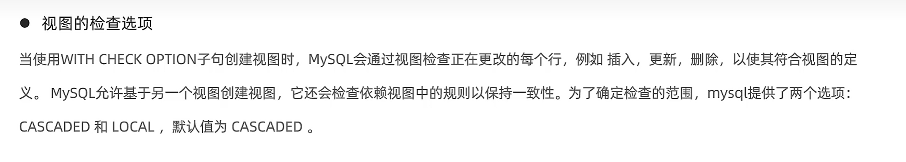

# 检查选项

```mysql
Create [Or Replace] View 要改的视图名[(列名列表)] As Select语句 [with [cascaded|Local] check option];
```

-   **with cascaded check option**检查选项



-   cascaded - 检查到最底层,检查每一个有check的
-   local - 检查到最上层没有check的,然后就不检查了
-   检查范围

```mysql
create or replace view user_1 as  select id,age from user where id>10;


insert into user_1 value(30,35);-- 成功添加
insert into user_1 value(5,35);-- 视图里不存在,为啥?新记录的id=5<10,不会到视图里去

-- 为了避免这种情况 with [] chech option
```


-   cascaded测试完整版


```mysql
create or replace
    view uv1_0 as
    select id,name
    from user
    where id>10 ;


        create or replace
            view uv2_0_0 as select id,name
                          from uv1_0
                          where id<20;

                create or replace
                        view uv3_0_0_0 as select id,name
                                    from uv2_0_0
                                    where id<15;

                create or replace
                        view uv3_0_0_1 as select id,name
                                    from uv2_0_0
                                    where id<15
                with cascaded check option ;


        create or replace
            view uv2_0_1 as select id,name
                          from uv1_0
                          where id<20
            with cascaded check option ;

                create or replace
                        view uv3_0_1_0 as select id,name
                                    from uv2_0_1
                                    where id<15;

                create or replace
                        view uv3_0_1_1 as select id,name
                                    from uv2_0_1
                                    where id<15
                with cascaded check option ;


create or replace
    view uv1_1 as
    select id,name
    from user
    where id>10
    with cascaded check option ;

    create or replace
            view uv2_1_0 as select id,name
                          from uv1_1
                          where id<20;

                create or replace
                        view uv3_1_0_0 as select id,name
                                    from uv2_1_0
                                    where id<15;

                create or replace
                        view uv3_1_0_1 as select id,name
                                    from uv2_1_0
                                    where id<15
                with cascaded check option ;


        create or replace
            view uv2_1_1 as select id,name
                          from uv1_1
                          where id<20
            with cascaded check option ;

                create or replace
                        view uv3_1_1_0 as select id,name
                                    from uv2_1_1
                                    where id<15;

                create or replace
                        view uv3_1_1_1 as select id,name
                                    from uv2_1_0
                                    where id<15
                with cascaded check option ;


select * from user ;

    select * from uv1_0 ;

        select * from uv2_0_0 ;

            select * from uv3_0_0_0 ;
            select * from uv3_0_0_1 ;

        select * from uv2_0_1 ;

            select * from uv3_0_1_0 ;
            select * from uv3_0_1_1 ;

    select * from uv1_1 ;

        select * from uv2_1_0 ;

            select * from uv3_1_0_0 ;
            select * from uv3_1_0_1 ;

        select * from uv2_1_1 ;

            select * from uv3_1_1_0 ;
            select * from uv3_1_1_1 ;


-- 原表如果不是no , 是一定有的只在第一层是我片面了
insert into uv1_0(id, name) values (12,'123');-- ok
insert into uv1_0(id, name) values (9,'123');--  ok 只在user

    insert into uv2_0_0(id, name) values ( 5,'123');-- ok 只在user
    insert into uv2_0_0(id, name) values (15,'123');-- ok 全员
    insert into uv2_0_0(id, name) values (20,'123');-- ok 第一层

            insert into uv3_0_0_0(id, name) values ( 5,'123');--  ok 只在user
            insert into uv3_0_0_0(id, name) values (12,'123');--  ok 全员
            insert into uv3_0_0_0(id, name) values (17,'123');--  ok 在第一第二层
            insert into uv3_0_0_0(id, name) values (25,'123');--  ok 在第一次

            insert into uv3_0_0_1(id, name) values ( 5,'123');--  no 1_0
            insert into uv3_0_0_1(id, name) values (12,'123');--  ok 全员
            insert into uv3_0_0_1(id, name) values (17,'123');--  no 3_0_0_1
            insert into uv3_0_0_1(id, name) values (25,'123');--  no 3_0_0_1

    insert into uv2_0_1(id, name) values ( 5,'123');-- no 1_0
    insert into uv2_0_1(id, name) values (15,'123');-- ok 全员
    insert into uv2_0_1(id, name) values (25,'123');-- no 2_0_1

            insert into uv3_0_1_0(id, name) values ( 5,'123');--  no 1_0
            insert into uv3_0_1_0(id, name) values (12,'123');--  ok 全员
            insert into uv3_0_1_0(id, name) values (17,'123');--  ok 在第一第二层
            insert into uv3_0_1_0(id, name) values (25,'123');--  no 2_1

            insert into uv3_0_1_1(id, name) values ( 5,'123');--  no 1_1
            insert into uv3_0_1_1(id, name) values (12,'123');--  ok 全员
            insert into uv3_0_1_1(id, name) values (17,'123');--  no 3_0_1_1
            insert into uv3_0_1_1(id, name) values (25,'123');--  no 3_0_1_1

insert into uv1_1(id,name) values (14,'123');-- ok 
insert into uv1_1(id,name) values (3,'123'); -- no 1_1

    insert into uv2_1_0(id, name) values ( 5,'123');-- no 1_1
    insert into uv2_1_0(id, name) values (15,'123');-- ok 全员
    insert into uv2_1_0(id, name) values (20,'123');-- ok 第一层

            insert into uv3_1_0_0(id, name)values ( 5, '123');-- no 1_1
            insert into uv3_1_0_0(id, name) values (12,'123');-- ok 全员
            insert into uv3_1_0_0(id, name) values (17,'123');-- ok 第一第二
            insert into uv3_1_0_0(id, name) values (25,'123');-- ok 第一


            insert into uv3_1_0_1(id, name)values ( 5, '123');-- no 1_1
            insert into uv3_1_0_1(id, name) values (12,'123');-- ok 全员
            insert into uv3_1_0_1(id, name) values (17,'123');-- no 3_1_0_1
            insert into uv3_1_0_1(id, name) values (25,'123');-- no 3_1_0_1


    insert into uv2_1_1(id, name) values ( 5,'123');-- no 1_1
    insert into uv2_1_1(id, name) values (15,'123');-- ok 全员
    insert into uv2_1_1(id, name) values (25,'123');-- no 2_1_1

            insert into uv3_1_1_0(id, name) values ( 5,'123');--  no 1_1
            insert into uv3_1_1_0(id, name) values (12,'123');--  ok 全员
            insert into uv3_1_1_0(id, name) values (17,'123');--  ok 第一第二层
            insert into uv3_1_1_0(id, name) values (25,'123');--  no 2_1_1


            insert into uv3_1_1_1(id, name) values ( 5,'123');--  no 1_1
            insert into uv3_1_1_1(id, name) values (12,'123');--  ok 全员
            insert into uv3_1_1_1(id, name) values (17,'123');--  no 3_1_1_1
            insert into uv3_1_1_1(id, name) values (25,'123');--  no 3_1_1_1
```


-   Local
-   v2视图是基于v1视图的，
-   如果在v2视图创建的时候指定了检查选项为 local ，
-   但是v1视图创 建时未指定检查选项。 
-   则在执行检查时，知会检查v2，不会检查v2的关联视图v1。

```mysql
insert into uv3_0_0_1(id, name) values ( 5,'123');
```

-   两者的区别主要看这条指令
