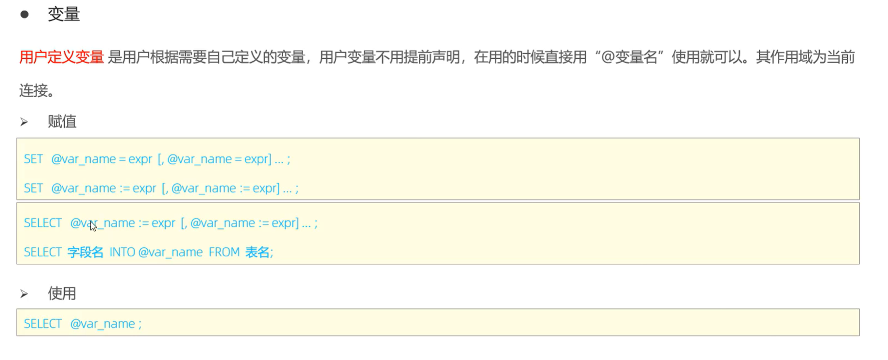
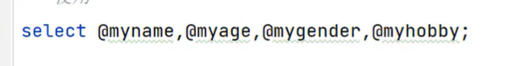

-   mysql里**'='**可以是赋值也可以是比较
    -   这不好吧?
    -   推荐使用:=

```mysql
select count(*) into @my_count from user;
```

-   **不赋值**

    ```mysql
    select @abc;
    ```

-   **就是null**


-   一次赋值多个

```mysql
select count(*) ,avg(id) into @my_cnt, @my_avg from user;
select @my_cnt,@my_avg;
```

-   不对↓
	```mysql    
  select count(*) into  @my_cnt,avg(id) into@my_avg from user;
  ```