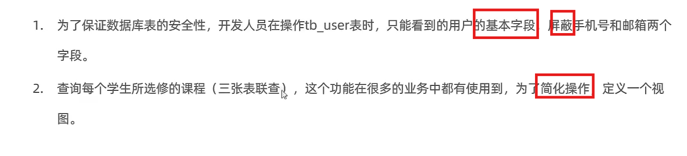

# MySqlView


## 作用



-   隐蔽
-   封装 
-   简单
-   安全
-   数据独立

## 使用


## 创建


```mysql
Create [Or Replace] View 取一个视图名[(列名列表)] As Select语句 [with [cascaded|local] check option]
```

-   Or replase 覆盖原视图

## 查询

-   查看创建的视图的信息

```mysql
Show create view 视图名称;
```


-   查询试图内容

    简而言之,当成表查,例如:

```mysql
select * from view_1;
```


## 修改

-   理解为赋值为佳

```mysql
Create [Or Replace] View 要改的视图名[(列名列表)] As Select语句;
```


```mysql
alter view 视图名[(列名列表)] as Select语句;
```

-   果然覆盖是无敌的!

## 增加字段

```mysql
insert into 视图名 value[s](...);
```

-   实质上是原表增加,然后映射?到视图上

## 删除

```mysql
Drop view [if exists] 视图1[,视图2...]
```

