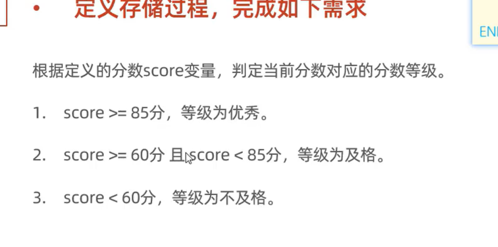

# 选择结构

## if条件判断

-   ```mysql
    if(判断语句,为真返回值,为假返回值);
    ```

-   只是给函数,还不是语句

### if语法

```mysql
if 条件1 then
	SQL语句1;
elseIf 条件2 then
	SQL语句2;
	...
Else
	语句三
End if;
```

### 案例



-   惊天大发现!**所有的declare声明语句都要在set赋值语句之前**

```mysql
create procedure p(in s int)
begin
    declare score int default 60;
    declare result varchar(3);

    set score := s;

    if score>=85 and score<=100 then
        set result := '优秀';
    elseif score>= 75 then
        set result := '良好';
    elseif score>= 60 then
        set result := '及格';
    elseif score>=0 then
        set result := '不及格';
    else
        set result := '错误';
    end if;
    select result;
end;
```

## case 选择

-   类似switch-case
-   小case,依赖于select

```mysql
SELECT
    name,
    case section_ID
        WHEN '010'
            then '管理部'
        WHEN '011'
            then '营销部'
        else
            '其他'
    end as '所属部门'
FROM employee;
```

### 语法

-   大case之语法一

```mysql
case 值
    when 值1
        then SQL语句(块)
    when 值2
        then SQL语句(块)
    when 值3
        then SQL语句(块)
    else
        SQL语句(块)
end case;
```


-   大case之语法二

```mysql
case
    when 条件语句1
        then SQL语句(块)
    when 条件语句2
        then SQL语句(块)
    when 条件语句3
        then SQL语句(块)
    else
        SQL语句(块)
end case;
```

### 示例


```mysql
create procedure day(month int,out day int)begin
    case
        when month<1 or month>12
            then set day:=-1;
        when month = 2
            then set day:=28;
        when month in (4,6,9,11)
            then set day:=30;
        else
            set day:=31;
    end case;
end;

select @day;
call day(8.4,@day);
-- 四舍五入是吧,还挺先进
select @day;

drop  procedure if exists day;
```

