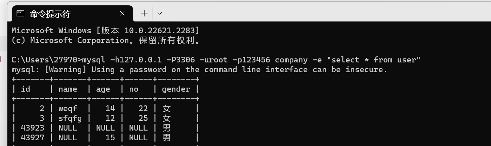
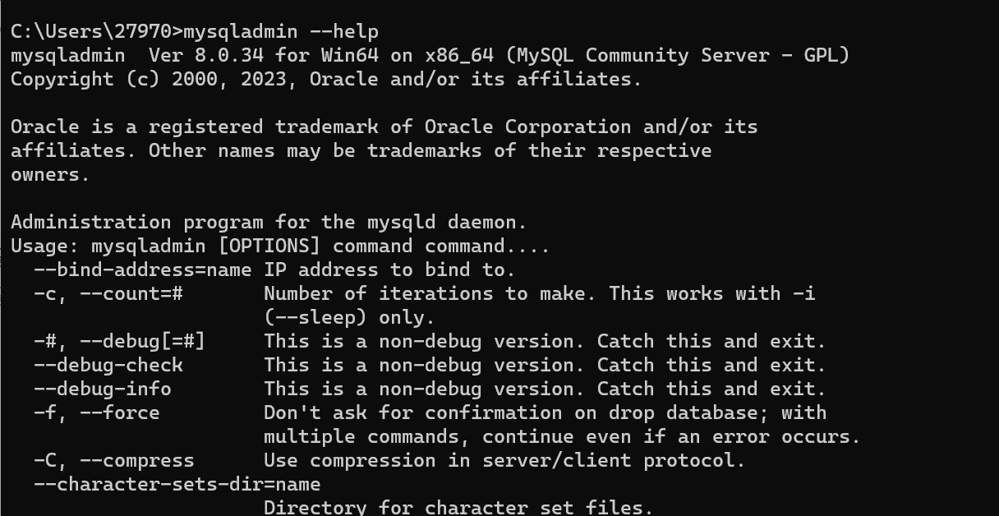
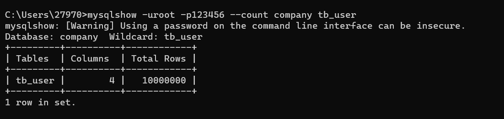
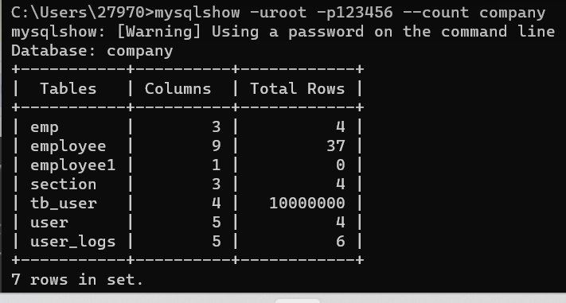
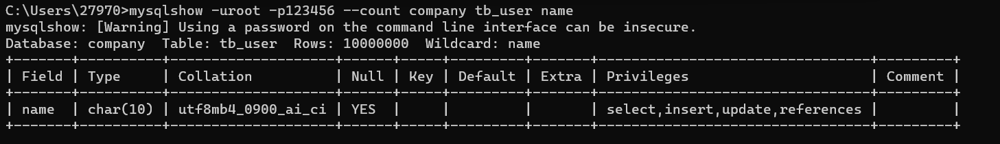
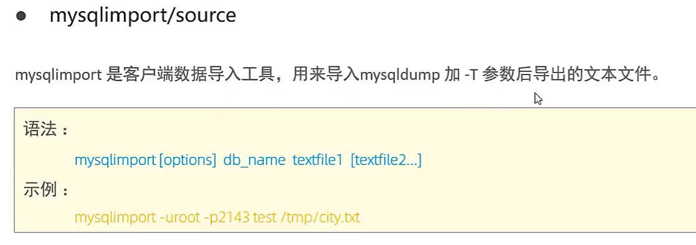

# 常用工具

## MySQL

>   MySQL客户端工具,this one ↓


```DOS
mysql [options] [dataBase] 
```

-   `-u` , `--u = name` 指定用户名
-   `-p` , `--passward[=name] ` 指定密码
-   `-h` , `--host=name ` 指定服务器IP或域名
-   `-P` , `--port=port ` 指定端口号
-   `-e` , `--execute=name` 执行SQL语句并输出
    -   `-e`可以再MySQL**客户端执行SQL语句**而不用连接MySQL数据库再执行,**对于一些批处理脚本,尤为方便**

```DOS
mysql -h127.0.0.1 -P3306 -uroot -p123456 company -e "select * from user"
```

-    -h可以不写



-   主打一个一次过

## mysqladmin

>   执行管理操作的客户端程序
>
>   可以用它来**检查服务器的配置和当前状态** , **创建并删除数据库**等

```DOS
mysqladmin --help
```



-   先来康康帮助文档,(不写就主机IP:3306)

    ```DOS
    mysqladmin -uroot -p123456 vertion #查看版本
    mysqladmin -uroot -p123456 create db01 #创建数据库
    mysqladmin -uroot -p123456 drop db01 #创建数据库
    ```

## mysqlbinlog

二进制日志以二进制保存,如果要查看这些文本的文本格式,就要 mysqlbinlog 日志管理

```DOS
mysqlbinlog [option] logfile1 logfile2...
```


```DOS
D:\IT_study\MySQL\MySQL Server 8.0\Data>mysqlbinlog -s PC-LUCIFER-SHAN-bin.000005
```

## mysqlshow

-   客户端对象查找工具,用来很快的查找存在哪些数据库 , 数据库中的表 , 表中的列或索引

    ```dos
    mysqlshow [option] [db_name[ table_name[ col_name]]]
    ```

    

    ```dos
    mysqlshow -uroot -p123456 --count company tb_user
    ```

    

    ```dos
    mysqlshow -uroot -p123456 --count company
    ```

    

    ```dos
    mysqlshow -uroot -p123456 --count company tb_user name
    ```

    

    ```dos
    mysqlshow -uroot -p123456 -i company tb_user
    ```

## mysqldump备份

-   用于数据备份


```dos
mysqldump -uroot -p123456 company > company.sql
```

-   实践见[全局锁备份](C:\Users\27970\Desktop\IT\MySQL\MySQLBlog\Blog\锁\Day10-全局锁.md)

## mysqlimport/Source 导入




```dos
mysqlimport -uroot -p1234 course.txt
```

Mysqlimport 怎么知道我要导入的是哪个表?

我没告诉它我的表名啊,但是它为什么会知道啊?

>   GPT如是说:

在`mysqlimport`命令中，如果没有指定表名，则会根据数据文件的名称来推断要导入的表名。具体规则如下：

-   **如果数据文件的名称与数据库中已存在的表名完全匹配（不区分大小写），则导入数据将覆盖该表中的数据。**
-   如果数据文件的名称与数据库中已存在的表名部分匹配（不区分大小写），则导入数据将追加到该表中。

例如，你在命令行中执行以下命令：

```bash
bashCopy code
mysqlimport -uroot -p1234 course.txt
```

假设数据库中已经存在名为`course`的表，那么 `mysqlimport` 将会将数据导入到该表。

注意，如果数据库中存在多个与数据文件名部分匹配的表，则可能会出现错误或数据被导入到错误的表中。

非常奇怪, 我当时为啥会问这个问题, SQL的插入语句不是会指定表名, 如果加上数据库前缀, 也不需要指定数据库了..

