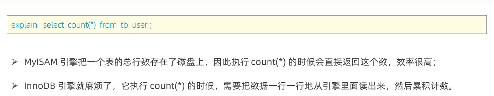
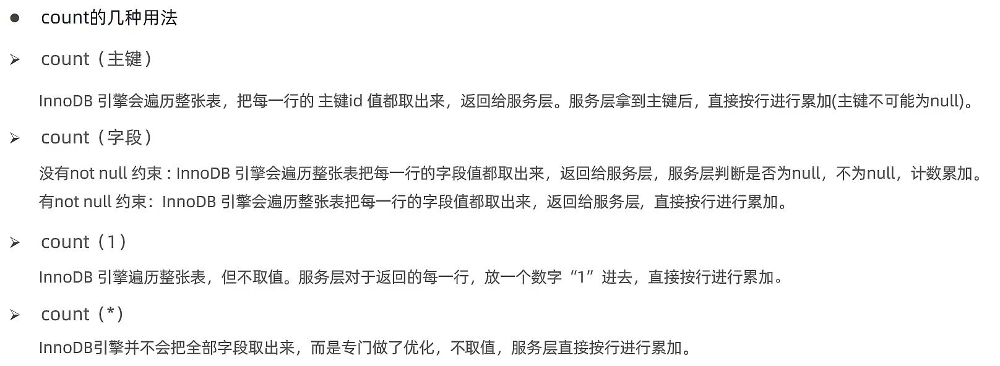
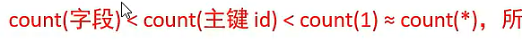

# count优化



-   如果使用了条件查询,统统打回原形,再数一遍


## count

count不是nul,就加一

```mysql
select count(*) from user ;										#不取值
select count(主键) from user ;								#取主键值,不判断
select count(字段) from user ; # 不记null						#取字段值,判定

-- 下面都一样,主键一定存在
select count(1) from user ; #有记录就放1,放1就加1 					#不取值
select count(0) from tb_user; #有记录就放0,放0就加1,
select count(2) from tb_user;
select count(-1) from tb_user;
-- 上面这些都一样


select count(null) from user ;# 有记录就放null,放再多null都不加1
```







-   
