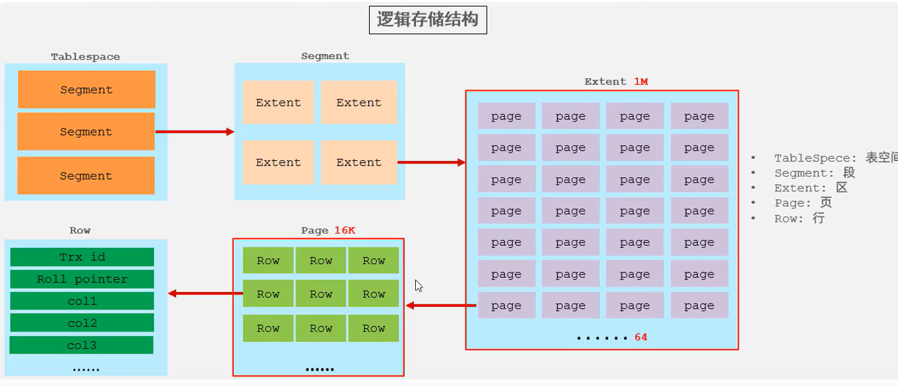

-   按顺序存入主键

## 页分裂

>   页可以为空,也可以填充一半,也可以填充100%.每页包含了2-N行数据
>
>   如果一行数据过大,会行溢出

### 页分裂概念

1.  页之间是指针连接的
2.  当id不是顺序插入的

2.  在各个记录之间插入新的行数据

3.  需要把一个页(新的行应该去的那个)从中间(50%)分裂成两个,
4.  新开辟一个页存放后50%
5.  指针变化
6.  然后再次想办法插入

## 页合并

-   删除(被标记,不是真删除)超过50%,就会合并
-   50%的阈值可以设置

## 主键的设计原则

-   因为每个索引都会有主键

    -   主键长度因该短

    -   别改主键

-   主键在索引里存的时候必是升序的

    -   尽量顺序插入
    -   不要用UUID或自然主键(身份证)做主键
