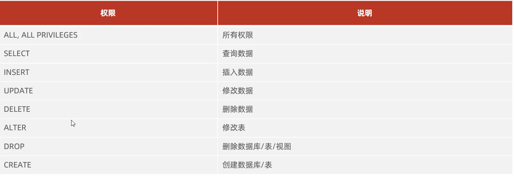

# 权限控制



## 查询权限

```mysql
SHOW GRANTS FOR '用户名'@'主机名';
```

```mysql
USE mysql;
select * from user where user='用户名'&& HOST='主机名';
```


## 授予权限

-   `TO`

```mysql
GRANT 权限列表 ON 数据库名.表名 TO '用户名'@'主机名';
```

-   权限列表
    -   `ALL`
-   `数据库名.表名`
    -   `数据库.*` - 数据库的所有表
    -   `*.*` - 所有数据库的所有表

## 撤销权限

-   `FROM`

```mysql
REMOVE 权限列表 ON 数据库名.表名 FROM '用户名'@'主机名';
```

