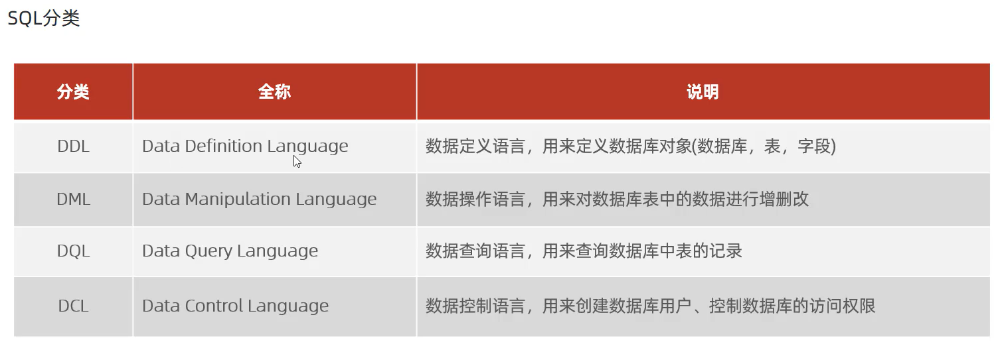

# SQL通用语言

1. 可以单行或多行书写,**以分号结尾**

2. 可以使用空格是缩进

3. MySQL数据库的SQL语句不区分大小写,关键字建议使用大写

4. 注释

   - 单行注释:

     ```sql
     --注释
     ```

     MySQL**独有**的注释:

     ```mysql
     #注释
     -- 注释,--后面要打空格
     ```

   - 多行注释:

     ```SQL
  /*
     多
     行
     注
     释
     */
     ```

## SQL语言分类


 


