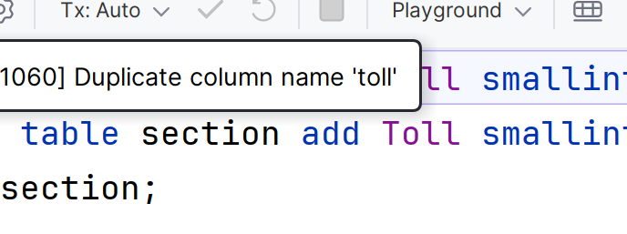

# 字段-列名(clumns)操作

## 增加(add)列名

```mysql
ALTER TABLE 表名 ADD 字段名 类型[(长度)] [comment '注释'] [约束];
```



-   命名也不区分大小写
-   **duplicate重复**

## 修改(modify)列名的数据类型

```mysql
ALTER TABLE 表名 MODIFY 列名之名 新类型[(长度)] [comment '注释'] [约束];
```

-   [数据类型](../Day02-MySQL数据类型.md)

## 修改(change)列名和列类型

```mysql
ALTER TABLE 表名 CHANGE 旧列名之名 新列名之名 新列的类型[(长度)] [comment '注释'] [约束];
```

## 删除列名

```mysql
ALTER TABLE 表名 DROP 列名之名;
```
