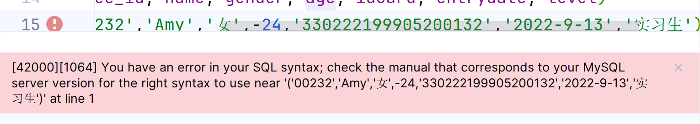
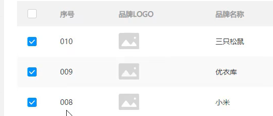

# 对记录的增删改

## insert into添加记录

-   添加的数值大小不能超过指定数据类型
    -   ↓把年龄写成负数就报错:超出范围了
    -   
-   字符串和日期应包含在'`'引号'`内
-   一一对应

-   value和values逻辑上没有区别
-   对比之下，插入多行时，用**VALUE**比较快
    -   应该在插入**单行**的时候使用**VALUES**
    -   在插入多行的时候使用**VALUE**
    -   和常理相反

### 对一条记录,指定列添加数据

```mysql
insert into 表名(列名1,列名2...) values(值1,值2...);
```

- 列1对应值1,列2对应值2...

### 添加一条完整记录

```mysql
insert 表名 values(值1,值2...值N);
```

- 和列**一一对应**

### 批量添加记录

#### 批量指定列添加数据

```mysql
insert into 表名(列名1,列名2...) values(值1,值2,...),(值1,值2,...),(值1,值2,...)...;
```

#### 批量添加完整记录

```mysql
insert into 表名 values(值1,值2,...),(值1,值2,...),(值1,值2,...)...;
```

```mysql
INSERT employee VALUES (null,Null,nUll,nuLl,nulL,NUll,NuLl,NULL);
```

-   null是可以手动加的

## 修改(update)记录

```mysql
update 表名 set 字段1=值1,字段名2=值2,....[where 条件];
```

-   `where 条件` : 要修改符合这个条件的数据

    -   若没有`where 条件` 将修改整张表的值

        ```mysql
        update 表名 set 字段1=值1,字段名2=值2,.... where 1;
        ```

        这一条可以略过警告
-   条件:
    -	判断相等`id='114514'`
    -	详见[where条件判断语句](../Day03-where条件判断语句.md)

### 使用update用null替换删除某列的内容

## 删除(delete)记录

```mysql
delete form 表名 [where 条件];
```



