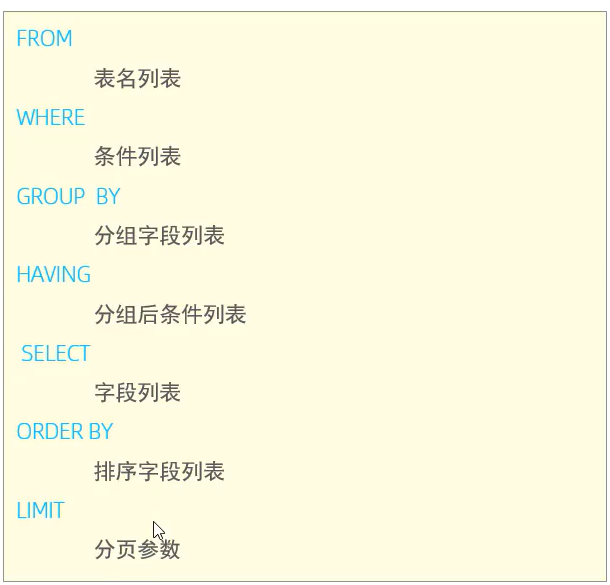
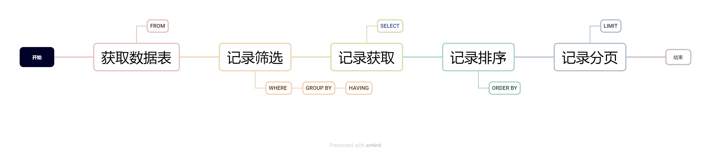

# DQL语句执行顺序

```mysql
/*-------------基本查询-------------*/
SELECT
	[聚合函数]
	字段
	FROM
		表名
/*-------------条件查询-------------*/
    [WHERE 
        条件]
/*-------------分组查询-------------*/
	[GROUP BY 
		分组字段]
	[HAVING
		过滤条件]
/*-------------排序查询-------------*/
	[ORDER BY 
		排序字段]
/*------------分页查询--------------*/
	[LIMIT
		起始索引,一页字节]
;
```

-   区分编写顺序和执行顺序






## 验证方法---------取别名

```mysql
select section_id ,age from employee 
	where age>0 GROUP BY section_id
	HAVING section_id in ('012','011','010','009','008')
	ORDER BY 排序字段
	LIMIT 0,2
;
```

-   看看from是不是在select前

```mysql
select empl.section_id ,empl.age from employee empl
	where age>0 GROUP BY section_id
	HAVING section_id in ('012','011','010','009','008')
	ORDER BY 排序字段
	LIMIT 0,2
;
```

-   看看where是不是在select之前

```mysql
select section_id , age how_old from employee 
	where how_old>0 GROUP BY section_id
	HAVING section_id in ('012','011','010','009','008')
	ORDER BY 排序字段
	LIMIT 0,2
;/*报错*/
```

-   以此类推