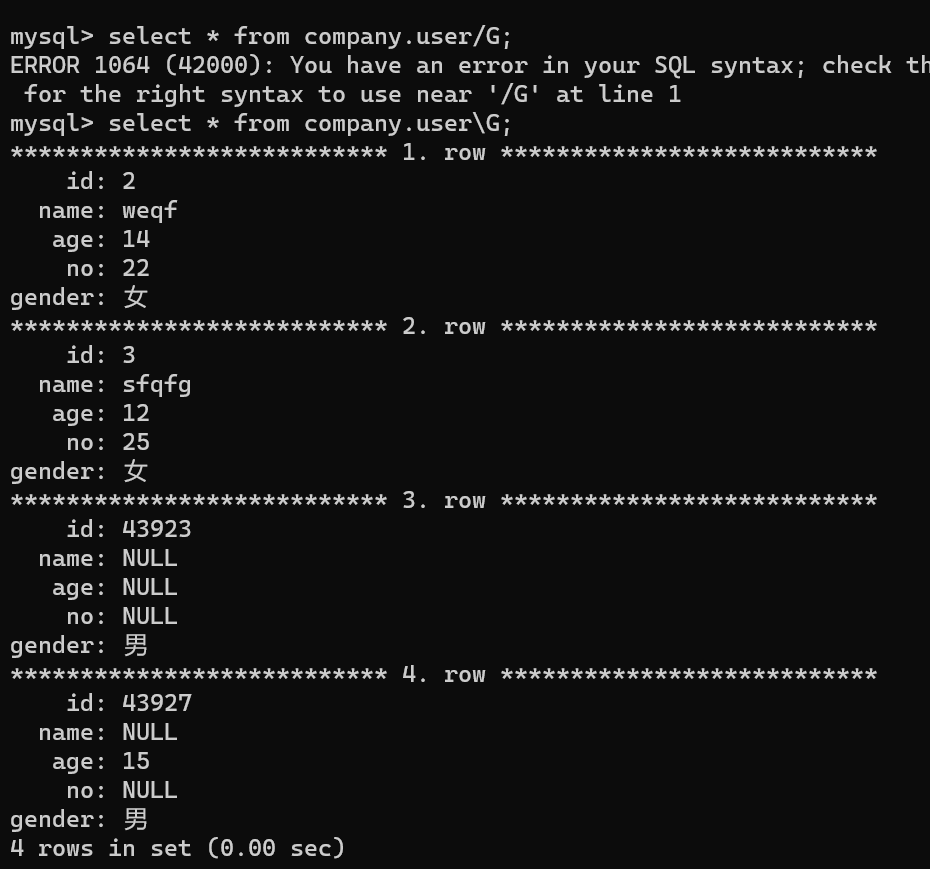
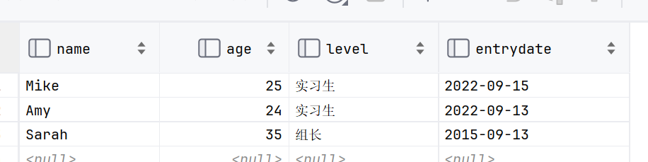
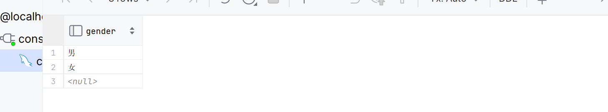
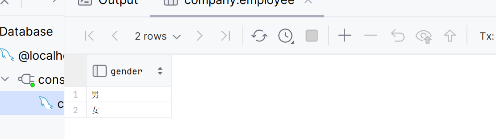
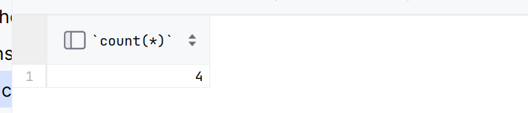
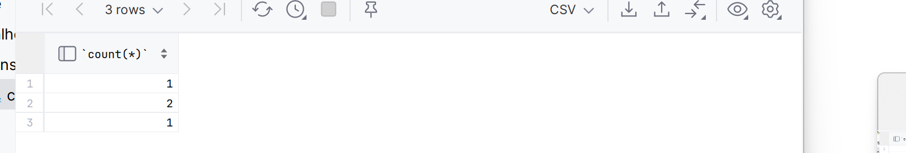
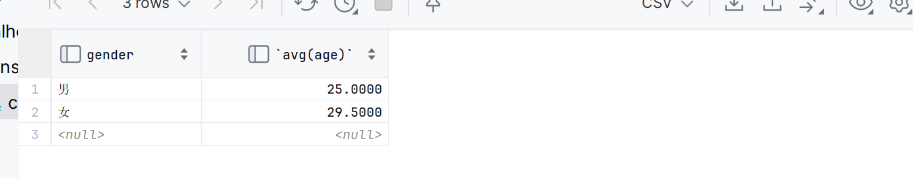
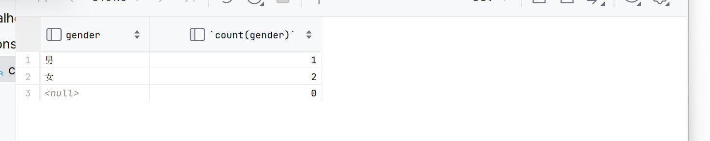
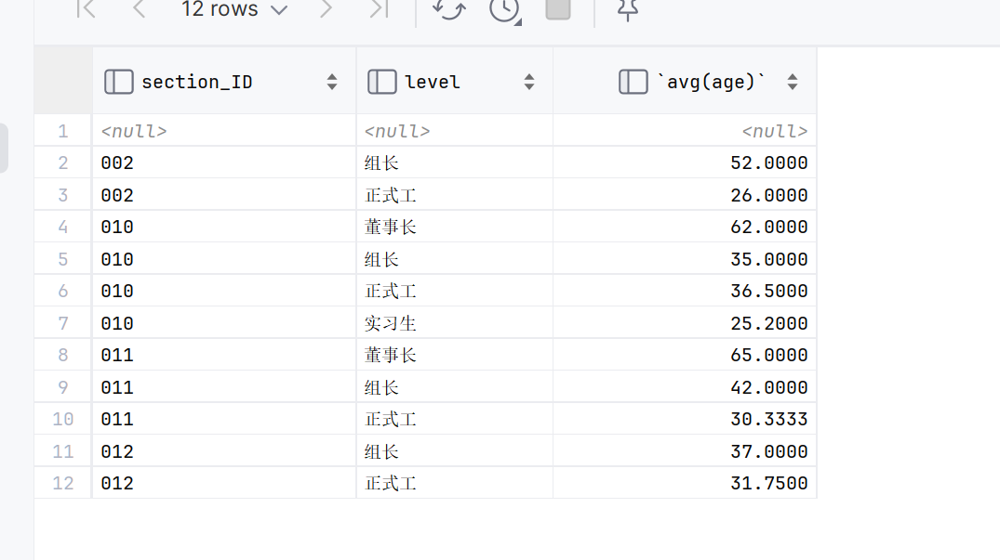

# 单表查询(select)



```mysql
/*-------------基本查询-------------*/
SELECT
	[聚合函数]
	字段列表
	FROM
		表名
/*-------------条件查询-------------*/
    [WHERE 
        条件]
/*-------------分组查询-------------*/
	[GROUP BY 
		分组字段]
	[HAVING
		过滤条件]
/*-------------排序查询-------------*/
	[ORDER BY 
		排序字段列表]
/*------------分页查询--------------*/
	[LIMIT
		起始索引,一页字节]
;
```

## 基本查询

### 查询返回多个字段

```mysql
SELECT 列名1, 列名2... FROWN 表名;
```

-   指定列

```mysql
SELECT * FROM 表名;
```

-   `*` 通配符,表所有
-   不要用*,因为不知道什么列了

#### 实践

```mysql
select name,age,level,entrydate from employee ;
```



**返回的字段顺序是按照指定的顺序来的**

### 取(as)别名

```mysql
SELECT
	列名1 [[AS] '别名1'],
	列名2 [[AS] '别名2'],
	列名3 [[AS] '别名3'],
	...
	FROM
		表名
;
```

-   爱取不取
-   不会对表本身产生影响,但此次返回的列名将化为你取的别名

### 去重(distinct)

```mysql
SELECT DISTINCT 列名1, 列名2... FROM 表名;
```

-   对同属一列的重复内容去重
    -   例如:对性别列去重,就只会留下**性别列列名 **, **男** , **女**,**null**,顶多三行



## 条件(where)查询条件/筛选

>   条件运算符; 
>
>   等于=
>
>   不等于<>或!= ;

>    between min and max     在**[min,mix]**之间,若min>max,将为空集,查不到任何数
>
>    in(值1,值2,...)   多选一
>
>    like 模糊匹配  **_匹配单个字符,%匹配任意个字符**
>
>    ​		用于字符长度特定的筛选之类的 
>
>    IS NULL

>   AND 或 &&
>
>   OR 或 ||
>
>   NOT 或 !

### 语法

```mysql
SELECT
	字段
	FROM
		表名
    WHERE 
        条件
;
```

### 测试与实践

```mysql
select name '姓名' ,age '年龄' from employee 
	where '年龄'<30;

select name '姓名' ,age '年龄' from employee 
	where 27<age<30;

update employee set section_number = '010' 
	where (35-30)<age;
```

-   不报错但不会筛选,所有记录都会上

```mysql
select * from employee 
	where age<25 and (age>24 or age >30);
```

-   括号是有用的

```mysql
select name '姓名' ,age '年龄' from employee 
	where age between 24 and 25;
```

-   包含min和max

```mysql
INSERT employee VALUES (null,Null,nUll,nuLl,nulL,NUll,NuLl,NULL);
select * from employee where age >30;
```

-   查找时null作为筛选的对象是绝对不可能被选入的

```mysql
select * from employee where name like '_____';/*五个下划线*/
```

-   筛选姓名五个字的
-   筛选IDCARD末位X的

```mysql
select * from employee where idcard like '_________________X';/*十七个下划线*/
select * from employee where idcard like '%X';
```

-   in的应用

```mysql
select * from employee where gender = '女' and age in (21,23,25,27,29);
```


## 聚合函数

### 特点和语法

-   将一列数据作为一个整体,进行纵向的计算
-   null不计入计算

``` mysql
SELECT COUNT(列名) FROM 数据表 ;
```

### 常用函数

| 函数  | 功能 |
| ----- | ---- |
| count | 数量 |
| max   | 最大 |
| min   | 最小 |
| avg   | 平均 |
| sum   | 累和 |

### 实践

```mysql
select count(*) from employee;
/*
"null不计入计算"唯一的例外
固定结构
返回包括null在内的记录总数
*/
select count(employee_id,idcard) from employee;
/*
error
这说明了*不是简单地代替了所有字段的综合
而是固定结构
*/
```

-   与条件查询,模糊匹配的混合使用

```mysql
select avg(age) from employee where employee_id like '00%';
/*
29.5000
这里我犯了一个错误
我like不写
写了employe_id like='00%'
当为鉴
*/
```


## 分组查询

```mysql
SELECT
	[字段列表,]
	[聚合函数() [AS 别名]]
	FROM
		表名
	[GROUP BY 
		分组字段列表
	[HAVING
		过滤条件,这里上面的别名就排上用场了]]
;

```

-   分组后其他字段将时区意义
-   支持多字段分组
    -   想象成一棵树会比较好吧

### having和where的区别

|        | 指执行时机   | 判断条件         |
| ------ | ------------ | ---------------- |
| where  | GROUP BY之前 | 不对聚合函数判断 |
| having | GROUP BY之后 | 对聚合函数判断   |

-   having查询的一般是分组的字段和聚合函数,查询其他字段是没有意义的

#### 执行顺序

where->聚合函数->having

#### 技巧

-   根据
    -   having和where的区别,
    -   having查询的一般是分组的字段和聚合函数,查询其他字段是没有意义的
    -   执行顺序

***在where里放没被分组的字段***

***在having里放分组的字段和聚合函数***

### 实践

-   做一波上面说没有意义的事:

```mysql
select name,gender,count(*) from employee group by gender;
```

视频里写的:


我写的:


-   应该是版本问题


```mysql
select gender from employee where age<30 group by gender ;
```




-   没啥意义,不如DISTINCT


```mysql
select gender  from employee  group by gender ;
SELECT DISTINCT gender FROM employee;
```

-   这俩结果完全一致

```mysql
select count(*) from employee;
```

-   聚合函数的内容,此处用作对照



```mysql
select * , count(*) from employee;/*error*/
```

-   这种**字段,聚合函数**的写法,只有在:
    1.  **使用GROUPBY**
    2.  **字段和GROUPBY的分组字段一致**


```mysql
select count(*) from employee group by gender;
```




```mysql
select avg(age) from employee group by gender;
```


```mysql
select gender,avg(age) from employee group by gender;
```




```mysql
select age,avg(age) from employee group by gender;/*error*/
select * , count(gender) from employee group by gender;/*error*/
select age , count(gender) from employee group by gender/*error*/;
```


```mysql
select gender , count(gender) from employee group by gender;
```




-   查询年龄小于30的员工,根据性别分组,获得员工人数大于3的性别

```mysql
select gender ,count(*) as gender_count from employee where age<30 group by gender having gender_count>3;
```

-   多字段分组

```mysql
select  
    section_ID,level,avg(age) from employee 
        group by section_ID,level 
        order by section_ID,level desc 
;
```



## 排序查询

```mysql
SELECT 字段 FROM 表名
	[ORDER BY 
		字段1 排序方式1,字段2 排序方式2...]
;
```

-   支持多字段排序
    -   优先级从左到右
-   排序方式:
    -   ASC(ascending,默认)升序
    -   DESC(descending)降序
        -   想起description的desc了吗?

### 实验

```mysql
select * from employee order by age asc ;
```

```mysql
select * from employee order by age desc;
```

```mysql
select * from employee order by id;
```

```mysql
select * from employee order by name,age;
```

-   字符串比较大小是逐位从高位到低位逐个比较（按ascii码）

## 分页查询


-   可以用来拿"前五个"这种

***有关分页查询语法不同数据库不同,此节正对MySQL***

```mysql
SELECT 字段 FROM 表名 
	[LIMIT
		起始索引,查询记录数]
;
```

-   起始索引从0开始
    -   起始索引 = (查询页码-1)*每显示记录数
    -   ***上面这个公式的理解是不合理的!!!!!!!!!***
    -   ***起始索引可以随便哪个,然后查询记录数就是从起始索引的那条记录(包括)开始,往下获取的数量***
-   查询第一页,起始索引可以省略

```mysql
select * from employee limit 0,1;
select * from employee limit 1;
select * from employee limit 1,1;
select * from employee limit 2,2;
```


-   看这个图想象一下

```mysql
select * from employee 
	where gender = '男' 
		and age between 20 and 29 
	order by employee_id asc 
	limit 2
;
```


