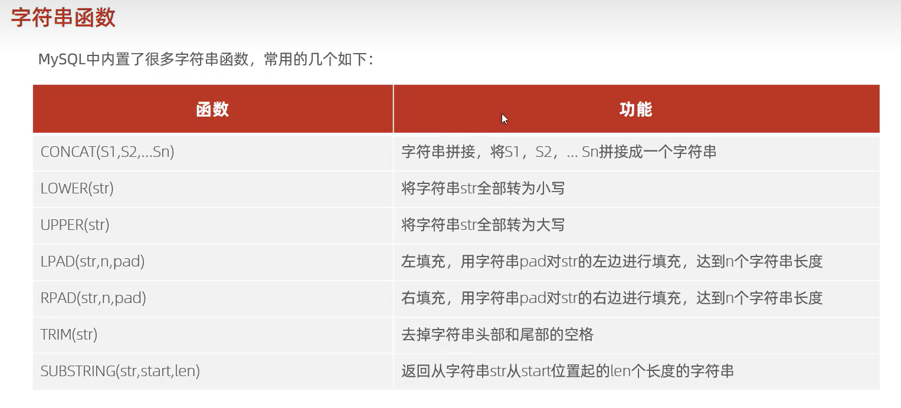

# 字符串函数

```mysql
SELECT 字符串;
select 'hello world';
```

-   直观上来看实现了打印字符串的功能



## 字符串拼接(concat)

```mysql 
CONCAT(s1,s2,...sn);
```


## 大小写转化(lower,upper)

```mysql 
LOWER(str);
```

```mysql
UPPER(str);
```


## 填充(pad)

```mysql 
LPAD(str,len,pad);
```

```mysql
RPAD(str,len,pad);
```

-   str - 要被修改的字符串
-   len - 修改后最终的长度
-   pad - 被用作填充的字符

## 去除头尾空格(trim)

```mysql 
TTRIM(str);
```


## 切片(substring)

```mysql 
SUBSTRING(str,start_pos,len)
```

-   str - 被切片的字符串
-   start_pos - 开始切片位置,**最开头是1**
-   len - 切片后的长度 

## 实践

```mysql
select concat('Hello',' ','World');
/*Hello World*/

select lower(concat('Hello',' ','World'));
/*hello world*/
select upper(concat('Hello',' ','World'));
/*HELLO WORLD*/

select trim(concat('       Hello','     ','World        '));
/*Hello     World*/

select rpad(concat('Hello',' ','World'),15,'.');
/*Hello World....*/
select lpad(concat('Hello',' ','World'),15,'.');
/*....Hello World */

select substring(concat('Hello',' ','World'),7);
/*World*/
select substring(concat('Hello',' ','World'),1,5);
/*Hello*/
```