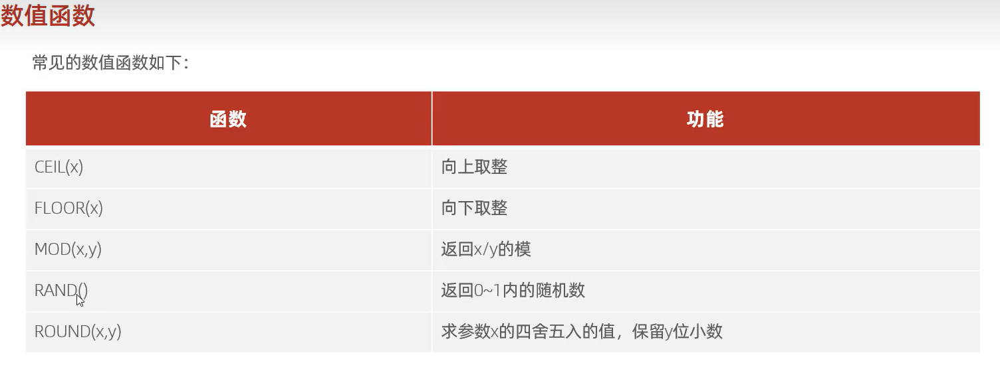

# 数值函数

```mysql
select 1.5;
```

-   尊滴流批



```mysql
select floor(-1.2);         -- -2
select ceil(-1.2);          -- -1

select round(-1.2456);      -- -1
select round(1.2456,2);     -- 1.25
select round(-1.2456,2);    -- -1.25
select round(-1.2456,6);    -- -1.2456

select RAND();              -- 0.054537142677732874
select floor(RAND()*2);     -- 0 or 1

select mod(15.4,-4);           -- 3.4
/*
x%y+int(x/y)*y=x
这里语法是乱的
*/

select lpad(floor(rand()*10000),4,0); -- 四位验证码
```