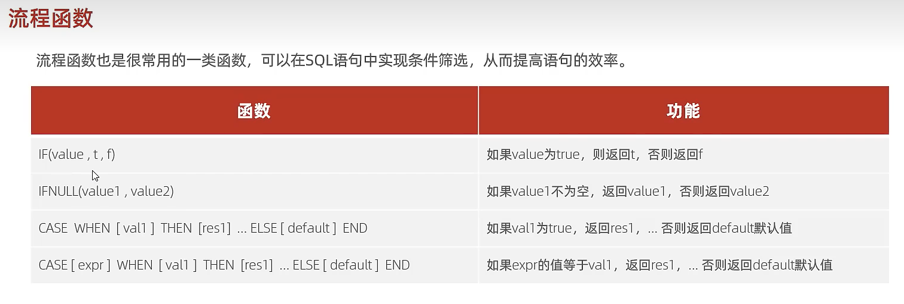
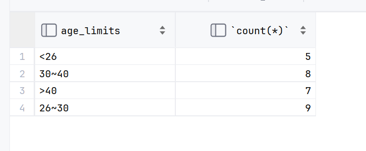
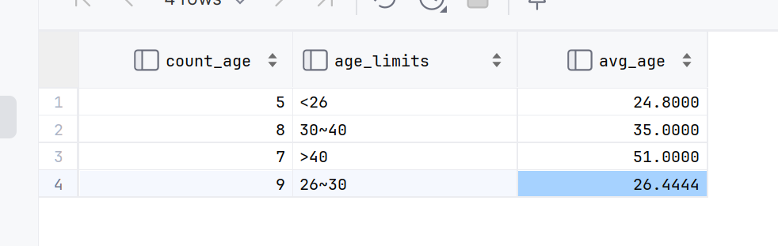

# 流程函数



## IF(value,t,f)

### 测试

```mysql
  select if(true,'true',false);
  select if(false,'true',false);
```

```mysql
  select if('true','true',false);  -- 0
  select if('','true',false); -- 0
  select if(true,'true','false'); -- true
  select if(true,true,false); -- 1
  select if(null,'true','false');  -- false
  select if(false,'true','false'); -- false
```

```mysql
select if(1,1,0);   -- 1
select if(2,1,0);   -- 1
select if(-1,1,0);  -- 1
select if(0.5,1,0); -- 1
select if(0,1,0);   -- 0
```

-   false = 0 = false
-   非0 = true = 1
-   字符串 = false = 0
-   null = false = 0
-   字符串 = 字符串 != 0 

```mysql
select if(1,(1<2)+1,0);   -- 2

select if(1,4/4,0);   -- 1.0000
select if(1,4%4+1,0);   -- 1

select if(1,4%3,0);   -- 1
select if(1,4%(-3),0);   -- 1
select if(1,(-4)%3,0);   -- -1
select if(1,(-4)%(-3),0);   -- -1
select if(1,(4.5)%(-3),0);   -- 1.5

select if(1,2e100,0);
/*200000000000000
  000000000000000
  000000000000000
  000000000000000
  000000000000000
  000000000000000
  00000000000*/
```

### 实践

if-else

```mysql
select if(age>30 ,1,0) from employee;

select
    if(age>30 ,
        if(age>40,
            '>40'
        ,
            '30~40'
        )
    ,
        if(age<26,
            '<26'
        ,
            '26~30'
        )
    )
    as age_limits,
    count(*)
from employee group by age_limits ;
```



-   很爽

```mysql
select
    if(age>30 ,
        if(age>40,
            '>40'
        ,
            '30~40'
        )
    ,
        if(age<26,
            '<26'
        ,
            '26~30'
        )
    )as age_limits,
    count(*) as count_age,
    avg(age) as avg_age
from employee group by age_limits ;
```

-   更爽了,但和之前讲的DQL执行顺序冲突
-   **mysql可,sql不可**



## case when then end

switch-case

```mysql
SELECT
    name,
    case section_ID
        WHEN '010'
            then '管理部'
        WHEN '011'
            then '营销部'
        else
            '其他'
    end as '所属部门'
FROM employee;
```

