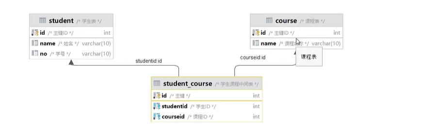

# 多表关系

## 一对多

-   在多的地方建立外键,指向以的一方的主键

## 多对多

-   建立第三张中间表,至少包含两个外键,关联两张表


-   案例学生与选课

```mysql
select s.name ,s.id ,c.name 
from student s,student_course sc,course c
where s.id = sc.student_id && sc.course_id = c.id;
```

-   图片是大概意思下,和文字没啥关系,看个思路

    



## 一对一

为啥不写到同一张表里去呢?(弱弱)

例如用户敏感信息和用户普通信息虽然是一对一的关系, 由于权限等原因不同而不能在同一张表

-   **在任意一方加入外键,关联另一方的主键,并且设置外键唯一(UNIQUE)**

