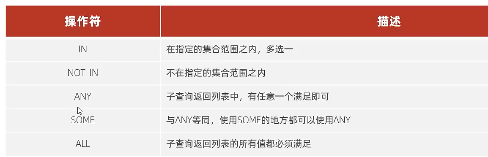
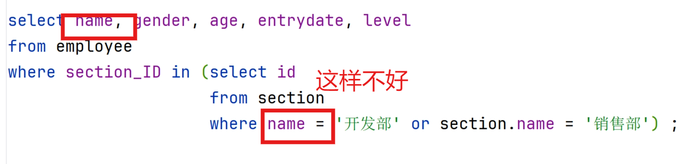

# 列子查询


## 常用操作符



## 实践

-   查询**开发部**和**销售部**的所有员工信息
    1.  查询**开发部**和**销售部**的ID
    2.  查询ID的所有员工信息



-   ↑能运行

```mysql
select name, gender, age, entrydate, level
from employee
where section_ID in (select id
                     from section
                     where section.name = '开发部' or section.name = '销售部') ;
```


-   查询比**董事会**年龄所有的人都大的人的信息

    1.  查询**董事会**所有人的年龄
    2.  查询信息

    ```mysql
    select name, gender, age, entrydate, level
    from employee
    where age > all (select age
                     from employee
                     where section_ID = (select id
                                         from section
                                         where section.name = '董事会'));
    ```

-   查询比**董事会**任意一人年龄大就行的人信息

    -   翻译:查询比**董事会**年龄最小的大的人信息

    ```mysql
    select name, gender, age, entrydate, level
    from employee
    where age > any (select age
                     from employee
                     where section_ID = (select id
                                         from section
                                         where section.name = '董事会'));
    ```

